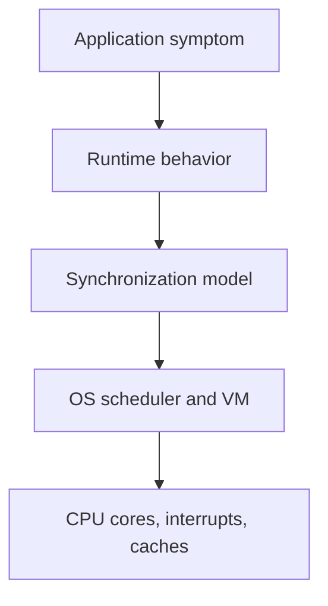

# What This Material Is About

Previous: none | [Index](index.md) | Next: [Concurrency Intuition](01-concurrency-intuition.md)

**Section purpose:** Explain why this material exists, what it will help engineers understand, and what it intentionally does not try to cover.

## Point Of View And Authorship

This is practitioner-written material, not an official specification.

The point of view comes from:

- early hands-on work with Qualcomm REX-style real-time software on non-VM, single-core embedded systems
- later work with Linux in embedded environments
- UNIX operating-system grounding built through Maurice J. Bach's *The Design of the UNIX Operating System*
- many subsequent years building and architecting full-stack web systems

That background shapes the course. REX-style systems provide the simpler baseline: task scheduling, shared memory, interrupt pressure, and watchdog discipline. UNIX/Linux then shows why richer systems add process containers, virtual memory, user/kernel separation, file descriptors, `fork`, `exec`, signals, and broader resource management.

The material has also been substantially shaped and co-authored with AI assistance. The author provided the topic sequence, teaching flow, required depth, and practical lens. The goal is to transfer the author's concurrency mental model with as little unnecessary reading as possible, without flattening the details engineers need.

There may be gaps, oversimplifications, or implementation-specific details that need correction. If you find one, please file an issue. If you want to co-edit or contribute larger changes, reach out to the author first so the flow and intent stay coherent.

---

## Why This Material Exists

Most engineers learn concurrency backward.

They first meet APIs:

- `Thread`
- `async`
- `await`
- `Promise`
- `ExecutorService`
- `pthread_mutex`
- `goroutine`
- `synchronized`
- `multiprocessing`

Then production teaches them the hard part:

- Why did this request hang when CPU was low?
- Why did adding a log line make the bug disappear?
- Why did the queue save us during the spike and then keep us down for 40 minutes?
- Why did Python threads not speed up CPU work?
- Why did a single Node.js route freeze the service?
- Why did a process crash not kill the whole machine?
- Why did a mutex fix corruption but destroy latency?
- Why did a watchdog reset the embedded target?
- Why did everything work on one core and fail on four?

This material exists to connect those symptoms to the machinery underneath:



The goal is not to memorize trivia. The goal is to build a mental model strong enough that a younger engineer can reason from first principles when the abstraction leaks.

> **Side note:** State this upfront: "You are not here to learn thread APIs. You are here to learn why those APIs behave the way they do under pressure."

---

## The Comparative Lens: REX, UNIX, And Linux

This material uses REX-style real-time operating-system ideas and UNIX/Linux ideas side by side on purpose.

REX is used here as a practical example of a real-time, task-oriented, generally non-VM or limited-protection embedded operating-system model. UNIX and Linux are used as examples of VM-backed, process-oriented systems with stronger isolation, richer file/process abstractions, and a different scheduling/resource-management contract.

Learning the REX-style model first helps because it exposes the simpler baseline:

- A schedulable task has registers, a stack, priority, and wait state.
- Tasks can often see the same memory image.
- A context switch can be mostly register and stack-pointer work.
- Hardware events and interrupt latency are visible design pressures.
- Protection is often a discipline of ownership, review, and testing rather than a full VM-enforced boundary.

Once that baseline is clear, UNIX becomes easier to understand. UNIX adds machinery because it is solving a harder management problem: many programs, many users, independent lifetimes, file descriptors, permissions, page tables, demand paging, `fork`, `exec`, signals, and resource accounting. The learner should feel that UNIX is not complicated for its own sake; it is carrying responsibilities the simpler embedded model often does not need to carry.

The comparison is not meant to say one model is inherently superior.

It is meant to answer:

- What problem was this design solving?
- What did it optimize for?
- What did it deliberately not optimize for?
- What failure modes did it accept?
- What complexity did it avoid?
- What complexity did it push onto the programmer, runtime, or kernel?

In a real-time embedded system, it can be reasonable to prefer:

- bounded interrupt latency
- direct hardware control
- predictable task wakeup
- small memory footprint
- static ownership
- reset-on-failure watchdog discipline

In a UNIX/Linux system, it can be reasonable to prefer:

- process isolation
- virtual memory
- file descriptor abstraction
- fork/exec process creation
- memory-mapped files
- rich IPC
- protection between independently authored programs

This course draws from practical understanding across REX-style embedded work, UNIX fundamentals, and Linux/web systems. The goal is not to preserve nostalgia for any one environment. The goal is to understand why each environment made different tradeoffs, so the engineer can recognize those tradeoffs in modern backend systems.

> **Side note:** Say this politely but clearly: "We are not comparing REX and UNIX as a contest. We are using them as two clean design poles: real-time shared-system discipline versus VM-backed multi-program isolation."

---

## The Most Important Whys This Material Answers

This material answers these whys:

1. **Why concurrency is not the same as parallelism**
   - A single-core system can be concurrent.
   - A multicore system can be parallel.
   - Many backend systems are mostly concurrent because they wait on I/O.

2. **Why the OS invented processes**
   - A process is not just "a running program."
   - It is an isolation boundary, resource container, and schedulable entity.

3. **Why virtual memory matters**
   - It gives isolation.
   - It enables lazy loading, shared libraries, copy-on-write, memory mapping, and page permissions.
   - It makes `fork()` practical.

4. **Why `fork()` and `exec()` are separate**
   - `fork()` creates a new process.
   - `exec()` replaces the program image inside a process.
   - This split lets shells and servers configure file descriptors before launching new code.

5. **Why kernel space and user space exist**
   - User code cannot be trusted with hardware, page tables, or global scheduling state.
   - The kernel is the privileged arbitrator.

6. **Why scheduling is not magic**
   - Tasks run because they are runnable.
   - Blocking removes work from the runnable set.
   - Interrupts and system calls create opportunities to switch.

7. **Why threads exist**
   - Processes isolate.
   - Threads share.
   - Sharing is powerful and dangerous.

8. **Why race conditions happen**
   - Correctness depends on interleaving.
   - Interleavings are shaped by scheduler, interrupts, cores, memory model, and blocking.

9. **Why mutexes, semaphores, critical sections, and atomics are different**
   - Mutex protects invariants.
   - Semaphore coordinates counts/resources.
   - Critical section is protected code.
   - Atomic operation gives indivisible hardware-visible update.

10. **Why language runtime choice matters**
    - C, C++, Java, Python, Ruby, JavaScript, and Go do not merely have different syntax.
    - They package memory, scheduling, GC, event loops, and threads differently.

11. **Why coroutines are not just "better threads"**
    - They are excellent for waiting.
    - They do not automatically provide CPU parallelism.
    - They require non-blocking discipline and cancellation discipline.

12. **Why backend architecture depends on concurrency model**
    - Node, Python, Java, C++, and Go fail differently.
    - The right choice depends on waiting, CPU work, isolation, latency, team skill, and operational visibility.

13. **Why production concurrency debugging needs different metrics**
    - You need queue age, lock wait, event-loop lag, thread pool saturation, GC pause, run queue length, and dependency fan-out.

> **Side note:** This is the promise of the material. If you can answer these whys, you can have serious architecture conversations instead of API debates.

---

## What You Should Be Able To Do After This Material

After going through this material, an engineer should be able to:

- Explain process vs thread vs coroutine without hand-waving.
- Explain why a process has stronger isolation than a thread.
- Draw a process memory layout and explain stack, heap, code, data, and mappings.
- Explain ELF loading at a useful level.
- Explain `fork`, `exec`, and copy-on-write clearly.
- Explain what a file descriptor is and why descriptors survive exec.
- Explain when scheduling can happen.
- Explain how an interrupt can lead to a context switch.
- Explain how REX-style RTOS scheduling differs from UNIX scheduling.
- Explain watchdog/kickdog mechanics as liveness checking, not just timer kicking.
- Explain race conditions with concrete interleavings.
- Choose between mutex, semaphore, atomic, condition variable, queue, actor, or process isolation.
- Spot deadlock risk in lock ordering.
- Explain GIL/GVL implications in Python/Ruby.
- Explain why Node.js is good at I/O and fragile under event-loop blocking.
- Explain why Go goroutines differ from Python coroutines.
- Review a backend design for concurrency risk.

The practical target:

> When production is slow, stuck, corrupting state, or behaving differently under load, you should know which layer to inspect next.

---

## Who This Is For

Intended readers:

- Younger engineers who can build services but have not deeply internalized OS/runtime behavior.
- Backend engineers moving from framework-level knowledge into systems thinking.
- Embedded engineers comparing RTOS models with UNIX/Linux models.
- Senior engineers preparing to mentor teams on concurrency tradeoffs.

This material assumes:

- Basic programming ability.
- Comfort reading small C/C++/Python/JavaScript/Java snippets.
- Basic idea of functions, memory, files, and servers.

This material does not assume:

- Kernel development experience.
- Compiler writing experience.
- Formal distributed systems background.
- Prior deep knowledge of ARM internals.

> **Side note:** The material is intentionally layered. If someone does not know ELF, they can still follow the process story. If someone knows ELF deeply, they can use those slides as a bridge to teach others.

---

## What This Material Is Not

This is not:

- A complete operating-system textbook.
- A full Linux kernel internals course.
- A formal proof course on memory models.
- A complete C++ atomics course.
- A complete Java/JVM tuning course.
- A complete Python async course.
- A full Node.js internals course.
- A complete Go scheduler implementation course.
- A distributed systems consensus course.
- A real-time systems certification course.
- A replacement for reading platform documentation.

It also does not try to:

- Teach every syscall.
- Cover every UNIX flavor.
- Cover every RTOS.
- Cover every ARM generation precisely.
- Guarantee exact Qualcomm REX internals; REX is treated as a useful RTOS-style model where public detail is limited.
- Give universal "best language" advice.
- Claim one concurrency model wins everywhere.

The material is deliberately about judgment:

```text
mechanism -> tradeoff -> failure mode -> architecture choice
```

> **Side note:** This boundary matters. The material should not become "Linux kernel source tour" or "language war." Keep pulling it back to concurrency reasoning.

---

## How To Read Or Teach It

Recommended path:

1. Start with this orientation.
2. Move through sections 1-12 in order.
3. Use appendices for exercises and pacing.
4. Use the deep expansion pack when readers or the team ask for more.

Do not rush the first half.

The OS foundation matters because later runtime behavior depends on it:


Teaching rhythm:

- Define the concept.
- Give a simple analogy.
- Give the engineer's precise model.
- Show a failure example.
- Show the mitigation.
- Explain the tradeoff.
- Lead into the next layer.

> **Side note:** The strongest version of this material is interactive. Ask "what can go wrong here?" before showing the bug.

---

## Lead Into Next Section

**Core takeaway to close with:** This material is about building a layered mental model for concurrency, from CPU and OS mechanics up to backend architecture decisions.

**Transition to next section:** Now that the purpose of the material is clear, start with the most abused word in concurrency discussions: concurrency itself.

**Continue reading:** Continue with [Concurrency Intuition](01-concurrency-intuition.md) to separate concurrency from parallelism before moving into mechanisms.

**Pause check before moving on:** pause and name one production symptom you have seen that might be explained by scheduler, runtime, lock, or event-loop behavior.

Previous: none | [Index](index.md) | Next: [Concurrency Intuition](01-concurrency-intuition.md)
