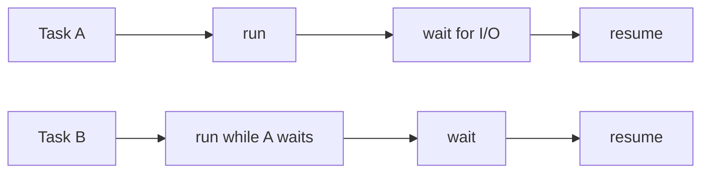
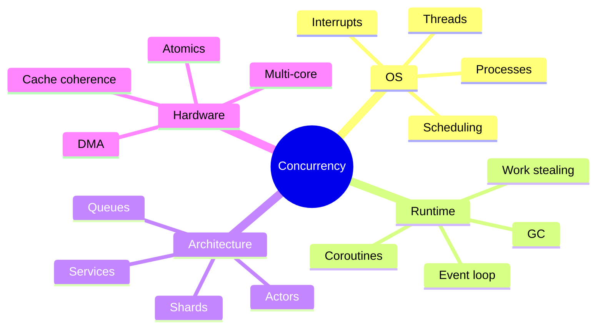
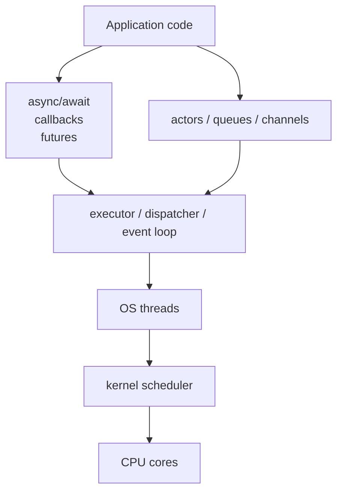

# Concurrency Intuition

Previous: [What This Material Is About](00-orientation.md) | [Index](index.md) | Next: [Process, Memory, And Executable Image](02-process-memory-and-executable-image.md)

**Section purpose:** Build the vocabulary before introducing OS objects.

## Section Bridge

**Arriving from:** [What This Material Is About](00-orientation.md). The previous section explained why this material exists, what questions it answers, and what it deliberately does not cover.

**This section answers:** Build the vocabulary before introducing OS objects.

**Watch for the next question:** once this section lands, the next natural question is why we need **Process, Memory, And Executable Image** next.

> **Reading note:** Read this as one continuous block. The slide-level `Flow` notes explain local transitions; the section-level transition at the end connects this topic to the next one.

---

## 1. What Is Concurrency

> **Flow:** Start by defining **What Is Concurrency**. Once the vocabulary is stable, move into **How A Grandma Understands Concurrency** so the idea becomes intuitive before it becomes technical.


Concurrency is the ability of a system to make progress on more than one task over an overlapping time interval.

Concurrency is not the same as parallelism:

- **Concurrency:** multiple tasks are in flight; their execution may be interleaved.
- **Parallelism:** multiple tasks are executing at the exact same instant on different execution resources.
- **Single-core CPU:** can be concurrent by time-slicing.
- **Multi-core CPU:** can be concurrent and parallel.
- **Distributed system:** can be concurrent across machines, processes, threads, event loops, and queues.

The core question concurrency answers is:

> How do we structure work so independent or partially independent activities can progress without waiting unnecessarily?



> **Side note:** Do not start by saying "threads". Threads are only one mechanism. Concurrency is a design property; threads, processes, coroutines, event loops, interrupts, DMA, queues, and actors are implementation choices.

---

## 2. How A Grandma Understands Concurrency

> **Flow:** From **What Is Concurrency**, move into **How A Grandma Understands Concurrency**. This page should answer the natural follow-up and prepare for **How An Engineer With 5 Years Of Working Understands Concurrency**.


Imagine making tea, toast, and taking a phone call.

- Put water on the stove.
- While water heats, put bread in toaster.
- While toast is getting done, answer the phone.
- When kettle whistles, pause the call briefly and pour tea.
- When toaster pops, butter the toast.

One person did not become three people. She simply did not stand idle while the kettle and toaster were doing their own work.

That is concurrency.

Parallelism would be different:

- Grandma makes tea.
- Grandpa makes toast.
- Someone else answers the phone.
- All happen at the same exact time.

> **Side note:** This example is powerful because most concurrency in backend systems is not "CPU doing many things at once"; it is "CPU not wasting time while disk, network, database, or timer work is pending."

---

## 3. How An Engineer With 5 Years Of Working Understands Concurrency

> **Flow:** From **How A Grandma Understands Concurrency**, move into **How An Engineer With 5 Years Of Working Understands Concurrency**. This page should answer the natural follow-up and prepare for **What All Are Common Ways Of Concurrency**.


An engineer with experience usually sees concurrency through production symptoms:

- Requests arrive while other requests are still running.
- Database calls wait on network and locks.
- Background jobs process queues.
- Multiple users mutate shared state.
- Caches can be stale.
- Race conditions appear only under load.
- Latency percentiles get worse even when average latency looks fine.

The sharper definition:

> Concurrency is the management of independent units of work, shared resources, waiting, scheduling, and state visibility under overlapping execution.

Key engineering questions:

- What can run independently?
- What must be serialized?
- What state is shared?
- What ordering must be guaranteed?
- What happens when a task waits?
- Who schedules the next unit of work?
- How is failure isolated?
- How do we debug it?

> **Side note:** Five-year engineers often know APIs such as `Thread`, `async`, `Promise`, `ExecutorService`, or `goroutine`. The upgrade is knowing the runtime below them: kernel scheduler, memory model, lock implementation, stack, heap, context switch, and visibility.

---

## 4. What All Are Common Ways Of Concurrency

> **Flow:** From **How An Engineer With 5 Years Of Working Understands Concurrency**, move into **What All Are Common Ways Of Concurrency**. This page should answer the natural follow-up and prepare for **What Is A Process**.


Common concurrency mechanisms:

- **Processes:** isolated address spaces, scheduled by OS.
- **Threads:** multiple execution streams inside one process, shared address space.
- **Coroutines/fibers:** cooperative user-space execution units.
- **Event loops:** one or more threads multiplex I/O readiness and callbacks.
- **Async/await:** language syntax over futures/promises/coroutines.
- **Actors:** isolated state + message passing.
- **Queues/workers:** producer-consumer concurrency.
- **Interrupts:** hardware or timer event preempts current execution.
- **DMA/device offload:** hardware progresses work while CPU does something else.
- **SIMD/vectorization:** data parallelism inside CPU instructions.
- **Multi-process servers:** pre-fork or worker process models.
- **Distributed concurrency:** multiple services/nodes progress independently.



> **Side note:** Every concurrency model is a trade: isolation, overhead, latency, throughput, memory, debuggability, fairness, and failure blast radius.

---

## 4A. Place The API On The Right Layer

Before the course moves into processes and memory, keep one map in mind.

Most engineers first say:

```text
Thread vs async vs actor vs coroutine
```

That phrasing is convenient, but it can blur the layers.

More precise:

```text
OS thread:
  kernel-scheduled execution stream

thread pool / executor:
  library or runtime owner of a bounded set of threads

callback / future / promise:
  completion model for work that finishes later

actor:
  state ownership and message-passing model

coroutine / async-await:
  control-flow model for suspend/resume

goroutine:
  Go runtime-scheduled execution unit multiplexed over OS threads
```



So when someone says "coroutines are better than threads", translate it carefully:

> Coroutines may be a better way to express many waiting operations, but they usually still depend on runtime scheduling, event loops, and one or more OS threads underneath.

This distinction will matter later when comparing Java, Python, Ruby, JavaScript, and Go.

> **Side note:** This page is the reader's compass. If they keep the layers separate, the rest of the material becomes much less confusing.

---

## Lead Into Next Section

**Core takeaway to close with:** Build the vocabulary before introducing OS objects.

**Transition to next section:** Now that concurrency is separated from parallelism and from any one API, the next question is: what exactly does the operating system run when it runs a program?

**Continue reading:** Continue with [Process, Memory, And Executable Image](02-process-memory-and-executable-image.md) to follow the next layer of the model.

**Pause check before moving on:** pause and summarize the section in one sentence and name the resource or boundary that became clearer.

Previous: none | [Index](index.md) | Next: [Process, Memory, And Executable Image](02-process-memory-and-executable-image.md)
