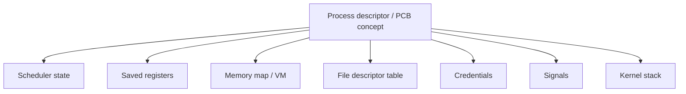
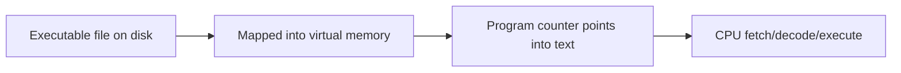
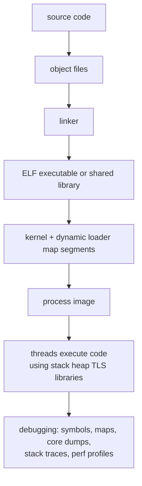
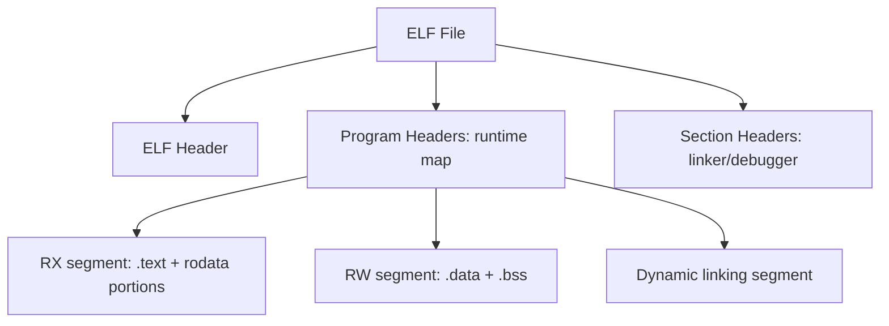
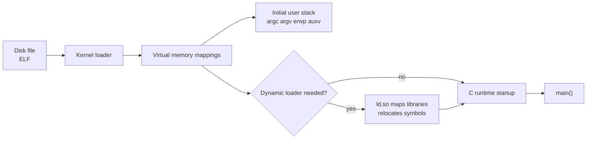
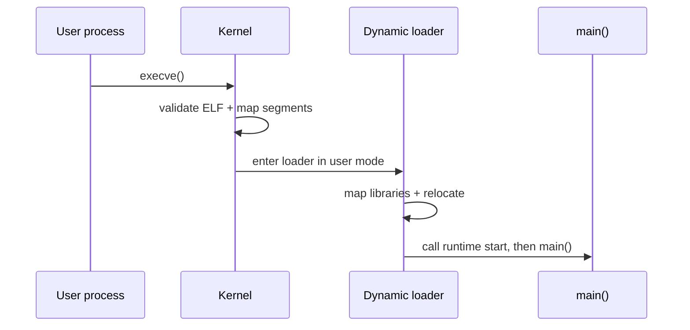
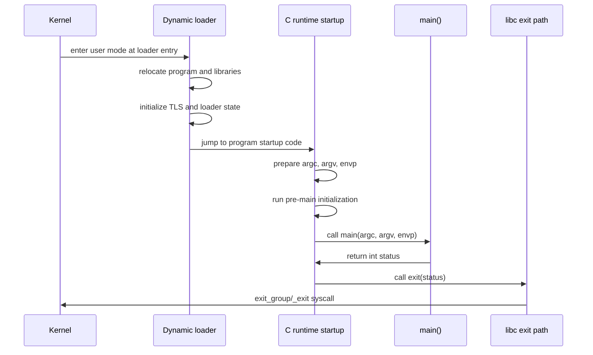
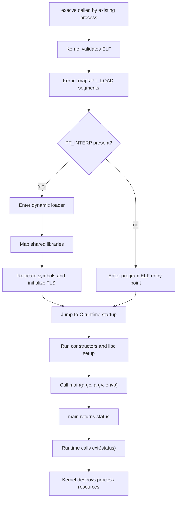

# Process, Memory, And Executable Image

Previous: [Concurrency Intuition](01-concurrency-intuition.md) | [Index](index.md) | Next: [REX, UNIX, And Virtual Memory](03-rex-unix-and-virtual-memory.md)

**Section purpose:** Explain process anatomy: PCB, stack, heap, executable bytes, ELF, and loading.

## Section Bridge

**Arriving from:** [Concurrency Intuition](01-concurrency-intuition.md). The previous section covered: Build the vocabulary before introducing OS objects.

**This section answers:** Explain process anatomy: PCB, stack, heap, executable bytes, ELF, and loading.

**Watch for the next question:** once this section lands, the next natural question is why we need **REX, UNIX, And Virtual Memory** next.

> **Reading note:** Read this as one continuous block. The slide-level `Flow` notes explain local transitions; the section-level transition at the end connects this topic to the next one.

---

## 5. What Is A Process

> **Flow:** From **What All Are Common Ways Of Concurrency**, move into **What Is A Process**. This page should answer the natural follow-up and prepare for **What Is Process Control Block, Taking UNIX As Case**.


A process is an executing program plus the operating-system state required to manage it.

A process normally includes:

- Virtual address space.
- Code/text segment.
- Data segment.
- Heap.
- One or more stacks.
- File descriptor table.
- Signal handling state.
- Credentials and permissions.
- Environment variables.
- Current working directory.
- Process ID and parent relationship.
- Scheduling state.
- Accounting/resource usage.

Important distinction:

- **Program:** passive bytes stored on disk.
- **Process:** active execution instance of that program.

You can run the same program ten times and get ten processes.

> **Side note:** A process is the OS boundary where isolation becomes real. If process A scribbles over its own heap, process B should not be corrupted because they do not share the same virtual address space by default.

---

## 6. What Is Process Control Block, Taking UNIX As Case

> **Flow:** From **What Is A Process**, move into **What Is Process Control Block, Taking UNIX As Case**. This page should answer the natural follow-up and prepare for **What Is The Stack**.


The Process Control Block, or PCB, is the kernel's record for a process.

UNIX-like systems do not always call one single structure "PCB" in user-visible terms. Internally, the information is spread across structures such as task/process descriptors, memory descriptors, file tables, signal structures, credential structures, and scheduler entities.

Conceptually, a UNIX process PCB contains:

- Process ID, parent PID, process group, session.
- Process state: running, runnable, sleeping, stopped, zombie.
- CPU register save area.
- Kernel stack pointer.
- Scheduling policy, priority, CPU affinity, runtime accounting.
- Address-space metadata, page tables, memory mappings.
- Open file descriptor table.
- Signal masks, pending signals, handlers.
- User/group credentials and capabilities.
- Resource limits.
- Exit status and wait information.



> **Side note:** The PCB is not "inside the process". It is kernel-owned metadata about the process. User code cannot directly edit it; user code asks the kernel through system calls.

---

## 6A. UNIX Process Model In The Bach Mental Frame

Maurice J. Bach's treatment of UNIX is useful because it does not present the OS as magic. It presents UNIX as a set of kernel data structures and algorithms that cooperate:

- process table
- user area / per-process state
- file table
- inode table
- buffer cache
- scheduler queues
- sleep and wakeup paths
- system-call entry points

The important mental frame:

> A UNIX process is not just code running. It is a kernel-managed object connected to files, memory, credentials, signals, and scheduler state.

For concurrency, this matters because every "running program" has two faces:

```text
User face:
  code, stack, heap, libraries, variables

Kernel face:
  process slot, credentials, open files, signal state,
  memory mappings, scheduling state, wait channel
```

When a process blocks:

- user code stops executing
- kernel state records why it stopped
- scheduler chooses another runnable entity
- later, an event wakes the blocked process

This is the bridge from Bach-style UNIX to modern concurrency:

- The core idea is not old.
- The names and implementation details evolved.
- The model of kernel-owned process state, wait queues, files, memory, and scheduling still pays rent.

> **Side note:** For engineers who read Bach years ago, bring back the data-structure mindset. Do not say "Linux does it exactly this way"; say "the conceptual split remains: user execution plus kernel-owned state."

---

## 7. What Is The Stack

> **Flow:** From **What Is Process Control Block, Taking UNIX As Case**, move into **What Is The Stack**. This page should answer the natural follow-up and prepare for **What Is Heap**.


The stack is memory used for function calls and automatic local state.

It commonly stores:

- Return addresses.
- Function arguments that are not passed in registers.
- Local variables with automatic storage duration.
- Saved registers.
- Stack frames for nested function calls.

Typical call flow:

```c
int add(int a, int b) {
    int result = a + b;
    return result;
}

int main(void) {
    return add(2, 3);
}
```

Each active call has a frame. When a function returns, its frame is popped.

Important properties:

- Fast allocation and deallocation.
- Usually per-thread, not globally shared.
- Limited size.
- Stack overflow can crash the process or corrupt memory in low-protection systems.
- In C/C++, returning a pointer to a local stack variable is invalid.

> **Side note:** Stack is a major reason threads are not free. A process with thousands of kernel threads can reserve significant virtual memory for stacks even before doing useful work.

---

## 8. What Is Heap

> **Flow:** From **What Is The Stack**, move into **What Is Heap**. This page should answer the natural follow-up and prepare for **What Is Executable Code In Execution**.


The heap is memory used for dynamic allocation.

Examples:

```c
int *p = malloc(sizeof(int));
*p = 42;
free(p);
```

In C++:

```cpp
auto p = std::make_unique<int>(42);
```

Heap properties:

- Allocation lifetime is not tied to a single function call.
- Objects can outlive the function that created them.
- Shared across threads in a process unless isolated by allocator design.
- Managed manually in C, usually RAII in modern C++, garbage-collected in languages such as Java and Go.
- Can fragment.
- Requires synchronization inside general-purpose allocators.

Heap bugs:

- Memory leak.
- Use after free.
- Double free.
- Buffer overflow.
- Data race on heap object.

> **Side note:** Stack bugs are often lifecycle bugs. Heap bugs are lifecycle plus ownership plus sharing bugs. Once threads enter the picture, heap ownership must be explained explicitly.

---

## 9. What Is Executable Code In Execution

> **Flow:** From **What Is Heap**, move into **What Is Executable Code In Execution**. This page should answer the natural follow-up and prepare for **What Is The Executable Format, Say ELF**.


Executable code in execution means CPU instruction bytes loaded into memory and being fetched, decoded, and executed by a processor.

At runtime:

- Program file is read by the kernel loader.
- Code sections are mapped into process virtual memory.
- CPU program counter points to the next instruction.
- Instructions operate on registers and memory.
- Branches, calls, returns, interrupts, and traps change control flow.

Important nuance:

- The code bytes may be read-only and shared among processes.
- The same executable file can map the same text pages into many processes.
- Each process gets separate data/heap/stack, even if code pages are shared.



> **Side note:** A program does not "run from disk". Disk supplies bytes. Execution happens from memory and CPU registers after the OS and loader prepare the process.

---

## 10. What Is The Executable Format, Say ELF

> **Flow:** From **What Is Executable Code In Execution**, move into **What Is The Executable Format, Say ELF**. This page should answer the natural follow-up and prepare for **ELF In Deeper Details**.


ELF means Executable and Linkable Format.

Why this matters for a concurrency learner:

- A process is not born from source code. It is born from an executable image loaded into memory.
- Threads, stacks, heap, shared libraries, TLS, constructors, and `main()` all depend on the loader-created runtime image.
- Shared text pages, dynamic libraries, and copy-on-write are possible because executable mappings are structured.
- Startup latency can come from dynamic loading, relocation, lazy binding, constructors, and page faults.
- Security and concurrency both depend on page permissions: readable, writable, executable, shared, private.
- When debugging production, stack traces, symbols, core dumps, ASLR, and shared library versions all lead back to executable format and loading.



ELF is common on UNIX-like systems including Linux. It can represent:

- Executable files.
- Shared libraries.
- Relocatable object files.
- Core dumps.

An ELF file includes:

- ELF header.
- Program headers.
- Section headers.
- Code section, commonly `.text`.
- Read-only data, commonly `.rodata`.
- Initialized data, commonly `.data`.
- Uninitialized data metadata, commonly `.bss`.
- Symbol tables.
- Relocation information.
- Dynamic linking information.

Two views matter:

- **Link-time view:** sections help linkers and debuggers.
- **Run-time view:** segments tell the loader what to map.

The learning point:

```text
ELF is the bridge between "a file on disk" and "a process the scheduler can run".
```

> **Side note:** Engineers often memorize `.text`, `.data`, `.bss`, but miss the key distinction: sections are mostly for tooling; program headers are what the kernel loader cares about when creating a process image.

---

## 11. ELF In Deeper Details

> **Flow:** From **What Is The Executable Format, Say ELF**, move into **ELF In Deeper Details**. This page should answer the natural follow-up and prepare for **What The Binary Loading At Run Time**.


ELF has three major structural ideas:

1. **ELF header**
   - Magic bytes.
   - Architecture.
   - Endianness.
   - 32-bit or 64-bit.
   - Entry point.
   - Offsets to program header and section header tables.

2. **Program header table**
   - Runtime loader instructions.
   - `PT_LOAD`: loadable segment.
   - `PT_DYNAMIC`: dynamic linking metadata.
   - `PT_INTERP`: interpreter path, usually dynamic loader.
   - Permissions: read, write, execute.

3. **Section header table**
   - Linker/debugger organization.
   - `.text`, `.data`, `.bss`, `.symtab`, `.strtab`, `.rela.*`, `.debug_*`.

Simplified mapping:



> **Side note:** Explain permissions here. A modern OS tries to map code as read-execute, data as read-write, and avoid writable-executable pages. This matters for security and for concurrency because memory sharing depends on page permissions and mapping type.

---

## 12. What The Binary Loading At Run Time

> **Flow:** From **ELF In Deeper Details**, move into **What The Binary Loading At Run Time**. This page should answer the natural follow-up and prepare for **Binary Loading In Run Time At Deeper Details**.


When a UNIX-like system executes a binary, roughly:

1. User calls `execve(path, argv, envp)`.
2. Kernel opens the executable.
3. Kernel validates executable format.
4. Kernel creates a new address-space image for the current process.
5. Loadable ELF segments are mapped.
6. Stack is prepared with arguments, environment, and auxiliary vector.
7. Dynamic loader is mapped if needed.
8. CPU registers are initialized.
9. Instruction pointer is set to the entry point.
10. Control returns to user mode at the new program image.

`execve` does not create a new process by itself. It replaces the current process image.

Why the loader story is necessary:

- It explains why `main()` is not the first instruction.
- It explains why a process can fault on first touch of a page even after `execve()` succeeds.
- It explains why two processes can share read-only code pages.
- It explains why dynamic libraries can affect startup time and runtime locking.
- It explains why `fork()` plus `exec()` is cheap enough to be a core UNIX pattern.
- It explains why environment, arguments, auxiliary vectors, and file descriptors shape program startup.



Classic UNIX program launch:

```c
pid_t pid = fork();
if (pid == 0) {
    execl("/bin/ls", "ls", "-l", NULL);
    _exit(127);
}
waitpid(pid, NULL, 0);
```

> **Side note:** `fork` creates a process; `exec` replaces what that process runs. Shells depend on this split.

---

## 13. Binary Loading In Run Time At Deeper Details

> **Flow:** From **What The Binary Loading At Run Time**, move into **Binary Loading In Run Time At Deeper Details**. This page should answer the natural follow-up and prepare for **Summary So Far**.


A dynamically linked ELF load involves cooperation between kernel and user-space dynamic loader.

Detailed path:

- Kernel reads ELF header.
- Kernel reads program headers.
- Kernel maps `PT_LOAD` segments into virtual address space.
- If `PT_INTERP` exists, kernel maps the interpreter, for example dynamic loader.
- Kernel builds initial user stack:
  - `argc`
  - `argv[]`
  - `envp[]`
  - auxiliary vector entries such as page size and program headers.
- Kernel jumps to dynamic loader entry point.
- Dynamic loader maps required shared libraries.
- Dynamic loader performs relocations.
- Dynamic loader resolves symbols eagerly or lazily.
- Dynamic loader calls constructors.
- Dynamic loader transfers control to program entry/startup code.
- C runtime startup eventually calls `main`.



> **Side note:** This slide is where young engineers realize `main` is not the first instruction. Runtime startup, loader, relocations, TLS setup, constructors, and libc initialization happen first.

---

## 13A. C Runtime Startup: How `main()` Is Actually Invoked

For C programs on UNIX-like systems, `main()` is not the entry point recorded in the executable as the first instruction to execute.

The rough path is:

```text
shell / parent process
  -> fork()
  -> child process
  -> execve(path, argv, envp)
  -> kernel validates ELF
  -> kernel maps program segments
  -> kernel maps dynamic loader if needed
  -> kernel builds initial user stack
  -> CPU enters user mode at ELF interpreter or program entry
  -> dynamic loader runs
  -> C runtime startup runs
  -> main(argc, argv, envp)
  -> return from main
  -> exit()
  -> kernel tears down process
```

For a dynamically linked C program, a useful mental model is:



Common names you may see:

- `_start`: low-level entry symbol linked into the program by C runtime startup files.
- `crt1.o`, `crti.o`, `crtn.o`: startup/termination object files commonly involved in C runtime setup.
- `__libc_start_main`: glibc-style helper that arranges initialization and calls `main`.
- `.init_array`: functions to run before `main`, such as C++ constructors or constructor-attributed functions.
- `.fini_array`: functions to run during normal process termination.

Important distinction:

```text
ELF entry point != main()
```

The ELF entry point usually targets startup code, not your application function.

What startup code prepares before `main()`:

- `argc`
- `argv`
- environment pointer
- stack alignment
- thread-local storage setup
- libc internal state
- constructors and pre-main hooks
- dynamic loader state for shared libraries

Visual model of the handoff:



What happens after `main()` returns:

```c
int main(int argc, char **argv) {
    return 42;
}
```

Returning from `main` is effectively turned into process termination:

```text
status = main(argc, argv, envp)
exit(status)
```

Then the runtime/kernel path:

- flushes standard I/O where appropriate
- runs registered `atexit` handlers
- runs destructors/finalizers for normal termination paths
- closes process resources as the kernel destroys the process
- wakes parent waiting in `wait()` / `waitpid()`

Concurrency relevance:

- Loader and runtime initialization happen before user threads are created by the program.
- Dynamic loader uses locks internally once multiple threads exist.
- `fork()` from a multithreaded process is delicate because only the calling thread survives in the child before `exec`.
- Constructors that start threads or take locks can create surprising startup ordering bugs.
- `exit()` in a multithreaded process terminates the process, not just the calling thread.

> **Side note:** If someone says "the OS calls main", refine it: the kernel enters the ELF-defined entry path; the loader and C runtime arrange the call to `main`.

---

## 13B. Static Vs Dynamic Linking: What Changes Before `main()`

The `main()` story differs slightly depending on whether the program is dynamically or statically linked.

Dynamically linked program:

- ELF includes `PT_INTERP`.
- Kernel maps the dynamic loader.
- Kernel enters the dynamic loader first.
- Dynamic loader maps shared libraries.
- Dynamic loader performs relocations.
- Dynamic loader transfers to program startup code.
- C runtime startup calls `main`.

Statically linked program:

- No separate dynamic loader is needed for normal startup.
- Kernel maps the program's loadable segments.
- Kernel jumps to the program's ELF entry point.
- Startup code linked into the binary runs.
- C runtime startup calls `main`.

Simplified comparison:

```text
Dynamic:
  kernel -> dynamic loader -> runtime startup -> main

Static:
  kernel -> runtime startup -> main
```

Why dynamic linking exists:

- shared libraries reduce disk/memory duplication
- security updates can patch shared libraries
- plugins and late binding become possible
- many processes can share read-only library code pages

Why static linking is still useful:

- simpler deployment in some environments
- fewer runtime library dependencies
- useful in constrained or recovery environments
- sometimes preferred for containers or minimal systems, depending on tradeoff

Concurrency relevance:

- Shared library code pages may be mapped into many processes.
- Dynamic loader work adds startup complexity.
- Lazy symbol binding can cause first-call latency and loader locking.
- Static binaries avoid some loader work but lose some sharing/flexibility.

> **Side note:** This ties loader mechanics back to concurrency: process startup, memory sharing, first-call latency, and loader locks all affect real systems.

---

## 14. Summary So Far

> **Flow:** From **Binary Loading In Run Time At Deeper Details**, move into **Summary So Far**. This page should answer the natural follow-up and prepare for **What Was QComm REX Operating System, Say On ARM7**.


We have built the base mental model:

- A program is a file; a process is an executing instance.
- The kernel tracks process state using PCB-like structures.
- The stack holds active function-call state.
- The heap holds dynamic objects.
- Executable code is mapped into memory and executed by CPU fetch/decode/execute.
- ELF is a structured file format with runtime segment metadata.
- Loading a binary means mapping segments, building the initial stack, and transferring control to runtime startup or the dynamic loader.
- In a C program, `main()` is called by runtime startup code, not directly by the kernel.
- The loader/runtime path matters because initialization, constructors, TLS, shared libraries, and exit handling all shape process behavior before and after application code.

Concurrency connection:

- Processes are schedulable units.
- Memory layout controls isolation and sharing.
- The loader creates the execution environment.
- The OS must save/restore enough process state to pause and resume execution.

> **Side note:** Do this summary slowly. If they do not own process, stack, heap, executable mapping, and loader, later discussions about threads and coroutines become API trivia.

---

## References For This Section

- [System V ABI: ELF contents](https://refspecs.linuxfoundation.org/elf/gabi4+/contents.html)
- [Linux man-pages: `elf(5)`](https://man7.org/linux/man-pages/man5/elf.5.html)
- [glibc manual: Program Basics](https://www.gnu.org/software/libc/manual/html_node/Program-Basics.html)

Use these when checking ELF structure, loadable segments, program entry, and the C runtime path to `main`.

---

## Lead Into Next Section

**Core takeaway to close with:** Explain process anatomy: PCB, stack, heap, executable bytes, ELF, and loading.

**Transition to next section:** Once the reader understands that a process is an executing program plus kernel state, move from the general UNIX process model into the contrast with embedded RTOS thinking.

**Continue reading:** Continue with [REX, UNIX, And Virtual Memory](03-rex-unix-and-virtual-memory.md) to follow the next layer of the model.

**Pause check before moving on:** pause and summarize the section in one sentence and name the resource or boundary that became clearer.

Previous: [Concurrency Intuition](01-concurrency-intuition.md) | [Index](index.md) | Next: [REX, UNIX, And Virtual Memory](03-rex-unix-and-virtual-memory.md)
