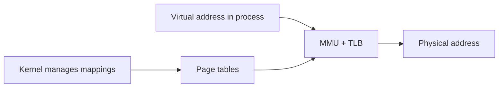
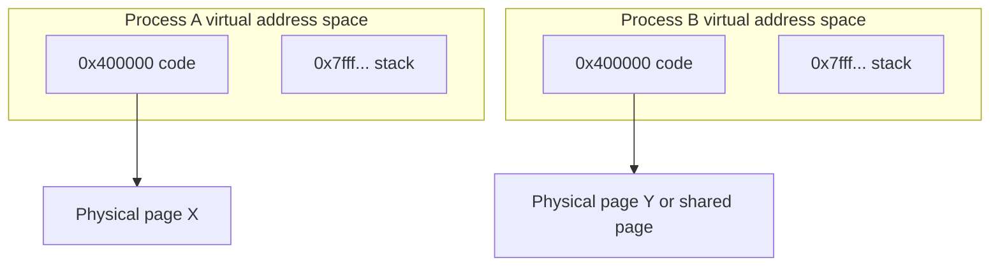

# REX, UNIX, And Virtual Memory

Previous: [Process, Memory, And Executable Image](02-process-memory-and-executable-image.md) | [Index](index.md) | Next: [Fork, Exec, Copy-On-Write, And File Descriptors](04-fork-exec-copy-on-write-and-fds.md)

**Section purpose:** Contrast RTOS-style tasks with UNIX processes and introduce VM as the isolation mechanism.

## Section Bridge

**Arriving from:** [Process, Memory, And Executable Image](02-process-memory-and-executable-image.md). The previous section covered: Explain process anatomy: PCB, stack, heap, executable bytes, ELF, and loading.

**This section answers:** Contrast RTOS-style tasks with UNIX processes and introduce VM as the isolation mechanism.

**Listen for the next question:** once this section lands, the audience should naturally ask why we need **Fork, Exec, Copy-On-Write, And File Descriptors** next.

> **Teaching note:** Read this as one continuous block. The slide-level `Flow` notes explain local transitions; the section-level handoff at the end tells you how to move the room into the next topic.

---

## 15. What Was QComm REX Operating System, Say On ARM7

> **Flow:** From **Summary So Far**, move into **What Was QComm REX Operating System, Say On ARM7**. This page should answer the natural follow-up and prepare the room for **What Is UNIX OS In Comparison To REX, Feature By Feature**.


Qualcomm REX, commonly understood as a real-time executive used historically in Qualcomm modem/software environments, was an RTOS-style kernel.

Public details are limited compared with UNIX/Linux, so treat this as the classic REX/embedded RTOS model rather than a claim about every internal implementation:

- Designed for constrained embedded systems.
- Often deployed on single-core ARM-class processors such as ARM7-era targets.
- Task-based execution model.
- Priority-oriented real-time scheduling.
- Tight interrupt integration.
- Usually no full UNIX-like process model.
- Usually no heavyweight virtual memory isolation.
- Tasks share one address space or a small number of memory regions.
- Strong focus on deterministic response to modem/baseband events.

Typical RTOS priorities:

- Interrupt latency.
- Predictable scheduling.
- Small memory footprint.
- Direct hardware control.
- Static or carefully bounded allocation.
- Avoidance of heavyweight process abstraction.

> **Speaker side-note:** REX is useful pedagogically because it shows what you get when the system is built around tasks and interrupts rather than UNIX processes and virtual memory.

---

## 16. What Is UNIX OS In Comparison To REX, Feature By Feature

> **Flow:** From **What Was QComm REX Operating System, Say On ARM7**, move into **What Is UNIX OS In Comparison To REX, Feature By Feature**. This page should answer the natural follow-up and prepare the room for **Virtual Memory: First Focus**.


| Dimension | REX-style RTOS | UNIX-style OS |
|---|---|---|
| Primary abstraction | Task | Process + thread |
| Memory model | Often shared physical address space | Per-process virtual address spaces |
| Isolation | Limited, design-time discipline | Strong process isolation |
| Scheduler goal | Determinism, priority response | Fairness, throughput, policy mix |
| Hardware target | Embedded constrained systems | General-purpose systems |
| System calls | Smaller, direct kernel services | Rich syscall API |
| Files | Often custom or limited | File descriptor model everywhere |
| User/kernel split | May be thin or absent | Strong user mode/kernel mode |
| Failure blast radius | Bad task can corrupt system | Bad process usually dies alone |
| Debug style | Embedded tracing/JTAG/logs | Process tools, ptrace, procfs, perf |

UNIX gives you stronger isolation and generality.

REX-style RTOS gives you tighter control and often lower overhead.

> **Speaker side-note:** Neither architecture is "better" absolutely. UNIX is great for untrusted/multiprogrammed environments. RTOS is great when you own the whole image and deadlines matter more than user/process isolation.

---

## 17. Virtual Memory: First Focus

> **Flow:** From **What Is UNIX OS In Comparison To REX, Feature By Feature**, move into **Virtual Memory: First Focus**. This page should answer the natural follow-up and prepare the room for **Virtual Memory: Why It Matters To Concurrency**.


Virtual memory means each process sees a virtual address space that the CPU and OS map to physical memory.

Without virtual memory, addresses used by code are close to physical memory addresses.

With virtual memory:

- Program uses virtual addresses.
- CPU Memory Management Unit translates virtual to physical.
- OS maintains page tables.
- Hardware enforces page permissions.
- Processes can use the same virtual address values while mapping to different physical pages.



> **Speaker side-note:** Virtual memory is not only "more memory than RAM". The more important ideas are isolation, flexible mapping, permissions, copy-on-write, mmap, shared libraries, and demand paging.

---

## 18. Virtual Memory: Why It Matters To Concurrency

> **Flow:** From **Virtual Memory: First Focus**, move into **Virtual Memory: Why It Matters To Concurrency**. This page should answer the natural follow-up and prepare the room for **What Is VM And Why We Have VM**.


VM helps concurrency because it lets multiple programs coexist safely.

Benefits:

- Process isolation.
- Per-process address spaces.
- Shared read-only code pages.
- Copy-on-write after `fork`.
- Memory-mapped files.
- Guard pages for stack overflow detection.
- Demand paging.
- Page-level permissions.
- Kernel/user boundary enforcement.

Concurrency without VM requires discipline.

Concurrency with VM gets hardware-backed isolation.

> **Speaker side-note:** VM is one of the reasons UNIX can run arbitrary user programs next to each other. In a shared-address embedded RTOS, one bad pointer can break the whole system.

---

## 19. What Is VM And Why We Have VM

> **Flow:** From **Virtual Memory: Why It Matters To Concurrency**, move into **What Is VM And Why We Have VM**. This page should answer the natural follow-up and prepare the room for **Tasks In A Non-VM System Like REX**.


Virtual memory exists for four main reasons:

1. **Isolation**
   - Process A cannot directly read or write process B memory.

2. **Abstraction**
   - Programs see clean address spaces independent of physical RAM layout.

3. **Efficiency**
   - Code pages and shared libraries can be mapped into many processes.
   - `fork` can use copy-on-write instead of copying all memory immediately.

4. **Control**
   - OS can mark pages read-only, executable, non-executable, or inaccessible.
   - OS can page memory in/out and map files lazily.

Common page states:

- Present.
- Not present.
- Readable.
- Writable.
- Executable or non-executable.
- User-accessible or kernel-only.
- Dirty.
- Accessed.

> **Speaker side-note:** VM is a contract between compiler, linker, loader, kernel, MMU, and CPU. It is not a single feature hidden in one place.

---

## 20. Tasks In A Non-VM System Like REX

> **Flow:** From **What Is VM And Why We Have VM**, move into **Tasks In A Non-VM System Like REX**. This page should answer the natural follow-up and prepare the room for **VM System Like UNIX**.


In a non-VM or limited-VM RTOS-style system:

- Tasks may share a single global address space.
- Code, globals, heap, stacks, and hardware registers may be directly visible.
- A bad pointer in one task can corrupt another task's stack or data.
- Context switch may only need CPU register and stack pointer changes.
- There may be no page table switch.
- IPC can be cheap because pointers can be shared directly.
- Protection relies on design, code review, testing, and sometimes MPU regions.

Benefits:

- Low overhead.
- Predictable timing.
- Simple memory access.
- Efficient ISR-to-task handoff.

Costs:

- Weak isolation.
- Harder fault containment.
- Memory corruption can be system-wide.
- Security boundary is limited.

> **Speaker side-note:** Embedded engineers often accept this because the image is built and tested as one product. UNIX assumes multiple programs, possibly from different authors, sharing one machine.

---

## 21. VM System Like UNIX

> **Flow:** From **Tasks In A Non-VM System Like REX**, move into **VM System Like UNIX**. This page should answer the natural follow-up and prepare the room for **How VM Plays With Process: Address Space**.


In UNIX-like systems:

- Each process has its own virtual address space.
- Kernel memory is mapped separately or protected in privileged regions.
- User pages are not freely accessible by other processes.
- Page tables define what each process can access.
- The scheduler can switch between processes by switching address-space context.
- Shared memory must be explicitly requested.

Important mechanisms:

- `fork()`
- `execve()`
- `mmap()`
- `brk()` / `sbrk()` historically for heap growth
- shared libraries
- copy-on-write
- page faults
- swapping/demand paging



> **Speaker side-note:** The same virtual address can mean different physical memory in different processes. That one sentence removes a lot of confusion.

---

## 22. How VM Plays With Process: Address Space

> **Flow:** From **VM System Like UNIX**, move into **How VM Plays With Process: Address Space**. This page should answer the natural follow-up and prepare the room for **How VM Plays With Process: Fork Vs Exec**.


A process is not just CPU execution. A process owns an address-space map.

Typical UNIX process virtual memory layout:

```text
High addresses
+--------------------------+
| Stack                    |
| guard page               |
| mmap region              |
| shared libraries         |
| heap                     |
| .bss                     |
| .data                    |
| .rodata                  |
| .text                    |
+--------------------------+
Low addresses
```

The kernel tracks mappings:

- Start and end virtual address.
- Permissions.
- Backing object: anonymous memory, file, device, shared memory.
- Copy-on-write state.
- Page table entries.

The key thing to explain carefully:

- The process does not directly "own RAM addresses" in the simple physical sense.
- It owns virtual mappings.
- Each mapping says: "this virtual range means this kind of memory, with these permissions, backed by this object."
- Physical pages can be attached lazily, shared, replaced, or copied.

Example:

```text
Virtual address 0x400000 in process A -> physical page 100
Virtual address 0x400000 in process B -> physical page 900
Virtual address 0x7fff... in process A -> A's stack page
Virtual address 0x7fff... in process B -> B's stack page
```

Same virtual address. Different physical memory.

> **Speaker side-note:** "A process has memory" is imprecise. A process has a virtual memory map. Physical memory is assigned page by page and can change over time.

---

## Lead Into Next Section

**Core takeaway to close with:** Contrast RTOS-style tasks with UNIX processes and introduce VM as the isolation mechanism.

**Verbal handoff:** At this point the listener knows that UNIX processes own virtual address spaces. The natural next step is to explain the most important UNIX process-launch trick: fork, exec, and copy-on-write.

**Opening line for next file:** "Now open [Fork, Exec, Copy-On-Write, And File Descriptors](04-fork-exec-copy-on-write-and-fds.md); it answers the next pressure point in the model."

**Pause check before moving on:** ask the room to summarize the section in one sentence and name the resource or boundary that became clearer.

Previous: [Process, Memory, And Executable Image](02-process-memory-and-executable-image.md) | [Index](index.md) | Next: [Fork, Exec, Copy-On-Write, And File Descriptors](04-fork-exec-copy-on-write-and-fds.md)
