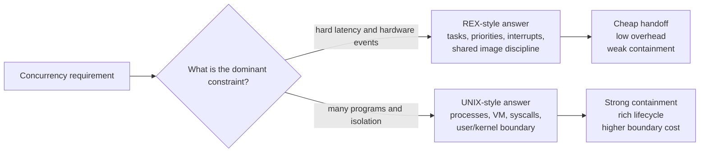
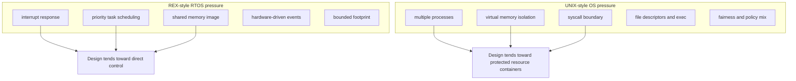
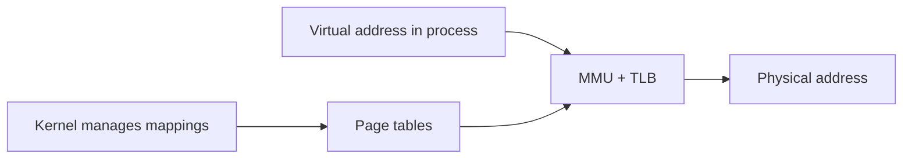
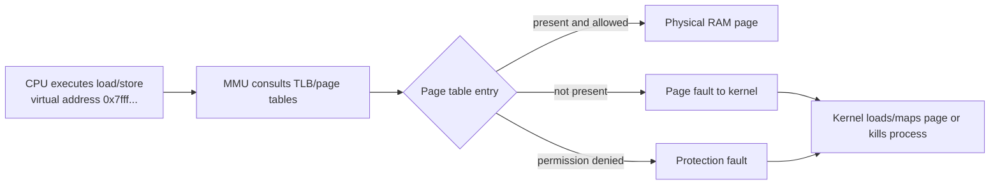
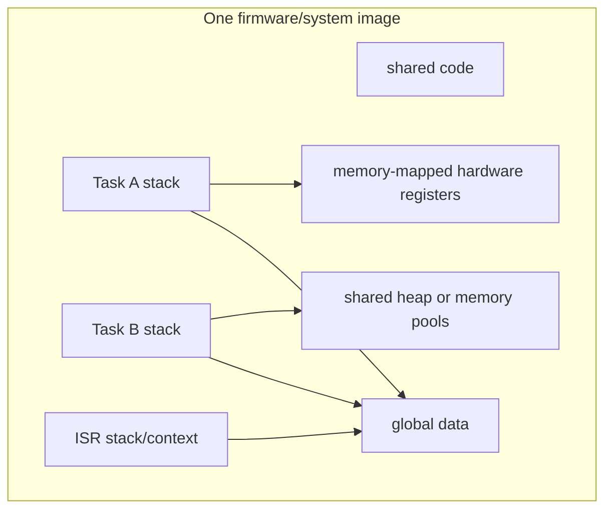
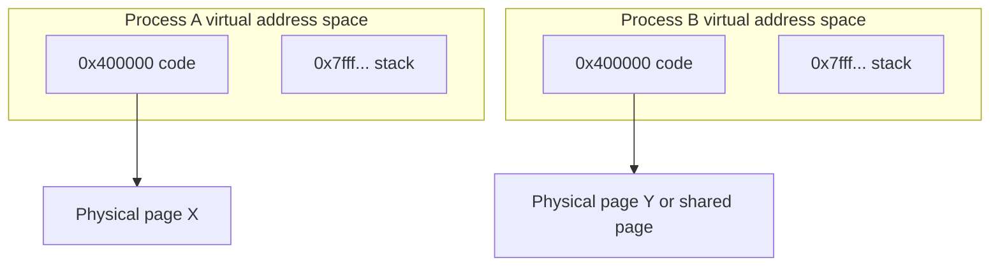

# REX, UNIX, And Virtual Memory

Previous: [Process, Memory, And Executable Image](02-process-memory-and-executable-image.md) | [Index](index.md) | Next: [Fork, Exec, Copy-On-Write, And File Descriptors](04-fork-exec-copy-on-write-and-fds.md)

**Focus:** Contrast RTOS-style tasks with UNIX processes and introduce VM as the isolation mechanism.

## Bridge

**Coming from:** [Process, Memory, And Executable Image](02-process-memory-and-executable-image.md).

**Read this for:** Contrast RTOS-style tasks with UNIX processes and introduce VM as the isolation mechanism.

**Then:** move into **Fork, Exec, Copy-On-Write, And File Descriptors**.

---

## Why Compare REX And UNIX At All?

This comparison is not nostalgia and it is not a contest between operating systems.

The purpose is to show that concurrency mechanisms are not arbitrary. They are answers to different operating constraints.

REX-style non-VM thinking gives the learner a clean starting point. You can see the essentials directly: task, stack, priority, interrupt, shared memory, and watchdog. There is less indirection.

UNIX then becomes the next layer of the same story. It keeps the same core questions, but answers them with more system management:

- Instead of one shared image, it has per-process virtual address spaces.
- Instead of trusting every task equally, it has user/kernel privilege and permissions.
- Instead of direct shared pointers everywhere, it has file descriptors, pipes, sockets, shared memory, and syscalls.
- Instead of one firmware lifecycle, it has `fork`, `exec`, `wait`, signals, sessions, and resource limits.
- Instead of memory corruption being mostly a whole-system problem, it uses VM to contain many failures to one process.

REX-style embedded systems and UNIX-style systems make different promises:

- REX-style systems emphasize bounded latency, direct hardware control, and disciplined shared-system design.
- UNIX-style systems emphasize isolation, multiprogramming, user/kernel separation, and process lifecycle management.
- REX-style systems often trust one integrated firmware image.
- UNIX-style systems assume many independently built programs sharing a machine.
- REX-style systems often make sharing cheap and fault containment expensive.
- UNIX-style systems often make isolation strong and crossing boundaries more expensive.

That contrast is useful because it forces the learner to ask:

- What does the system need to protect?
- What does the system need to schedule?
- What does the system need to recover from?
- What does the system need to share?
- What does the system need to make cheap?
- What failure blast radius is acceptable?



> **Side note:** The comparison is valuable because it explains why the architecture is the way it is. If you only learn UNIX, REX looks unsafe. If you only learn REX, UNIX looks heavy. If you understand both, you can reason about tradeoffs.

---

## 15. What Was QComm REX Operating System, Say On ARM7

> **Flow:** From **Summary So Far**, move into **What Was QComm REX Operating System, Say On ARM7**. This page should answer the natural follow-up and prepare for **What Is UNIX OS In Comparison To REX, Feature By Feature**.

Qualcomm REX, commonly understood as a real-time executive used historically in Qualcomm modem/software environments, was an RTOS-style kernel.

Public details are limited compared with UNIX/Linux, so treat this as the classic REX/embedded RTOS model rather than a claim about every internal implementation:

- Designed for constrained embedded systems.
- Often deployed on single-core ARM-class processors such as ARM7-era targets.
- Task-based execution model.
- Priority-oriented real-time scheduling.
- Tight interrupt integration.
- Usually no full UNIX-like process model.
- Usually no heavyweight virtual memory isolation.
- Tasks share one address space or a small number of memory regions.
- Strong focus on deterministic response to modem/baseband events.

Why start here:

- It makes the minimum unit of scheduling visible: a task that can run, block, wake, and be preempted.
- It makes interrupt pressure concrete before adding UNIX syscalls, page faults, and process accounting.
- It shows what life looks like when memory sharing is cheap but memory protection is weak.
- It prepares the learner to ask why UNIX spends so much effort on VM, process descriptors, file tables, and privilege checks.

Typical RTOS priorities:

- Interrupt latency.
- Predictable scheduling.
- Small memory footprint.
- Direct hardware control.
- Static or carefully bounded allocation.
- Avoidance of heavyweight process abstraction.

> **Side note:** REX is useful pedagogically because it shows what you get when the system is built around tasks and interrupts rather than UNIX processes and virtual memory.

---

## 16. What Is UNIX OS In Comparison To REX, Feature By Feature

> **Flow:** From **What Was QComm REX Operating System, Say On ARM7**, move into **What Is UNIX OS In Comparison To REX, Feature By Feature**. This page should answer the natural follow-up and prepare for **Virtual Memory: First Focus**.

| Dimension | REX-style RTOS | UNIX-style OS |
|---|---|---|
| Primary abstraction | Task | Process + thread |
| Memory model | Often shared physical address space | Per-process virtual address spaces |
| Isolation | Limited, design-time discipline | Strong process isolation |
| Scheduler goal | Determinism, priority response | Fairness, throughput, policy mix |
| Hardware target | Embedded constrained systems | General-purpose systems |
| System calls | Smaller, direct kernel services | Rich syscall API |
| Files | Often custom or limited | File descriptor model everywhere |
| User/kernel split | May be thin or absent | Strong user mode/kernel mode |
| Failure blast radius | Bad task can corrupt system | Bad process usually dies alone |
| Debug style | Embedded tracing/JTAG/logs | Process tools, ptrace, procfs, perf |

UNIX gives you stronger isolation and generality.

REX-style RTOS gives you tighter control and often lower overhead.

The teaching value is in the contrast:

```text
REX-style model: "What must run now, and can the whole product keep making progress?"
UNIX-style model: "How do many independent programs share one machine safely and fairly?"
```

Feature comparison as concurrency pressure:



> **Side note:** Neither architecture is "better" absolutely. UNIX is great for untrusted/multiprogrammed environments. RTOS is great when you own the whole image and deadlines matter more than user/process isolation.

---

## 17. Virtual Memory: First Focus

> **Flow:** From **What Is UNIX OS In Comparison To REX, Feature By Feature**, move into **Virtual Memory: First Focus**. This page should answer the natural follow-up and prepare for **Virtual Memory: Why It Matters To Concurrency**.

Virtual memory means each process sees a virtual address space that the CPU and OS map to physical memory.

Grandma version:

Imagine every tenant gets an apartment numbered "101". Inside each building, "101" is real for that tenant, but it is not the same physical room in every building. Virtual memory lets each process use familiar-looking addresses while the OS maps them to the actual physical memory safely.

Without virtual memory, addresses used by code are close to physical memory addresses.

With virtual memory:

- Program uses virtual addresses.
- CPU Memory Management Unit translates virtual to physical.
- OS maintains page tables.
- Hardware enforces page permissions.
- Processes can use the same virtual address values while mapping to different physical pages.



> **Side note:** Virtual memory is not only "more memory than RAM". The more important ideas are isolation, flexible mapping, permissions, copy-on-write, mmap, shared libraries, and demand paging.

---

## 18. Virtual Memory: Why It Matters To Concurrency

> **Flow:** From **Virtual Memory: First Focus**, move into **Virtual Memory: Why It Matters To Concurrency**. This page should answer the natural follow-up and prepare for **What Is VM And Why We Have VM**.

VM helps concurrency because it lets multiple programs coexist safely.

Benefits:

- Process isolation.
- Per-process address spaces.
- Shared read-only code pages.
- Copy-on-write after `fork`.
- Memory-mapped files.
- Guard pages for stack overflow detection.
- Demand paging.
- Page-level permissions.
- Kernel/user boundary enforcement.

Concurrency without VM requires discipline.

Concurrency with VM gets hardware-backed isolation.

> **Side note:** VM is one of the reasons UNIX can run arbitrary user programs next to each other. In a shared-address embedded RTOS, one bad pointer can break the whole system.

---

## 19. What Is VM And Why We Have VM

> **Flow:** From **Virtual Memory: Why It Matters To Concurrency**, move into **What Is VM And Why We Have VM**. This page should answer the natural follow-up and prepare for **Tasks In A Non-VM System Like REX**.

Virtual memory exists for four main reasons:

1. **Isolation**
   - Process A cannot directly read or write process B memory.

2. **Abstraction**
   - Programs see clean address spaces independent of physical RAM layout.

3. **Efficiency**
   - Code pages and shared libraries can be mapped into many processes.
   - `fork` can use copy-on-write instead of copying all memory immediately.

4. **Control**
   - OS can mark pages read-only, executable, non-executable, or inaccessible.
   - OS can page memory in/out and map files lazily.

Common page states:

- Present.
- Not present.
- Readable.
- Writable.
- Executable or non-executable.
- User-accessible or kernel-only.
- Dirty.
- Accessed.

Address translation picture:



> **Side note:** VM is a contract between compiler, linker, loader, kernel, MMU, and CPU. It is not a single feature hidden in one place.

---

## 20. Tasks In A Non-VM System Like REX

> **Flow:** From **What Is VM And Why We Have VM**, move into **Tasks In A Non-VM System Like REX**. This page should answer the natural follow-up and prepare for **VM System Like UNIX**.

In a non-VM or limited-VM RTOS-style system:

- Tasks may share a single global address space.
- Code, globals, heap, stacks, and hardware registers may be directly visible.
- A bad pointer in one task can corrupt another task's stack or data.
- Context switch may only need CPU register and stack pointer changes.
- There may be no page table switch.
- IPC can be cheap because pointers can be shared directly.
- Protection relies on design, code review, testing, and sometimes MPU regions.

This is exactly why the model is worth learning before UNIX:

- You see what a task switch is before it is mixed with address-space switching.
- You see why shared memory is fast before you see why it is dangerous.
- You see why direct hardware access is attractive before you see why UNIX hides hardware behind kernel APIs.
- You see why a watchdog can be a system-level progress detector before you see richer UNIX process supervision.
- You see what UNIX adds: containment, naming, permissions, accounting, and safer coexistence.

Benefits:

- Low overhead.
- Predictable timing.
- Simple memory access.
- Efficient ISR-to-task handoff.

Costs:

- Weak isolation.
- Harder fault containment.
- Memory corruption can be system-wide.
- Security boundary is limited.

Non-VM task layout:



> **Side note:** Embedded engineers often accept this because the image is built and tested as one product. UNIX assumes multiple programs, possibly from different authors, sharing one machine.

---

## 21. VM System Like UNIX

> **Flow:** From **Tasks In A Non-VM System Like REX**, move into **VM System Like UNIX**. This page should answer the natural follow-up and prepare for **How VM Plays With Process: Address Space**.

In UNIX-like systems:

- Each process has its own virtual address space.
- Kernel memory is mapped separately or protected in privileged regions.
- User pages are not freely accessible by other processes.
- Page tables define what each process can access.
- The scheduler can switch between processes by switching address-space context.
- Shared memory must be explicitly requested.

Compared with the REX-style baseline, UNIX is adding management layers around the same raw facts of execution. CPU still runs instructions. Stacks still hold call state. The scheduler still chooses runnable work. The difference is that UNIX wraps those facts in process identity, VM mappings, kernel-owned resources, and permission checks so unrelated programs can safely coexist.

Important mechanisms:

- `fork()`
- `execve()`
- `mmap()`
- `brk()` / `sbrk()` historically for heap growth
- shared libraries
- copy-on-write
- page faults
- swapping/demand paging



> **Side note:** The same virtual address can mean different physical memory in different processes. That one sentence removes a lot of confusion.

---

## 22. How VM Plays With Process: Address Space

> **Flow:** From **VM System Like UNIX**, move into **How VM Plays With Process: Address Space**. This page should answer the natural follow-up and prepare for **How VM Plays With Process: Fork Vs Exec**.

A process is not just CPU execution. A process owns an address-space map.

Typical UNIX process virtual memory layout:

```text
High addresses
+--------------------------+
| Stack                    |
| guard page               |
| mmap region              |
| shared libraries         |
| heap                     |
| .bss                     |
| .data                    |
| .rodata                  |
| .text                    |
+--------------------------+
Low addresses
```

The kernel tracks mappings:

- Start and end virtual address.
- Permissions.
- Backing object: anonymous memory, file, device, shared memory.
- Copy-on-write state.
- Page table entries.

The key thing to explain carefully:

- The process does not directly "own RAM addresses" in the simple physical sense.
- It owns virtual mappings.
- Each mapping says: "this virtual range means this kind of memory, with these permissions, backed by this object."
- Physical pages can be attached lazily, shared, replaced, or copied.

Example:

```text
Virtual address 0x400000 in process A -> physical page 100
Virtual address 0x400000 in process B -> physical page 900
Virtual address 0x7fff... in process A -> A's stack page
Virtual address 0x7fff... in process B -> B's stack page
```

Same virtual address. Different physical memory.

> **Side note:** "A process has memory" is imprecise. A process has a virtual memory map. Physical memory is assigned page by page and can change over time.

---

## Lead Into Next Section

**Core takeaway to close with:** Contrast RTOS-style tasks with UNIX processes and introduce VM as the isolation mechanism.

**Transition to next section:** At this point the listener knows that UNIX processes own virtual address spaces. The natural next step is to explain the most important UNIX process-launch trick: fork, exec, and copy-on-write.

**Continue reading:** Continue with [Fork, Exec, Copy-On-Write, And File Descriptors](04-fork-exec-copy-on-write-and-fds.md) to follow the next layer of the model.

**Pause check before moving on:** pause and summarize the section in one sentence and name the resource or boundary that became clearer.

Previous: [Process, Memory, And Executable Image](02-process-memory-and-executable-image.md) | [Index](index.md) | Next: [Fork, Exec, Copy-On-Write, And File Descriptors](04-fork-exec-copy-on-write-and-fds.md)
