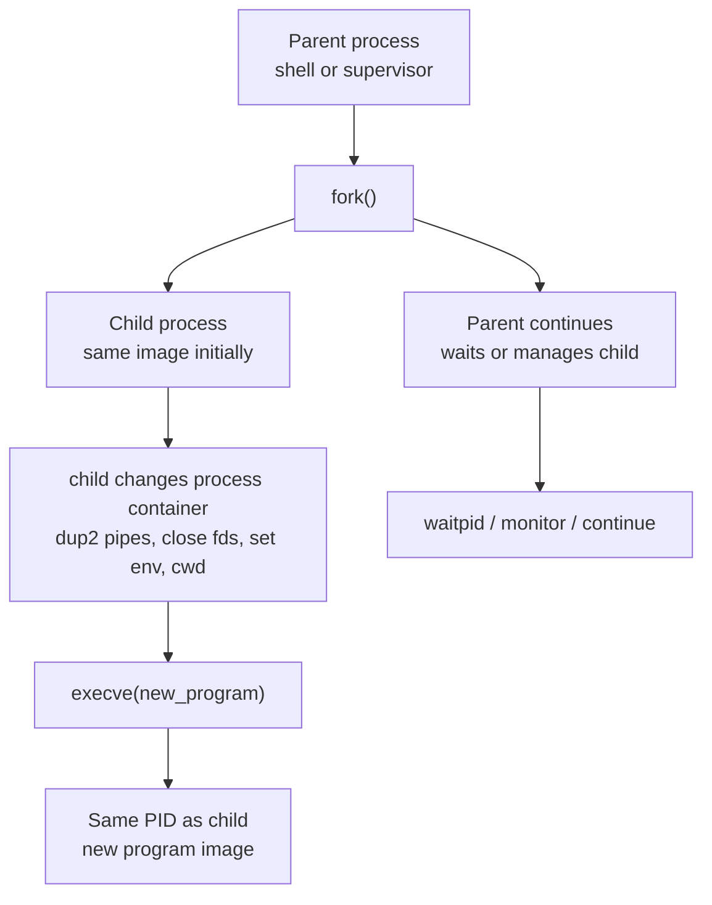
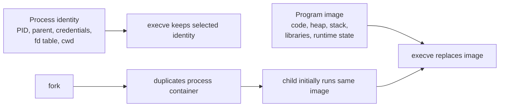
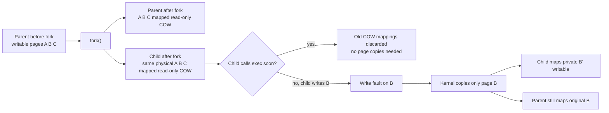
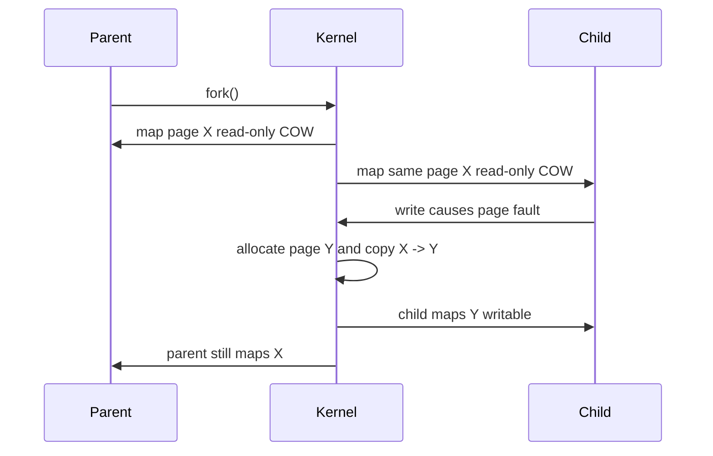
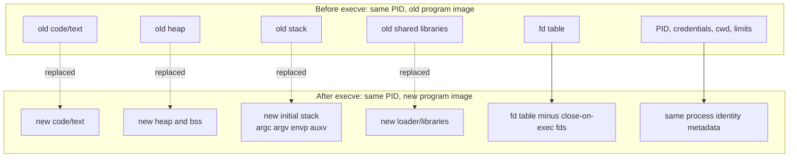
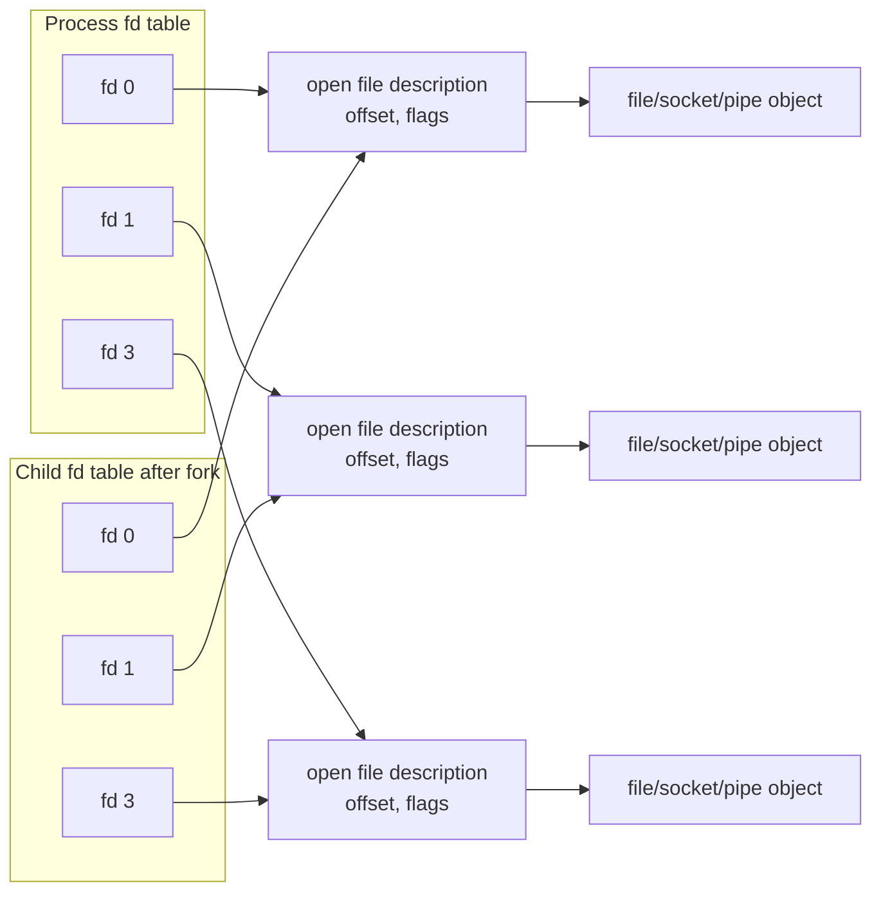

# Fork, Exec, Copy-On-Write, And File Descriptors

Previous: [REX, UNIX, And Virtual Memory](03-rex-unix-and-virtual-memory.md) | [Index](index.md) | Next: [Kernel Space And User Space](05-kernel-space-user-space.md)

**Section purpose:** Remove ambiguity around fork, exec, COW, page faults, context, and FD inheritance.

## Section Bridge

**Arriving from:** [REX, UNIX, And Virtual Memory](03-rex-unix-and-virtual-memory.md). The previous section covered: Contrast RTOS-style tasks with UNIX processes and introduce VM as the isolation mechanism.

**This section answers:** Remove ambiguity around fork, exec, COW, page faults, context, and FD inheritance.

**Watch for the next question:** once this section lands, the next natural question is why we need **Kernel Space And User Space** next.

> **Reading note:** Read this as one continuous block. The slide-level `Flow` notes explain local transitions; the section-level transition at the end connects this topic to the next one.

---

## 23. How VM Plays With Process: Fork Vs Exec

> **Flow:** From **How VM Plays With Process: Address Space**, move into **How VM Plays With Process: Fork Vs Exec**. This page should answer the natural follow-up and prepare for **How VM Plays With Process: What Fork Copies Immediately**.


`fork()` and `exec()` are different operations.

Why the learner needs this part:

- It is the center of the UNIX process model.
- It explains how shells launch programs while applying redirection, pipes, environment, and working directory changes.
- It explains why process identity and program image are separate ideas.
- It explains why file descriptors survive into a new program unless marked close-on-exec.
- It explains why `fork()` in a multithreaded process is dangerous before `exec()`.
- It explains why copy-on-write exists and why process creation can be fast.
- It explains common production bugs: fd leaks, zombie processes, double-executed code after `fork`, and unsafe child initialization.



`fork()`:

- Creates a new child process.
- Child starts as a near-clone of the parent.
- Child has a new PID.
- Child gets its own process descriptor.
- Child appears to return from the same `fork()` call.
- Parent receives child's PID as return value.
- Child receives `0` as return value.

`execve()`:

- Does not create a new process.
- Replaces the current process image with a new program.
- Keeps the same PID.
- Replaces old code, heap, stack, and memory mappings.
- Rebuilds user stack with new `argv`, `envp`, and auxiliary vector.
- Keeps selected process resources, especially file descriptors not marked close-on-exec.

Short version:

```text
fork = create another process running the same program image
exec = replace this process with a different program image
```

Mental split:



> **Side note:** This is where many people get UNIX wrong. `exec` is not "start a new process." `fork` starts a new process; `exec` changes what that process is running.

---

## 24. How VM Plays With Process: What Fork Copies Immediately

> **Flow:** From **How VM Plays With Process: Fork Vs Exec**, move into **How VM Plays With Process: What Fork Copies Immediately**. This page should answer the natural follow-up and prepare for **How VM Plays With Process: What Remains Common After Fork**.


When a process calls `fork()`, the kernel must create a child process that behaves as if it got a copy of the parent.

But "copy" does not mean "copy every byte of RAM immediately."

What is copied or newly created immediately:

- New process ID.
- New process descriptor / PCB-like kernel structures.
- New scheduler entity.
- New kernel stack for the child.
- New user-visible return value from `fork()`.
- New file descriptor table entries pointing to the same underlying open file descriptions.
- New virtual memory map metadata.
- New page tables or page-table structures that initially point to many of the same physical pages.
- Signal pending state is not simply identical in all details; UNIX systems define exact inheritance rules.
- Resource accounting starts separately for the child.

What is not copied byte-for-byte immediately in modern UNIX:

- Most anonymous memory pages.
- Heap contents page data.
- Stack page data.
- Private writable data pages.

Those are initially shared and protected by copy-on-write.

> **Side note:** Fork creates the illusion of a full copy. The OS implements that illusion lazily because most forked children immediately call `exec`.

---

## 25. How VM Plays With Process: What Remains Common After Fork

> **Flow:** From **How VM Plays With Process: What Fork Copies Immediately**, move into **How VM Plays With Process: What Remains Common After Fork**. This page should answer the natural follow-up and prepare for **How VM Plays With Process: Why Copy-On-Write Exists**.


After `fork()`, parent and child are separate processes, but some things remain shared or refer to the same kernel objects.

Common or shared initially:

- Physical memory pages for private mappings, until one side writes.
- Read-only executable code pages.
- Shared library code pages.
- Memory-mapped file pages, depending on mapping type.
- Underlying open file descriptions.
- File offsets for inherited file descriptors that refer to the same open file description.
- Pipes, sockets, terminals, devices.

Separate immediately:

- PID.
- Process descriptor.
- Scheduler state.
- User stack mapping identity, even if physical stack pages are initially COW-shared.
- Heap mapping identity, even if physical heap pages are initially COW-shared.
- Signal masks/pending state according to OS rules.
- Address-space metadata structures.

Surprise example:

```c
int fd = open("log.txt", O_WRONLY | O_APPEND);
pid_t pid = fork();
// parent and child both have an fd number pointing to the same open file description
```

> **Side note:** Parent and child have separate file descriptor tables, but entries can point to the same underlying open file description. "Separate table" does not always mean "separate file offset."

---

## 26. How VM Plays With Process: Why Copy-On-Write Exists

> **Flow:** From **How VM Plays With Process: What Remains Common After Fork**, move into **How VM Plays With Process: Why Copy-On-Write Exists**. This page should answer the natural follow-up and prepare for **How VM Plays With Process: Copy-On-Write Mechanics**.


Copy-on-write exists because eager copying would be wasteful.

Naive `fork()` without COW:

```text
Parent has 8 GB address space
fork copies all writable pages immediately
Child immediately calls exec("/bin/grep")
All copied pages are thrown away
```

That is terrible because:

- Most copied memory may never be read by child.
- Most copied memory may never be written by either side.
- `fork+exec` is common in shells and process launchers.
- Large processes would make process creation very expensive.
- Memory bandwidth would be wasted.
- Physical RAM pressure would spike.

Copy-on-write strategy:

- Share pages initially.
- Mark writable private pages as read-only/COW in both parent and child.
- If no one writes, no physical copy happens.
- If someone writes, copy only that page.
- Keep the illusion that parent and child have private memory.

Why this is cheaper:



> **Side note:** COW is laziness as an optimization. The OS delays work until it proves the work is necessary.

---

## 27. How VM Plays With Process: Copy-On-Write Mechanics

> **Flow:** From **How VM Plays With Process: Why Copy-On-Write Exists**, move into **How VM Plays With Process: Copy-On-Write Mechanics**. This page should answer the natural follow-up and prepare for **How VM Plays With Process: What Exec Replaces And What Survives**.


`fork()` creates a child process with a nearly identical virtual address space.

Modern COW approach:

- Parent and child page tables point to the same physical page for many private mappings.
- Those page table entries are marked read-only plus COW metadata.
- Parent and child can read the page freely.
- If either tries to write, CPU raises a page fault because the page is not writable.
- Kernel sees the fault is a valid COW write.
- Kernel allocates a new physical page.
- Kernel copies old page contents into the new page.
- Kernel updates the writer's page table entry to point to the new page with write permission.
- Other process keeps mapping the original page.
- Faulting instruction is retried and now succeeds.



> **Side note:** The write instruction does not know about COW. It only sees a protection fault. The kernel interprets that fault using VM metadata.

---

## 28. How VM Plays With Process: What Exec Replaces And What Survives

> **Flow:** From **How VM Plays With Process: Copy-On-Write Mechanics**, move into **How VM Plays With Process: What Exec Replaces And What Survives**. This page should answer the natural follow-up and prepare for **How Process Loads Revisited With Fork, Exec, File Descriptors, Memory, VM**.


`execve()` keeps the process identity but replaces the program image.

Replaced by `execve()`:

- Old executable code mappings.
- Old heap.
- Old stack.
- Old anonymous private mappings, unless special rules apply.
- Old shared library mappings.
- Old dynamic-loader state.
- Old C runtime state.
- Old thread state; after exec, the process is effectively single-threaded running the new image.

Survives across `execve()`:

- PID.
- Parent PID.
- Many credentials and permissions.
- Current working directory.
- Root directory.
- File descriptors not marked `FD_CLOEXEC`.
- Some signal dispositions reset while ignored signals may remain ignored according to UNIX rules.
- Resource limits.
- Process group/session relationship.

Exec boundary as a picture:



Why this matters:

- Shell can open/redirect file descriptors before `exec`.
- Child can inherit socket or pipe endpoints.
- Servers can pass listening sockets across exec during restart.
- FD leaks across exec can become security bugs.

> **Side note:** `exec` is memory death and descriptor survival. That phrase sticks.

---

## 29. How Process Loads Revisited With Fork, Exec, File Descriptors, Memory, VM

> **Flow:** From **How VM Plays With Process: What Exec Replaces And What Survives**, move into **How Process Loads Revisited With Fork, Exec, File Descriptors, Memory, VM**. This page should answer the natural follow-up and prepare for **How VM Plays With Process: Page Faults**.


A shell running a command demonstrates process, FD, memory, and VM together.

Example:

```sh
grep error app.log > errors.txt
```

Timeline:

```text
Shell process
  |
  | fork()
  v
Child process initially looks like shell
  - same program image by COW
  - inherited fd table
  - separate PID
  |
  | open("errors.txt")
  | dup2(file_fd, 1)
  | execve("/usr/bin/grep", ["grep","error","app.log"], env)
  v
Same child PID now runs grep
  - old shell memory replaced
  - grep ELF mapped
  - fd 1 still points to errors.txt
  |
  | write(1, ...)
  v
Output goes to errors.txt
```

Conceptual steps:

1. Shell parses command.
2. Shell calls `fork()`.
3. Child inherits shell's fd table and COW VM mappings.
4. Child opens `errors.txt`.
5. Child makes fd `1` point to `errors.txt` using `dup2`.
6. Child calls `execve("/usr/bin/grep", ...)`.
7. Kernel replaces child VM image with grep image.
8. File descriptor table survives exec unless close-on-exec flag is set.
9. Grep writes to fd `1`; output goes to file.

> **Side note:** This sequence is the UNIX process model in miniature: clone process, adjust descriptors, replace memory image, run new program.

---

## 30. How VM Plays With Process: Page Faults

> **Flow:** From **How Process Loads Revisited With Fork, Exec, File Descriptors, Memory, VM**, move into **How VM Plays With Process: Page Faults**. This page should answer the natural follow-up and prepare for **What Is Context**.


A page fault is not always a bug.

For the main concurrency path, keep this narrow: page faults matter here because copy-on-write, demand loading, stack growth, and invalid memory access all meet at the same kernel mechanism. You do not need a full virtual-memory implementation tour before understanding threads.

Page faults happen when:

- Page is not present and must be loaded.
- Page is copy-on-write and someone writes.
- Page permission is violated.
- Stack grows into a valid guard-supported region.
- Memory-mapped file page is touched for first time.

Fault handling:

1. CPU traps into kernel.
2. Kernel inspects faulting address and access type.
3. Kernel checks process VM map.
4. If valid, kernel resolves fault.
5. If invalid, kernel sends signal such as `SIGSEGV`.
6. Process resumes or dies.

> **Side note:** A page fault is a synchronous trap caused by the current instruction. An interrupt is asynchronous to current code. That difference matters in debugging.

---

## 31. What Is Context

> **Flow:** From **How VM Plays With Process: Page Faults**, move into **What Is Context**. This page should answer the natural follow-up and prepare for **File Descriptors, Memory, VM, Etc.**.


Context is the state required to pause an execution unit and later resume it correctly.

For a process/thread, context may include:

- Program counter.
- Stack pointer.
- General-purpose registers.
- Floating-point/vector registers if used.
- CPU status flags.
- Privilege mode state.
- Memory address-space identifier or page table root.
- Kernel stack.
- Scheduling metadata.
- Signal mask.
- Thread-local storage pointer.

For a coroutine, context may include:

- Coroutine frame.
- Instruction continuation point.
- Saved local variables.
- Awaited future/promise state.

> **Side note:** Context is not a vague word. Ask: "What exact state must I save so this execution can continue as if nothing happened?"

---

## 32. File Descriptors, Memory, VM, Etc.

> **Flow:** From **What Is Context**, move into **File Descriptors, Memory, VM, Etc.**. This page should answer the natural follow-up and prepare for **How Process Loads Revisited After File Descriptors**.


A UNIX process context includes more than registers.

Important process resources:

- **File descriptor table:** small integers map to open file descriptions.
- **Open file descriptions:** file offset, status flags, underlying inode/socket/pipe.
- **Memory map:** virtual regions and permissions.
- **Signal table:** handlers and masks.
- **Credentials:** UID, GID, capabilities.
- **Current working directory.**
- **Root directory.**
- **Environment variables.**
- **Resource limits.**

File descriptor example:

```text
Process fd table
  0 -> stdin open file description
  1 -> stdout open file description
  2 -> stderr open file description
  3 -> socket
```

Relationship map:



> **Side note:** `fork()` duplicates file descriptors, but the underlying open file description can be shared. That means parent and child may share file offset. This surprises people.

---

## 32A. Optional UNIX Detail: Descriptor, Open File Description, Inode

The main path only needs this practical rule:

> A file descriptor is process-local, but after `fork()` two descriptors can still refer to the same underlying open file description.

That is enough to understand fd inheritance, shell redirection, shared offsets, pipes, and sockets during `fork+exec`.

The deeper Bach-style distinction between descriptor table, system-wide open file table entry, and inode-like file object is useful, but it is UNIX-specific enough to treat as optional reference material.

Read [Appendix D. Bach-Style File Model](13-appendices.md#appendix-d-bach-style-file-model-descriptor-open-file-description-inode) when you want the full model.

> **Side note:** This keeps the main flow about concurrency and process launch, while preserving the UNIX depth for readers who want it.

---

## 32B. Embedded-To-Web Assumption Trap: Handles Are Not Objects

Embedded systems often make handles feel direct:

```text
handle -> driver object or memory region
```

UNIX and web systems often add more layers:

```text
fd -> open file description -> inode/socket/pipe
HTTP request -> framework object -> socket -> fd -> kernel socket state
DB connection handle -> pool entry -> TCP socket -> fd -> kernel socket state
```

Why this matters for a web developer with embedded background:

- Closing a high-level object may or may not immediately close the underlying fd.
- A connection pool may keep sockets alive after request completion.
- A duplicated fd may keep a resource alive after one fd is closed.
- A child process can accidentally inherit fds unless close-on-exec is set.
- A leaked fd in a web service can become "too many open files."

Concrete production symptom:

```text
service uses HTTP client
responses are not fully read/closed
connection pool cannot reuse sockets
fds accumulate
process hits fd limit
new connections fail
```

The UNIX lesson:

> Track the real resource and its reference path, not only the high-level object.

> **Side note:** Embedded engineers often have excellent hardware-resource instincts. Reuse that instinct in web systems: sockets, fds, DB connections, file handles, and queues are all finite resources with ownership.

---

## 33. How Process Loads Revisited After File Descriptors

> **Flow:** From **File Descriptors, Memory, VM, Etc.**, move into **How Process Loads Revisited After File Descriptors**. This page should answer the natural follow-up and prepare for **Summary So Far**.


After understanding file descriptors, revisit process launch one more time.

What the shell wants:

```sh
grep error app.log > errors.txt
```

What must be true when `grep` starts:

- `grep` must be a new program image.
- It should not overwrite the shell's own memory.
- It should receive arguments: `grep`, `error`, `app.log`.
- Its stdout, fd `1`, should point to `errors.txt`.
- The shell should remain alive to accept the next command.

Why UNIX uses `fork` then `exec`:

1. Shell calls `fork()` so the child can be modified without harming the shell.
2. Child inherits fd table, current directory, environment, and COW VM image.
3. Child changes only what must differ, such as stdout redirection.
4. Child calls `execve()` to replace shell code with grep code.
5. Parent shell waits or continues depending on foreground/background job.

What survives the `exec` boundary:

- fd `1` still points to `errors.txt`.
- PID of the child remains the same.
- Current directory and selected process attributes remain.

What does not survive:

- The child copy of the shell's heap.
- The child copy of the shell's stack.
- The child copy of the shell executable mapping.
- The child copy of the shell runtime state.

> **Side note:** This is why fork-before-exec is powerful: the child can customize the process container before the new program image enters it.

---

## 34. Summary So Far

> **Flow:** From **How Process Loads Revisited After File Descriptors**, move into **Summary So Far**. This page should answer the natural follow-up and prepare for **Kernel Space Vs User Space**.


We added VM and UNIX resource context:

- REX-style RTOS tasks often run in shared memory.
- UNIX processes run with virtual memory isolation.
- VM gives isolation, permissions, lazy loading, COW, and file mapping.
- Process context includes address space and kernel-managed resources.
- File descriptors are process-visible handles to kernel objects.
- `fork`, `exec`, `mmap`, page faults, and fd inheritance are central to UNIX execution.

Why the REX contrast still matters here:

- In a shared-image RTOS, launching another independent program image is usually not the central operation.
- In UNIX, process creation and image replacement are central because the OS is a platform for many programs.
- `fork`, `exec`, COW, and fd inheritance are the machinery UNIX needs once it commits to isolated process containers.
- The simpler REX-style model helps the learner feel why this machinery is extra work and what problem that extra work solves.

Concurrency connection:

- VM makes concurrent processes safer.
- FDs let processes communicate through pipes, sockets, files.
- Shared memory is explicit and therefore easier to reason about.
- Context switching between processes may include address-space changes.

> **Side note:** By now you should be able to explain why process isolation is powerful and why it has cost.

---

## References For This Section

- [Linux man-pages: `fork(2)`](https://man7.org/linux/man-pages/man2/fork.2.html)
- [Linux man-pages: `execve(2)`](https://man7.org/linux/man-pages/man2/execve.2.html)
- [Linux man-pages: `open(2)`](https://man7.org/linux/man-pages/man2/open.2.html)
- [Linux man-pages: `dup(2)`](https://man7.org/linux/man-pages/man2/dup.2.html)
- [Linux man-pages: `mmap(2)`](https://man7.org/linux/man-pages/man2/mmap.2.html)

Use these when checking `fork`, `exec`, copy-on-write notes, file descriptor inheritance, open file descriptions, and memory mappings.

---

## Lead Into Next Section

**Core takeaway to close with:** Remove ambiguity around fork, exec, COW, page faults, context, and FD inheritance.

**Transition to next section:** After showing how UNIX creates and replaces process images, transition to the protection boundary that makes this safe: kernel space versus user space.

**Continue reading:** Continue with [Kernel Space And User Space](05-kernel-space-user-space.md) to follow the next layer of the model.

**Pause check before moving on:** pause and summarize the section in one sentence and name the resource or boundary that became clearer.

Previous: [REX, UNIX, And Virtual Memory](03-rex-unix-and-virtual-memory.md) | [Index](index.md) | Next: [Kernel Space And User Space](05-kernel-space-user-space.md)
