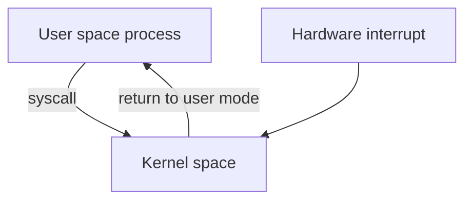
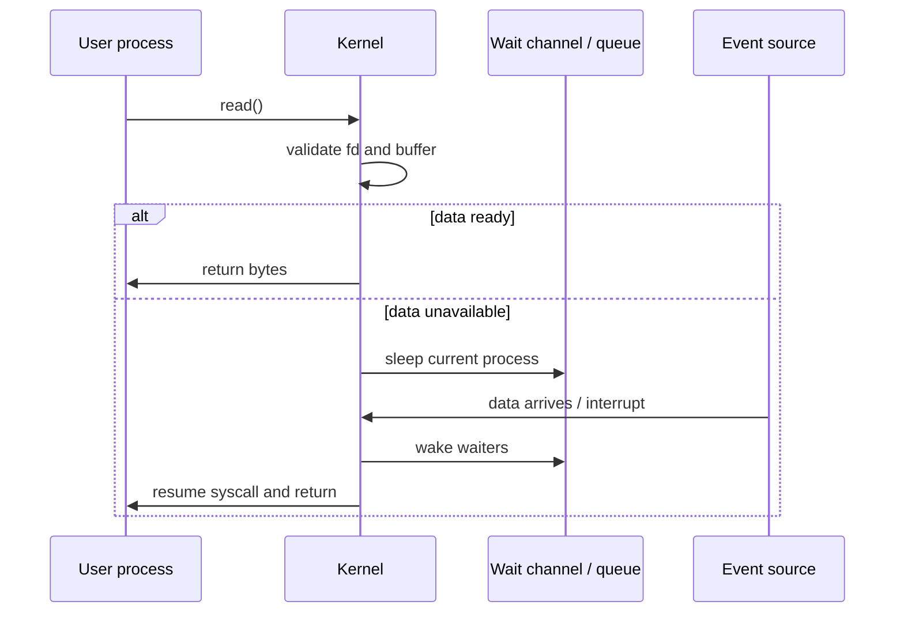

# Kernel Space And User Space

Previous: [Fork, Exec, Copy-On-Write, And File Descriptors](04-fork-exec-copy-on-write-and-fds.md) | [Index](index.md) | Next: [Scheduling, Priority, And Interrupts](06-scheduling-priority-and-interrupts.md)

**Focus:** Explain privilege, memory protection, system calls, and why UNIX needs a kernel boundary.

## Bridge

**Coming from:** [Fork, Exec, Copy-On-Write, And File Descriptors](04-fork-exec-copy-on-write-and-fds.md).

**Read this for:** Explain privilege, memory protection, system calls, and why UNIX needs a kernel boundary.

**Then:** move into **Scheduling, Priority, And Interrupts**.

---

## 35. Why User Space Cannot Own The Whole Machine

> **Flow:** From **Summary So Far**, move into **Why User Space Cannot Own The Whole Machine**. This page should answer the natural follow-up and prepare for **Kernel Space Vs User Space In Deeper Details**.

👵 Grandma version:

Think of user space as guests in a hotel room and kernel space as the building staff with master keys. Guests can use their room, call reception, and request service, but they should not rewire electricity, open every door, or change the elevator controls. The boundary exists so one careless guest cannot damage the whole building.

User space:

- Runs application code.
- Uses restricted CPU privilege.
- Cannot directly access arbitrary hardware.
- Cannot directly modify page tables or scheduler state.
- Requests services through system calls.

Kernel space:

- Runs OS kernel code.
- Uses privileged CPU mode.
- Manages memory, devices, filesystems, networking, scheduling.
- Handles interrupts and traps.
- Enforces isolation and permissions.

Boundary crossing:

- System call.
- Interrupt.
- Exception/trap.



> **Side note:** The kernel is not another library linked into your process. It is privileged code entered through controlled gates.

---

## 36. Kernel Space Vs User Space In Deeper Details

> **Flow:** From **Why User Space Cannot Own The Whole Machine**, move into **Kernel Space Vs User Space In Deeper Details**. This page should answer the natural follow-up and prepare for **Memory Boundary Between Kernel And User Space**.

Modern CPUs support privilege levels.

Typical split:

- User mode cannot execute privileged instructions.
- User mode cannot access kernel-only pages.
- User mode cannot directly program MMU, interrupt controller, or devices.
- Kernel mode can access hardware and manage process state.

System call path:

1. User code places syscall number and arguments in agreed registers/stack.
2. User code executes syscall/trap instruction.
3. CPU switches to privileged mode.
4. CPU jumps to kernel syscall entry.
5. Kernel validates arguments.
6. Kernel performs requested operation.
7. Kernel returns result and switches back to user mode.

Cost factors:

- Mode switch.
- Validation.
- Possible blocking.
- Scheduler involvement.
- Cache/TLB effects.
- Security mitigations on modern CPUs.

> **Side note:** System calls are not "just function calls". They are controlled crossings into privileged execution with validation and possible scheduling side effects.

---

## 36A. System Call View: Trap, Validate, Sleep, Wake

A very useful UNIX teaching pattern is:

```text
user process
  -> system call trap
  -> kernel validates state
  -> kernel either completes work or sleeps process
  -> some event wakes process
  -> syscall returns
```

Example:

```c
read(fd, buf, len);
```

Kernel path conceptually:

1. Enter kernel through syscall trap.
2. Find process's fd table.
3. Resolve fd to open file entry.
4. Resolve file entry to inode/socket/pipe/device.
5. Check permissions and state.
6. If data is ready, copy to user buffer.
7. If data is not ready and fd is blocking, sleep.
8. Another event makes data available.
9. Wake sleeping process.
10. Return to user mode with byte count or error.



This is a major concurrency idea:

- A blocked process is not running.
- It is represented by kernel state.
- It is waiting for a condition.
- Wakeup makes it runnable again.

> **Side note:** The classic sleep/wakeup model is still practical for backend engineers. A modern web request blocked on socket, DB, futex, or epoll still fits this "sleep until condition changes" shape.

---

## 36B. Lost Wakeup: The Old UNIX Lesson That Still Matters

A lost wakeup happens when a thread/process decides to sleep after the event it needed has already happened.

Broken conceptual pattern:

```text
Task checks condition: false
Event happens and wakeup is sent
Task goes to sleep
No one wakes it again
Task sleeps forever
```

Correct pattern requires checking the condition and sleeping atomically with respect to the event producer.

This is why condition variables are paired with mutexes:

```c
pthread_mutex_lock(&m);
while (!ready) {
    pthread_cond_wait(&cv, &m);
}
pthread_mutex_unlock(&m);
```

`pthread_cond_wait` releases the mutex and sleeps as one coordinated operation.

Embedded parallel:

- Task waits on signal/event.
- ISR or another task sets signal.
- Kernel/RTOS must avoid missing the signal between check and sleep.

Web parallel:

- Event loop registers interest in socket readiness.
- Runtime must avoid missing readiness transition.
- Future/promise completion must safely publish state before waking awaiters.

> **Side note:** Lost wakeup is not an old textbook bug. It is the ancestor of many modern "hung future", "missed notification", and "stuck waiter" bugs.

---

## 37. Memory Boundary Between Kernel And User Space

> **Flow:** From **Kernel Space Vs User Space In Deeper Details**, move into **Memory Boundary Between Kernel And User Space**. This page should answer the natural follow-up and prepare for **Why We Need Kernel Space, Compare REX Vs UNIX**.

In a UNIX-like VM system:

- User pages are accessible in user mode.
- Kernel pages are accessible only in kernel mode.
- The kernel may map its own memory into every process's page tables but mark it supervisor-only.
- User pointers passed to syscalls must be validated.
- Kernel copies data in/out using safe routines.

Example syscall problem:

```c
write(fd, user_buffer, len);
```

Kernel must ask:

- Is `fd` valid?
- Is `user_buffer` a valid user address?
- Is the memory readable by this process?
- Can copying fault?
- What if another thread changes memory while kernel copies?

> **Side note:** Kernel code treats user memory as hostile, even if the process is not malicious. It can be invalid, unmapped, racing, or intentionally crafted.

---

## 38. Why We Need Kernel Space, Compare REX Vs UNIX

> **Flow:** From **Memory Boundary Between Kernel And User Space**, move into **Why We Need Kernel Space, Compare REX Vs UNIX**. This page should answer the natural follow-up and prepare for **Multiple Processes Simultaneously: What It Throws Into Action**.

REX-style RTOS:

- Often assumes trusted tasks in one firmware image.
- Hardware control may be direct or through thin kernel APIs.
- Isolation is less central.
- Determinism and low overhead dominate.

Learning value:

- REX-style systems show the simpler question: "Can trusted tasks coordinate with low overhead and meet timing?"
- UNIX adds the harder question: "Can untrusted or independent programs share CPU, memory, files, and devices without corrupting each other?"
- Kernel space in UNIX is easier to appreciate once you have seen a model where some protection is replaced by discipline and whole-image ownership.

UNIX:

- Assumes multiple programs, users, permissions, files, sockets, devices.
- Needs strong isolation.
- Needs protection from buggy or malicious programs.
- Needs centralized resource arbitration.

Kernel space is needed in UNIX to:

- Protect processes from each other.
- Protect hardware from user code.
- Enforce permissions.
- Schedule CPU time.
- Manage memory.
- Multiplex devices.
- Provide stable abstractions.

> **Side note:** In embedded firmware, the product is the system. In UNIX, the OS is a platform for many programs with different trust levels.

---

## 39. Multiple Processes Simultaneously: What It Throws Into Action

> **Flow:** From **Why We Need Kernel Space, Compare REX Vs UNIX**, move into **Multiple Processes Simultaneously: What It Throws Into Action**. This page should answer the natural follow-up and prepare for **Summary So Far**.

When multiple processes run:

- Scheduler chooses who runs.
- VM isolates address spaces.
- Kernel handles page faults.
- File systems serialize shared file access.
- Network stack multiplexes sockets.
- IPC mechanisms connect processes.
- Signals may interrupt process flow.
- Accounting tracks CPU, memory, I/O.
- Resource limits prevent domination.

Problems introduced:

- Starvation.
- Priority inversion.
- Deadlock across IPC.
- Thundering herd.
- FD leaks.
- Zombie processes.
- Memory pressure.
- Cache contention.
- Lock contention inside kernel.

> **Side note:** Concurrency does not only create bugs in user code. It also forces the kernel to become a concurrency manager for CPU, memory, files, devices, and network.

---

## 40. Summary So Far

> **Flow:** From **Multiple Processes Simultaneously: What It Throws Into Action**, move into **Summary So Far**. This page should answer the natural follow-up and prepare for **Why Scheduling Policy Exists: REX Vs UNIX**.

We added protection:

- User space runs application code with limited privilege.
- Kernel space owns privileged resource management.
- System calls are controlled transitions.
- User memory must be validated by the kernel.
- REX-style systems may accept less isolation for lower overhead.
- UNIX needs kernel isolation because it runs many independent programs and must manage resources across trust boundaries.
- The REX-style baseline helps the learner see kernel/user separation as added responsibility, not ceremony.

Concurrency connection:

- The kernel arbitrates shared hardware.
- The scheduler is the core concurrency engine.
- User/kernel transitions are points where blocking and rescheduling can happen.

> **Side note:** This is the bridge into scheduling. Once multiple runnable things exist, somebody must decide who gets the CPU next.

---

## Lead Into Next Section

**Core takeaway to close with:** Explain privilege, memory protection, system calls, and why UNIX needs a kernel boundary.

**Transition to next section:** Once the kernel boundary is clear, the next question is who gets the CPU when many protected processes want to run.

**Continue reading:** Continue with [Scheduling, Priority, And Interrupts](06-scheduling-priority-and-interrupts.md) to follow the next layer of the model.

**Pause check before moving on:** pause and summarize the section in one sentence and name the resource or boundary that became clearer.

Previous: [Fork, Exec, Copy-On-Write, And File Descriptors](04-fork-exec-copy-on-write-and-fds.md) | [Index](index.md) | Next: [Scheduling, Priority, And Interrupts](06-scheduling-priority-and-interrupts.md)
