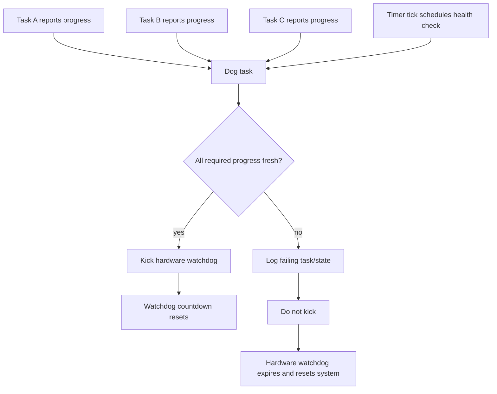
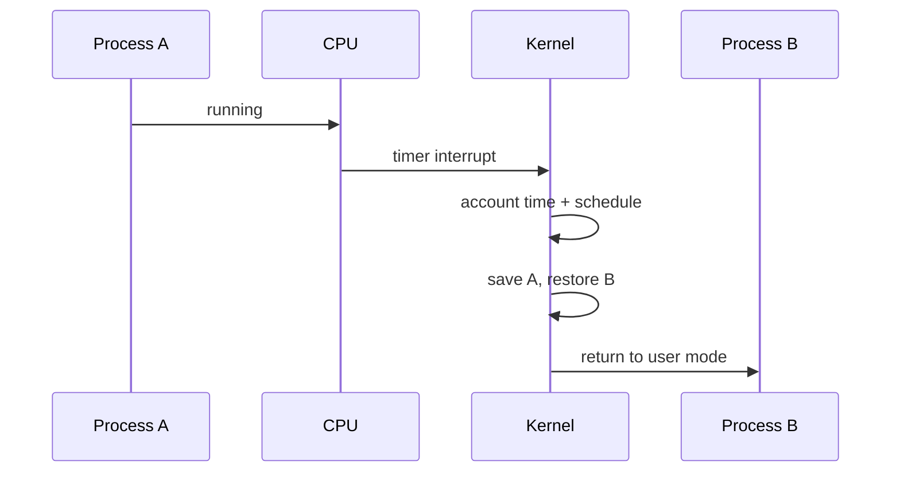
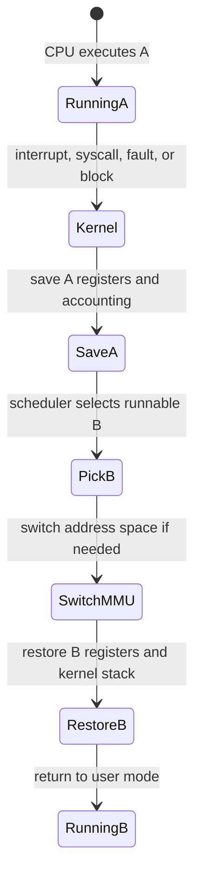
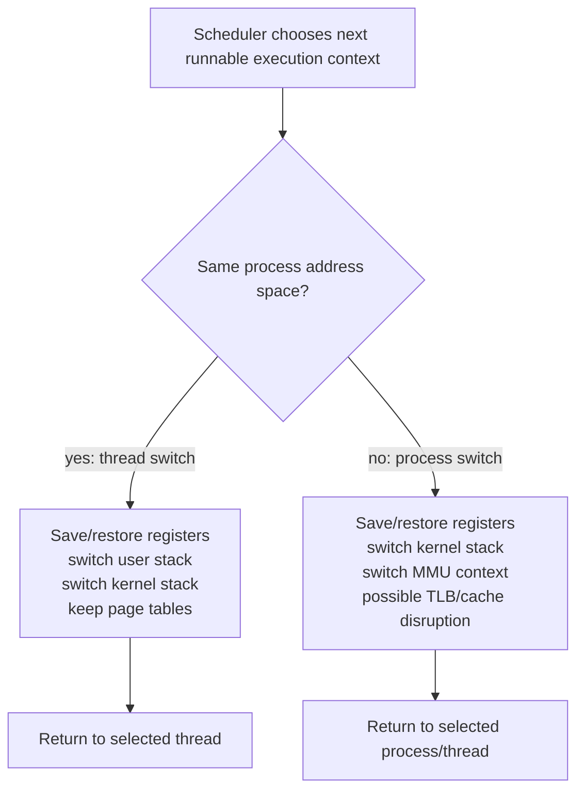

# Scheduling, Priority, And Interrupts

Previous: [Kernel Space And User Space](05-kernel-space-user-space.md) | [Index](index.md) | Next: [Threads And Process Comparison](07-threads-and-process-comparison.md)

**Section purpose:** Cover scheduling policy, priority, system-call scheduling points, interrupts, and context switches.

## Section Bridge

**Arriving from:** [Kernel Space And User Space](05-kernel-space-user-space.md). The previous section covered: Explain privilege, memory protection, system calls, and why UNIX needs a kernel boundary.

**This section answers:** Cover scheduling policy, priority, system-call scheduling points, interrupts, and context switches.

**Watch for the next question:** once this section lands, the next natural question is why we need **Threads And Process Comparison** next.

> **Reading note:** Read this as one continuous block. The slide-level `Flow` notes explain local transitions; the section-level transition at the end connects this topic to the next one.

---

## 41. OS Scheduling: REX Vs UNIX

> **Flow:** From **Summary So Far**, move into **OS Scheduling: REX Vs UNIX**. This page should answer the natural follow-up and prepare for **Types Of Scheduling In UNIX**.


Scheduling answers:

> Which execution unit gets the CPU now?

REX-style RTOS scheduling:

- Priority-driven.
- Often preemptive.
- High-priority tasks can run as soon as ready.
- Designed around bounded latency.
- Lower-priority work may starve if design is poor.
- Tasks often wait on signals/events/semaphores.

UNIX scheduling:

- Designed for fairness, throughput, responsiveness, and policy.
- Supports many processes/threads from many programs.
- Has dynamic priorities and scheduling classes.
- Balances CPU usage across cores.
- Handles interactive and batch workloads.

> **Side note:** RTOS scheduling asks "who must run to meet a deadline?" UNIX scheduling often asks "how do we share this machine acceptably among many workloads?"

---

## 41A. REX-Style Preemptive Scheduling And Kickdog Timer Mechanics

REX-style RTOS systems are usually built around a simple but strict idea:

> The highest-priority ready task should run, and the system must prove it has not stopped making progress.

That second part is where watchdog or "kickdog" mechanics enter.

Terminology:

- **Watchdog timer:** hardware or low-level timer that resets the system if not serviced in time.
- **Kickdog / pet watchdog:** software action that periodically resets the watchdog countdown.
- **Dog task / watchdog task:** task responsible for deciding whether the system is healthy enough to kick the watchdog.
- **Task dog report:** per-task "I am alive" signal, timestamp, flag, or counter.

Typical REX/RTOS-style pattern:

```text
Hardware watchdog countdown starts
  |
  | periodic timer tick / dog task wakeup
  v
Dog task checks required tasks:
  - did task A report?
  - did task B report?
  - did task C report?
  - are interrupts still firing?
  - is scheduler still running?
  |
  | if healthy
  v
Kick watchdog: reset hardware countdown
  |
  | if unhealthy
  v
Do not kick watchdog, or log/fatal first
  |
  v
Hardware watchdog expires and resets system
```

Why this exists:

- Embedded modem/baseband systems may not have a human nearby to restart them.
- A deadlocked high-priority task can freeze important work.
- An interrupt storm can starve normal tasks.
- Memory corruption can break scheduler state.
- A blocked task may mean radio/protocol deadlines are missed.
- Reset may be safer than continuing in an unknown state.

How it relates to preemption:

- Preemptive scheduling ensures a higher-priority ready task can interrupt lower-priority work.
- The watchdog ensures the whole system keeps making progress over time.
- A timer tick or periodic interrupt often drives both scheduling and health checks.
- If the scheduler cannot run the dog task, that itself is evidence of system failure.

Important subtlety:

- A naive watchdog kicked from an interrupt can hide scheduler failure.
- A better design kicks only after meaningful task-level health checks.
- If the timer ISR always kicks the watchdog, the hardware may never reset even when all normal tasks are dead.

Better watchdog discipline:

- Each critical task reports progress.
- Dog task validates reports.
- Dog task runs at a priority high enough to run regularly, but not so high that it masks failures.
- Reports must mean real forward progress, not merely "loop is alive."
- On failure, capture crash reason if possible before reset.

Watchdog as a liveness contract:



> **Side note:** Do not teach kickdog as "periodically reset a timer." Teach it as a system-level liveness contract. The important question is: what evidence must exist before software is allowed to kick the dog?

---

## 41B. REX-Style Scheduling Failure Examples

Example 1: high-priority task spins forever.

```c
void high_priority_task(void) {
    while (1) {
        // bug: forgot to wait on signal/event
        poll_register_forever();
    }
}
```

What happens:

- Task never blocks.
- Lower-priority tasks never run.
- Dog task may not run.
- Watchdog is not kicked.
- System resets.

Example 2: interrupt storm.

```text
Device interrupt fires
ISR clears wrong bit
Same interrupt fires again immediately
CPU spends most time in ISR
Tasks stop making progress
Dog task misses deadline
Watchdog expires
```

Example 3: false health report.

```c
void protocol_task(void) {
    while (1) {
        dog_report(PROTOCOL_TASK);  // reports too early
        wait_for_message();
        process_message();
    }
}
```

Why this is weak:

- The task reports before doing useful work.
- It may keep reporting even if processing is stuck elsewhere.
- The watchdog sees "alive" without knowing whether protocol state advances.

Stronger pattern:

```c
void protocol_task(void) {
    while (1) {
        wait_for_message();
        process_message();
        commit_protocol_progress();
        dog_report(PROTOCOL_TASK);  // report after useful progress
    }
}
```

What a seasoned engineer asks:

- Which tasks must report?
- What does "progress" mean for each task?
- What is the watchdog timeout budget?
- Can a high-priority task starve the dog task?
- Can an ISR accidentally keep kicking the watchdog?
- What diagnostics survive reset?

> **Side note:** Watchdogs do not fix concurrency bugs. They convert certain unrecoverable concurrency failures into controlled reset plus evidence collection.

---

## 42. Types Of Scheduling In UNIX

> **Flow:** From **OS Scheduling: REX Vs UNIX**, move into **Types Of Scheduling In UNIX**. This page should answer the natural follow-up and prepare for **What Is Process Priority**.


UNIX-like systems may support:

- **Time-sharing scheduling:** normal user processes, dynamic fairness.
- **Real-time FIFO scheduling:** higher-priority real-time task runs until block/yield/preempted by higher priority.
- **Real-time round-robin scheduling:** real-time priority with time quantum among equals.
- **Batch scheduling:** lower interactivity expectations.
- **Idle scheduling:** runs only when nothing else wants CPU.
- **Deadline scheduling:** where supported, schedules by runtime/deadline/period model.

Linux example names:

- `SCHED_OTHER`
- `SCHED_FIFO`
- `SCHED_RR`
- `SCHED_BATCH`
- `SCHED_IDLE`
- `SCHED_DEADLINE`

> **Side note:** The exact names vary by UNIX flavor, but the engineering idea is stable: policy classes define what "fair" or "urgent" means.

---

## 43. What Is Process Priority

> **Flow:** From **Types Of Scheduling In UNIX**, move into **What Is Process Priority**. This page should answer the natural follow-up and prepare for **How Priority Plays With Scheduling**.


Process priority is scheduler metadata used to influence CPU selection.

Priority can mean:

- Static priority.
- Dynamic priority.
- Nice value.
- Real-time priority.
- Effective priority after boosts or penalties.

High priority usually means:

- Runs sooner.
- Preempts lower-priority work.
- Gets more favorable scheduling treatment.

But priority is not the same as performance:

- A high-priority task that waits on I/O still sleeps.
- Too many high-priority tasks can destroy responsiveness.
- Incorrect real-time priority can starve the system.

> **Side note:** Priority is a responsibility. Raising priority is not an optimization knob to turn casually; it changes fairness and can hide design problems.

---

## 44. How Priority Plays With Scheduling

> **Flow:** From **What Is Process Priority**, move into **How Priority Plays With Scheduling**. This page should answer the natural follow-up and prepare for **Summary So Far**.


Scheduling combines:

- Runnable state.
- Priority.
- Scheduling class.
- Time slice.
- CPU affinity.
- Cache locality.
- Load balancing.
- Real-time constraints.
- Blocking/wakeup behavior.

Example:

- Process A is high priority but blocked on socket read.
- Process B is medium priority and runnable.
- Process C is low priority and runnable.
- Scheduler runs B because A cannot run.

Priority inversion:

- High-priority task waits for lock.
- Low-priority task holds lock.
- Medium-priority task runs and prevents low-priority from releasing lock.

Mitigation:

- Priority inheritance.
- Priority ceiling.
- Avoid long critical sections.

> **Side note:** Priority inversion is where scheduler theory becomes production pain. It famously affected real systems because the scheduler obeyed priority locally while the lock dependency created a global contradiction.

---

## 45. Summary So Far

> **Flow:** From **How Priority Plays With Scheduling**, move into **Summary So Far**. This page should answer the natural follow-up and prepare for **In UNIX, Points At Which Scheduling May Happen**.


Scheduling basics:

- REX-style RTOS scheduling optimizes for deterministic priority response.
- UNIX scheduling balances fairness, throughput, and responsiveness.
- Priority influences who runs, but only among runnable tasks.
- Scheduling class changes the meaning of priority.
- Priority inversion happens when locks and priorities interact badly.

Concurrency connection:

- Concurrency requires waiting and waking.
- Waiting removes a task from runnable competition.
- Waking inserts it back into scheduler decisions.
- Locks and priorities can interact in surprising ways.

> **Side note:** A scheduler does not make blocked code run. Blocking changes the set of candidates.

---

## 45A. Bach-Style Buffer Cache Lesson: I/O Is Often Deferred And Shared

Classic UNIX teaching spends real attention on the buffer cache because it changes how programs experience disk I/O.

The important idea:

> A write by a process may update kernel memory now and reach the device later.

Conceptual path:

```text
user write()
  -> syscall
  -> copy data into kernel buffer/page cache
  -> mark buffer dirty
  -> return to user
  -> later kernel flushes dirty data to disk
```

Why this matters for concurrency:

- Multiple processes can interact through cached filesystem state.
- Writes may appear complete before physical device write finishes.
- Kernel background flushers introduce asynchronous work.
- `fsync` changes the contract by forcing persistence work.
- Buffer cache/page cache creates shared kernel state protected by kernel locks.

Embedded contrast:

- Embedded code may write directly to a device register, flash driver, or tightly controlled storage layer.
- UNIX introduces buffering, caching, writeback, and filesystem metadata.
- Web apps add even more buffering: language runtime, HTTP library, kernel socket buffer, proxy, database, queue.

Production parallel:

```text
app writes response
framework buffer
runtime buffer
kernel socket buffer
NIC queue
client TCP receive buffer
browser/application
```

The write returning does not always mean the other side processed the data.

> **Side note:** Bach's buffer cache lesson generalizes: modern systems are full of buffers. A successful write often means "accepted by the next layer," not "fully consumed by the final destination."

---

## 45B. Embedded-To-Web Assumption Trap: Directness Disappears

Embedded systems often train a valuable habit:

> Know exactly when the hardware changed.

Web systems often break that directness:

- Logging may be buffered.
- HTTP writes may be buffered.
- DB writes may be committed but replicas lag.
- Queue publish may be acknowledged before consumers process.
- Cache writes may not invalidate all readers immediately.
- File writes may sit in page cache before disk persistence.

This affects concurrency reasoning.

Bad assumption:

```text
I called write/send/publish, therefore the other side has acted.
```

Better assumption:

```text
I handed data to the next layer. I need to know that layer's durability,
ordering, visibility, and backpressure contract.
```

Questions to ask:

- Did this call block until completion or only enqueue?
- Is the operation durable?
- Is ordering guaranteed?
- Can another reader observe stale state?
- Is there a buffer that can fill?
- What happens on retry?

> **Side note:** Embedded experience gives you respect for hardware truth. Carry that forward, but in web systems the "hardware" is a chain of buffers and services.

---

## 46. In UNIX, Points At Which Scheduling May Happen

> **Flow:** From **Summary So Far**, move into **In UNIX, Points At Which Scheduling May Happen**. This page should answer the natural follow-up and prepare for **What Is An Interrupt**.


Scheduling may happen when:

- A process blocks in a system call.
- A process exits.
- A process sleeps on I/O, lock, futex, pipe, socket, disk.
- A timer interrupt indicates time slice expiry.
- A higher-priority task wakes.
- A signal changes process state.
- A page fault requires disk I/O.
- A thread voluntarily yields.
- Kernel returns from interrupt/syscall and checks reschedule flag.

System calls matter because many can block:

- `read()` from empty pipe/socket.
- `accept()` waiting for connection.
- `waitpid()` waiting for child.
- `futex()` waiting on lock state.
- `poll()`/`epoll_wait()` waiting for readiness.

> **Side note:** The CPU does not schedule only at pretty API boundaries. Interrupts and kernel paths can change the decision at points invisible in your source code.

---

## 47. What Is An Interrupt

> **Flow:** From **In UNIX, Points At Which Scheduling May Happen**, move into **What Is An Interrupt**. This page should answer the natural follow-up and prepare for **How Interrupt Can Cause Context Switch**.


An interrupt is an asynchronous signal to the CPU that an event needs attention.

Sources:

- Timer.
- Network device.
- Disk controller.
- UART.
- GPIO.
- Inter-processor interrupt.
- Power/thermal event.

Interrupt handling:

1. Hardware signals CPU.
2. CPU stops current flow at an instruction boundary.
3. CPU saves minimal state.
4. CPU jumps to interrupt handler.
5. Kernel/device handler acknowledges and handles event.
6. Work may be deferred to a bottom half/tasklet/workqueue/thread.
7. CPU returns to previous code or scheduler chooses another task.

> **Side note:** Interrupts are one reason a single-core system can feel concurrent. Your code can be interrupted between two ordinary-looking instructions.

---

## 48. How Interrupt Can Cause Context Switch

> **Flow:** From **What Is An Interrupt**, move into **How Interrupt Can Cause Context Switch**. This page should answer the natural follow-up and prepare for **What Happens When Process A Is Scheduled Out And Process B Is Scheduled In**.


Timer interrupt example:

1. Process A is running.
2. Timer interrupt fires.
3. CPU enters kernel interrupt handler.
4. Kernel updates time accounting.
5. Scheduler sees A's time slice expired or B has higher priority.
6. Kernel marks need-reschedule.
7. Before returning to user mode, kernel calls scheduler.
8. Scheduler selects process B.
9. Kernel saves A context and restores B context.
10. CPU returns to user mode in process B.



> **Side note:** A context switch is often caused by an interrupt, but the interrupt handler itself is not always the full scheduler. Kernels often defer expensive work until a safe point.

---

## 49. What Happens When Process A Is Scheduled Out And Process B Is Scheduled In

> **Flow:** From **How Interrupt Can Cause Context Switch**, move into **What Happens When Process A Is Scheduled Out And Process B Is Scheduled In**. This page should answer the natural follow-up and prepare for **How Context Is Switched: Minutest Details In REX Model**.


Conceptually:

1. A enters kernel due to syscall, interrupt, fault, or blocking.
2. Kernel saves A's CPU register context.
3. Kernel updates A's scheduler state.
4. If A blocks, it is placed on a wait queue.
5. Scheduler chooses B from runnable tasks.
6. Kernel switches address-space context if B is a different process.
7. Kernel switches kernel stack to B's kernel stack.
8. Kernel restores B's saved registers.
9. Kernel returns to B's previous execution point.

Costs:

- Register save/restore.
- Kernel execution.
- Possible TLB flush or address-space switch overhead.
- Cache disruption.
- Branch predictor/cache effects.
- Locking inside scheduler.

State transition view:



> **Side note:** Context switch cost is not one number. It depends on architecture, cache state, TLB behavior, scheduler path, security mitigations, and working set.

---

## 50. How Context Is Switched: Minutest Details In REX Model

> **Flow:** From **What Happens When Process A Is Scheduled Out And Process B Is Scheduled In**, move into **How Context Is Switched: Minutest Details In REX Model**. This page should answer the natural follow-up and prepare for **How Context Is Switched: Minutest Details In UNIX Model**.


Typical REX/RTOS-style task switch:

- Task A runs with its own stack.
- Interrupt or kernel service occurs.
- Kernel disables interrupts or enters critical scheduler section.
- Registers are pushed to A's stack or saved in A's task control block.
- A's stack pointer is saved.
- Scheduler selects highest-priority ready task B.
- B's saved stack pointer is loaded.
- B's registers are restored from its stack/control block.
- Interrupt state is restored.
- CPU resumes B.

Often no process address-space switch occurs.

Simplified stack model:

```text
Task A stack: [saved r0-r12, lr, pc, cpsr, ...]
Task B stack: [saved r0-r12, lr, pc, cpsr, ...]
```

> **Side note:** In many RTOS designs, the task stack itself is the saved context. That is elegant and fast, but only if memory corruption is controlled.

---

## 51. How Context Is Switched: Minutest Details In UNIX Model

> **Flow:** From **How Context Is Switched: Minutest Details In REX Model**, move into **How Context Is Switched: Minutest Details In UNIX Model**. This page should answer the natural follow-up and prepare for **Introducing Single Core ARM7 Vs Multicore Say ARM9**.


UNIX process/thread switch includes:

- Enter kernel mode.
- Save current CPU state.
- Save current stack pointer/program counter.
- Update scheduler run queue/wait queue state.
- Choose next runnable task.
- Switch kernel stack.
- Switch MMU context if address space changes.
- Update CPU-local current task pointer.
- Restore next task's CPU state.
- Return from trap/syscall/interrupt into next task.

If switching between threads in same process:

- Address space may remain same.
- File descriptor table remains same.
- VM mappings remain same.
- Registers and stack change.

If switching between processes:

- Address space changes.
- TLB effects are more likely.
- Process-level accounting/resources differ.

Process switch vs same-process thread switch:



> **Side note:** A UNIX "task" in kernel scheduling often represents a schedulable execution context. Whether you call it process or thread at user level, the scheduler needs a register/stack context to run.

---

## 52. Introducing Single Core ARM7 Vs Multicore Say ARM9

> **Flow:** From **How Context Is Switched: Minutest Details In UNIX Model**, move into **Introducing Single Core ARM7 Vs Multicore Say ARM9**. This page should answer the natural follow-up and prepare for **How Process Execution Works From Single Core Vs Multi Core**.


ARM7-era embedded systems are often discussed as:

- Single-core.
- Simpler MMU/MPU options depending on part.
- Lower memory.
- RTOS-friendly.
- Interrupt-heavy.
- No true CPU parallelism on one core.

ARM9-class and later systems may include:

- More capable MMU.
- Higher clocks.
- Caches.
- Sometimes multicore in broader ARM9-family discussions or later ARM generations.
- Richer OS support.

Key conceptual split:

- **Single core:** only one instruction stream executes at a time.
- **Multicore:** multiple instruction streams can execute truly simultaneously.

> **Side note:** Do not over-index on exact ARM7/ARM9 marketing names. Use them as a historical teaching anchor: small single-core RTOS world versus richer MMU/multicore UNIX-capable world.

---

## 53. How Process Execution Works From Single Core Vs Multi Core

> **Flow:** From **Introducing Single Core ARM7 Vs Multicore Say ARM9**, move into **How Process Execution Works From Single Core Vs Multi Core**. This page should answer the natural follow-up and prepare for **How Scheduling Works Between Single Core Vs Multi Core**.


Single core:

- One task/thread runs at any instant.
- Concurrency is interleaving.
- Race conditions still exist due to interrupts/preemption.
- Parallel speedup is impossible on CPU-bound work.

Multicore:

- Multiple threads/processes can run simultaneously.
- True data races exist at the same instant.
- Cache coherence becomes central.
- Locks and atomics must work across cores.
- Scheduler must choose both "who runs" and "where runs".

```mermaid
gantt
  title Single-core interleaving
  dateFormat  X
  axisFormat %s
  section CPU0
  A :0, 2
  B :2, 4
  A :4, 6
```

```mermaid
gantt
  title Multi-core parallelism
  dateFormat  X
  axisFormat %s
  section CPU0
  A :0, 6
  section CPU1
  B :0, 6
```





> **Side note:** Single core does not eliminate concurrency bugs; it changes their shape. Multi-core makes memory visibility and atomicity much harder.

---

## 54. How Scheduling Works Between Single Core Vs Multi Core

> **Flow:** From **How Process Execution Works From Single Core Vs Multi Core**, move into **How Scheduling Works Between Single Core Vs Multi Core**. This page should answer the natural follow-up and prepare for **Summary So Far**.


Single-core scheduling:

- One run queue may be enough conceptually.
- Scheduler selects next runnable task.
- Timer interrupt drives preemption.
- No CPU placement decision.

Multicore scheduling:

- Per-core run queues are common.
- Global load balancing may move tasks.
- CPU affinity can pin tasks.
- Cache locality matters.
- NUMA locality may matter on larger systems.
- Inter-processor interrupts can request rescheduling on another core.

Tradeoff:

- Moving a task balances load.
- Keeping a task on same core preserves cache warmth.

> **Side note:** On multicore, the scheduler is also a traffic engineer. Moving work too aggressively wastes cache; moving too little leaves cores idle.

---

## 55. Summary So Far

> **Flow:** From **How Scheduling Works Between Single Core Vs Multi Core**, move into **Summary So Far**. This page should answer the natural follow-up and prepare for **What Is A Thread**.


We covered scheduling mechanics:

- Scheduling happens at blocking, wakeups, timer interrupts, syscalls, faults, and returns to user mode.
- Interrupts can force scheduler decisions.
- Context switch saves one execution context and restores another.
- REX-style switches are often stack/register/task-control-block focused.
- UNIX switches add VM/resource/accounting complexity.
- Single-core concurrency is interleaving.
- Multicore concurrency is interleaving plus true parallel execution.

> **Side note:** This is the point to pause and ask: "Can a race condition happen on a single-core system?" Correct answer: yes, if preemption or interrupts split a non-atomic operation.

---

## Lead Into Next Section

**Core takeaway to close with:** Cover scheduling policy, priority, system-call scheduling points, interrupts, and context switches.

**Transition to next section:** Scheduling explains how whole execution contexts move on and off CPU. Now narrow the unit of execution from processes to threads inside a process.

**Continue reading:** Continue with [Threads And Process Comparison](07-threads-and-process-comparison.md) to follow the next layer of the model.

**Pause check before moving on:** pause and summarize the section in one sentence and name the resource or boundary that became clearer.

Previous: [Kernel Space And User Space](05-kernel-space-user-space.md) | [Index](index.md) | Next: [Threads And Process Comparison](07-threads-and-process-comparison.md)
