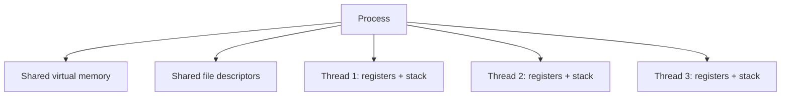
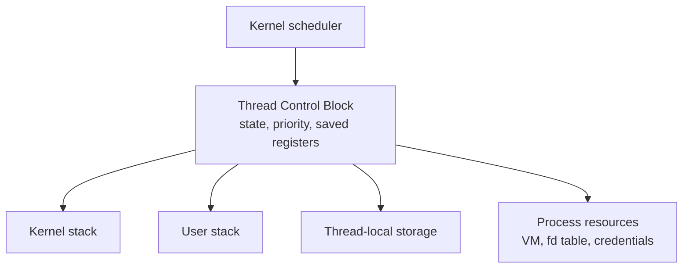
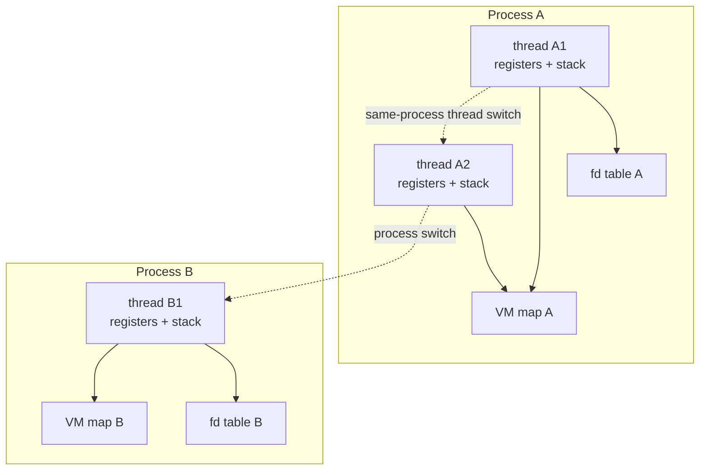

# Threads And Process Comparison

Previous: [Scheduling, Priority, And Interrupts](06-scheduling-priority-and-interrupts.md) | [Index](index.md) | Next: [Races, Locks, Semaphores, And Atomics](08-races-locks-semaphores-and-atomics.md)

**Section purpose:** Define threads, TCBs, process-vs-thread context, and why UNIX/RTOS models differ.

## Section Bridge

**Arriving from:** [Scheduling, Priority, And Interrupts](06-scheduling-priority-and-interrupts.md). The previous section covered: Cover scheduling policy, priority, system-call scheduling points, interrupts, and context switches.

**This section answers:** Define threads, TCBs, process-vs-thread context, and why UNIX/RTOS models differ.

**Watch for the next question:** once this section lands, the next natural question is why we need **Races, Locks, Semaphores, And Atomics** next.

> **Reading note:** Read this as one continuous block. The slide-level `Flow` notes explain local transitions; the section-level transition at the end connects this topic to the next one.

---

## 56. What Is A Thread

> **Flow:** From **Summary So Far**, move into **What Is A Thread**. This page should answer the natural follow-up and prepare for **Why Do We Need A Thread**.

A thread is a schedulable execution stream within a process.

Threads in the same process generally share:

- Virtual address space.
- Heap.
- Global variables.
- File descriptors.
- Process credentials.
- Current working directory.
- Signal dispositions.

Each thread has its own:

- Stack.
- Program counter.
- Registers.
- Thread-local storage.
- Scheduling state.
- Signal mask in many systems.

> **Side note:** Threads are cheaper than processes mainly because they share the expensive process resources. That same sharing is why they are dangerous.

---

## 57. Why Do We Need A Thread

> **Flow:** From **What Is A Thread**, move into **Why Do We Need A Thread**. This page should answer the natural follow-up and prepare for **What Is A Thread Control Block**.

Threads are useful when we want:

- Concurrent work inside one process.
- Shared memory communication.
- Responsiveness while another activity blocks.
- CPU parallelism across cores.
- Separation of control flows.
- Background work such as logging, GC, compaction, JIT, polling.
- Blocking API compatibility without blocking the entire process.

Examples:

- Web server handles many requests.
- GUI app keeps UI responsive while loading data.
- JVM runs application threads plus GC/JIT threads.
- Database uses worker threads for queries and I/O.
- C++ service uses thread pool for CPU-bound work.

> **Side note:** Threads solve both performance and structure problems. But if the main reason is "I do not want to think about state ownership", threads will punish you.

---

## 58. What Is A Thread Control Block

> **Flow:** From **Why Do We Need A Thread**, move into **What Is A Thread Control Block**. This page should answer the natural follow-up and prepare for **Context Of Thread Vs Context Of Process**.

A Thread Control Block, or TCB, is kernel/runtime metadata for a thread.

It typically contains:

- Thread ID.
- Saved registers.
- Stack pointer.
- Program counter.
- Thread state: running, runnable, blocked.
- Priority and scheduling policy.
- CPU affinity.
- Thread-local storage pointer.
- Signal mask.
- Kernel stack pointer.
- Accounting information.
- Linkage into scheduler queues.

In user-space threading libraries, there may also be runtime TCBs:

- Coroutine/goroutine metadata.
- Stack bounds.
- Cancellation state.
- Runtime scheduler links.
- Await/future state.

TCB ownership model:

> **Side note:** PCB and TCB are conceptual tools. Real kernels may merge or split these structures. What matters is what state exists and who owns it.

---

## 59. Context Of Thread Vs Context Of Process

> **Flow:** From **What Is A Thread Control Block**, move into **Context Of Thread Vs Context Of Process**. This page should answer the natural follow-up and prepare for **Does QComm REX Need A Thread, Why?**.

Thread context:

- Registers.
- Stack.
- Program counter.
- Thread-local storage.
- Scheduling state.

Process context:

- Address space.
- File descriptor table.
- Credentials.
- Signal dispositions.
- Resource limits.
- Process ID hierarchy.
- One or more thread contexts.

Switch between threads in same process:

- Save/restore registers and stack.
- Same address space.
- Same heap and globals.

Switch between processes:

- Save/restore registers and stack.
- Change address space.
- Different VM mappings.
- Different process resources.

Resource boundary comparison:

> **Side note:** A process is a resource container plus execution. A thread is primarily execution context inside that container.

---

## 60. Does QComm REX Need A Thread, Why?

> **Flow:** From **Context Of Thread Vs Context Of Process**, move into **Does QComm REX Need A Thread, Why?**. This page should answer the natural follow-up and prepare for **Does UNIX Need A Thread, Why?**.

In a REX-style RTOS, the word "thread" may not be necessary if the system already has "tasks".

This is an important learning shortcut. In a non-VM task-oriented system, the schedulable unit is already visible and concrete. A task has its own stack and saved CPU context, but it may share the broader memory image with other tasks. That lets the learner understand "thread-like execution" before introducing the UNIX split between a process as a resource container and a thread as an execution stream inside that container.

REX task model can provide:

- Independent execution stacks.
- Scheduler-visible units.
- Priorities.
- Blocking/wakeup on signals/events.
- Context switching.

That is thread-like in many practical ways.

Why no UNIX-style thread distinction?

- No heavy process abstraction to subdivide.
- Tasks already share the system image/address space.
- Isolation boundary is not process-centric.
- RTOS design starts with schedulable tasks, not forked processes.

UNIX needs the distinction because a process owns a protected address space, file descriptor table, credentials, and lifecycle. Threads were added so multiple execution streams could share that protected container. REX-style tasks help the learner see the execution stream first; UNIX then adds the container around it.

> **Side note:** In UNIX, threads are "inside a process". In an RTOS without UNIX processes, a task may already be the fundamental thread-like thing.

---

## 61. Does UNIX Need A Thread, Why?

> **Flow:** From **Does QComm REX Need A Thread, Why?**, move into **Does UNIX Need A Thread, Why?**. This page should answer the natural follow-up and prepare for **When Thread In UNIX Makes Sense**.

UNIX can run concurrent work with processes alone, but threads solve different problems.

Without threads:

- Use multiple processes.
- Communicate through pipes, sockets, shared memory, files.
- Better isolation.
- More overhead for shared state.

With threads:

- Share memory naturally.
- Lower context/memory overhead than processes.
- Easier to share caches, pools, in-memory indexes.
- Can exploit multicore CPU parallelism inside one service.
- Can keep blocking calls from freezing entire application.

UNIX does not strictly need threads, but modern workloads benefit from them.

> **Side note:** Processes are safer; threads are more intimate. Use threads when shared memory is truly a benefit, not just a convenience.

---

## 62. When Thread In UNIX Makes Sense

> **Flow:** From **Does UNIX Need A Thread, Why?**, move into **When Thread In UNIX Makes Sense**. This page should answer the natural follow-up and prepare for **How Context Switch Between UNIX Thread And Process Differ**.

Threads make sense when:

- Shared in-memory state is central and high-volume.
- Work is CPU-bound and parallelizable.
- Blocking calls need isolation but process overhead is too high.
- A thread pool can bound concurrency.
- Runtime or framework expects threaded execution.
- Low-latency communication through shared memory matters.

Threads are less attractive when:

- Failure isolation matters more.
- Work units are independent.
- Shared state would require complex locking.
- Scaling across machines is the real goal.
- The language runtime prevents CPU parallelism, as classic CPython GIL does for Python bytecode.

> **Side note:** Threading is an architecture decision. "Can use threads" is not the same as "should use threads."

---

## 63. How Context Switch Between UNIX Thread And Process Differ

> **Flow:** From **When Thread In UNIX Makes Sense**, move into **How Context Switch Between UNIX Thread And Process Differ**. This page should answer the natural follow-up and prepare for **UNIX Thread Vs Process Context Switch: Deeper Details**.

Thread switch in same process:

- Switch registers.
- Switch stack.
- Switch thread-local state.
- Keep same address space.
- Keep same file descriptor table.

Process switch:

- Switch registers.
- Switch stack.
- Switch memory context/page tables.
- Switch process-level accounting/resource view.
- Possibly incur more TLB/cache disruption.

Commonality:

- Both are scheduled by kernel in native threading systems.
- Both require saving/restoring CPU context.
- Both can be preemptive.

> **Side note:** The difference is not "threads do not context switch." They do. The difference is what else must change beyond CPU execution state.

---

## 64. UNIX Thread Vs Process Context Switch: Deeper Details

> **Flow:** From **How Context Switch Between UNIX Thread And Process Differ**, move into **UNIX Thread Vs Process Context Switch: Deeper Details**. This page should answer the natural follow-up and prepare for **What Are Wins With Threads**.

Extra costs in process switch may include:

- Loading new page-table base register.
- Changing address-space identifier.
- TLB invalidation or reduced TLB reuse.
- Different memory working set.
- Different kernel resource pointers.
- More cache misses after switch.

Thread switch may still be expensive:

- Different stack means different cache lines.
- Lock handoff may bounce cache lines between cores.
- Floating-point/vector state may be large.
- Scheduler overhead still exists.
- Kernel/user transition still exists if preemptive.

Optimization details:

- Lazy FPU save/restore historically reduced cost.
- Address Space Identifiers can reduce TLB flushes.
- Per-core run queues reduce scheduler lock contention.
- CPU affinity improves cache locality but can hurt load balance.

> **Side note:** Avoid teaching "thread switch is cheap" as absolute truth. It is cheaper in some dimensions, but contention and cache behavior can dominate.

---

## 65. What Are Wins With Threads

> **Flow:** From **UNIX Thread Vs Process Context Switch: Deeper Details**, move into **What Are Wins With Threads**. This page should answer the natural follow-up and prepare for **What Is A Race Condition In Thread**.

Thread wins:

- Shared memory with no serialization by default.
- Lower overhead than processes for many workloads.
- Parallel CPU execution on multicore.
- Natural model for blocking APIs.
- Thread pools can amortize creation cost.
- Good fit for servers, databases, runtimes, media pipelines.
- Can isolate latency-sensitive work from background work within one process.

But every win has a corresponding risk:

- Shared memory creates races.
- Low overhead encourages too many threads.
- Parallelism creates lock contention.
- Blocking APIs can exhaust pools.
- Debugging interleavings is hard.

> **Side note:** Threads are a power tool. They make easy things easy and hard things extremely hard unless ownership and synchronization are designed.

---

## Lead Into Next Section

**Core takeaway to close with:** Define threads, TCBs, process-vs-thread context, and why UNIX/RTOS models differ.

**Transition to next section:** Threads win by sharing memory, but shared memory is the source of most concurrency bugs. Move next into races and synchronization.

**Continue reading:** Continue with [Races, Locks, Semaphores, And Atomics](08-races-locks-semaphores-and-atomics.md) to follow the next layer of the model.

**Pause check before moving on:** pause and summarize the section in one sentence and name the resource or boundary that became clearer.

Previous: [Scheduling, Priority, And Interrupts](06-scheduling-priority-and-interrupts.md) | [Index](index.md) | Next: [Races, Locks, Semaphores, And Atomics](08-races-locks-semaphores-and-atomics.md)
