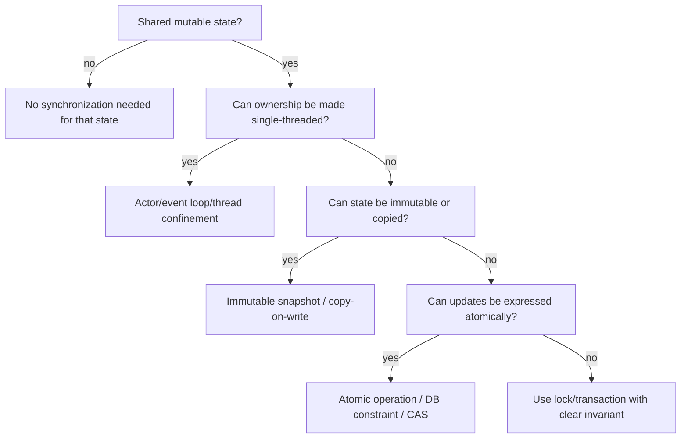

# Races, Locks, Semaphores, And Atomics

Previous: [Threads And Process Comparison](07-threads-and-process-comparison.md) | [Index](index.md) | Next: [Language Runtimes: C, C++, Java, Python, Ruby, JavaScript](09-language-runtimes-c-cpp-java-python-ruby-js.md)

**Section purpose:** Explain races, mutexes, semaphores, critical sections, interrupt locking, multicore requirements, and atomics.

## Section Bridge

**Arriving from:** [Threads And Process Comparison](07-threads-and-process-comparison.md). The previous section covered: Define threads, TCBs, process-vs-thread context, and why UNIX/RTOS models differ.

**This section answers:** Explain races, mutexes, semaphores, critical sections, interrupt locking, multicore requirements, and atomics.

**Watch for the next question:** once this section lands, the next natural question is why we need **Language Runtimes: C, C++, Java, Python, Ruby, JavaScript** next.

> **Reading note:** Read this as one continuous block. The slide-level `Flow` notes explain local transitions; the section-level transition at the end connects this topic to the next one.

---

## 66. What Is A Race Condition In Thread

> **Flow:** From **What Are Wins With Threads**, move into **What Is A Race Condition In Thread**. This page should answer the natural follow-up and prepare for **What Are The Ways To Mitigate Race**.


A race condition occurs when program correctness depends on timing or interleaving of concurrent operations.

Classic data race example:

```c
// shared
int counter = 0;

// two threads do this
counter = counter + 1;
```

`counter++` is conceptually:

1. Load counter.
2. Add one.
3. Store counter.

Two threads can interleave:

```text
T1 load 0
T2 load 0
T1 store 1
T2 store 1
```

Expected result: 2  
Actual result: 1

> **Side note:** A race is not always a crash. Often it is silent wrongness, which is worse.

---

## 66A. Race Condition Examples: Memory, File, And Business Logic

Race conditions appear at multiple layers.

Memory race:

```c
if (queue->count > 0) {
    item = queue_pop(queue);
}
```

Two threads can both observe `count > 0`, then both pop. If only one item existed, one thread may read invalid data or corrupt queue state.

File race:

```c
if (!file_exists(path)) {
    create_file(path);
}
```

Between check and create, another process can create the same file. This is called a time-of-check to time-of-use race.

Business race:

```text
Request A checks: user has no active subscription
Request B checks: user has no active subscription
Request A creates subscription
Request B creates subscription
Now user has two active subscriptions
```

This may happen even if the application has no data race in memory. The race is in the business invariant.

Correct approaches:

- Use a mutex for in-process shared memory.
- Use atomic file creation flags for file races.
- Use database unique constraints or transactions for business races.
- Use idempotency keys for request retries.
- Use compare-and-swap/version checks for state transitions.

> **Side note:** The mature lesson is that a race condition is not merely a thread bug. It is any correctness bug where interleaving changes the answer.

---

## 66B. Race Condition Timeline: Why Testing Often Misses It

The broken counter example fails only for certain interleavings.

```text
Safe-looking run:
T1 load 0
T1 add 1
T1 store 1
T2 load 1
T2 add 1
T2 store 2
```

Result is correct.

```text
Failing run:
T1 load 0
T2 load 0
T1 add 1
T2 add 1
T1 store 1
T2 store 1
```

Result is wrong.

Why local testing misses races:

- Timing window is tiny.
- CPU count differs from production.
- Optimizer changes instruction order.
- Logging changes timing.
- Load is lower.
- Race needs rare request ordering.
- Race needs a slow dependency at the wrong moment.

How to expose races:

- Stress tests.
- Thread sanitizers where available.
- Deterministic schedulers in tests when available.
- Random sleeps only as a crude supplement.
- Production invariant checks.
- Database constraints.
- Idempotency tests.

> **Side note:** If adding a log line makes the bug disappear, suspect timing. The log did not fix the bug; it changed the schedule.

---

## 67. What Are The Ways To Mitigate Race

> **Flow:** From **What Is A Race Condition In Thread**, move into **What Are The Ways To Mitigate Race**. This page should answer the natural follow-up and prepare for **Deep Dive Into Mutex**.


Race mitigation strategies:

- Avoid shared mutable state.
- Use immutable data.
- Use message passing.
- Use ownership transfer.
- Use mutexes.
- Use semaphores.
- Use condition variables.
- Use atomic operations.
- Use read-write locks.
- Use thread confinement.
- Use transactions.
- Use lock-free/wait-free structures only when justified.
- Use actors or queues.
- Use structured concurrency.

Design questions:

- Who owns this data?
- Who may read it?
- Who may write it?
- What lock protects it?
- What is the lock ordering?
- What memory visibility is required?

> **Side note:** Most race fixes should start at design level, not by sprinkling locks. Locks without ownership are just decorative risk.

---

## 67A. Race Mitigation Decision Tree

Do not automatically reach for a mutex.

Ask this sequence:



Examples:

- Counter only: atomic increment may be enough.
- Queue with head/tail invariant: mutex or lock-free queue designed by experts.
- User subscription invariant: database unique constraint or serializable transaction.
- Per-connection state in Node: event-loop ownership may be enough.
- Per-shard cache: shard ownership reduces global lock pressure.

> **Side note:** The best lock is the one you deleted by changing ownership. The second-best lock is the one whose invariant is written down.

---

## 68. Deep Dive Into Mutex

> **Flow:** From **What Are The Ways To Mitigate Race**, move into **Deep Dive Into Mutex**. This page should answer the natural follow-up and prepare for **Deep Dive Into Semaphores**.


A mutex provides mutual exclusion: only one thread enters the protected critical region at a time.

Pattern:

```c
pthread_mutex_lock(&m);
// read/write shared state
pthread_mutex_unlock(&m);
```

Mutex protects invariants:

- Account balance cannot go negative.
- Queue head/tail remain consistent.
- Map resize is not observed halfway.
- Reference count and object lifetime move together.

Correct mutex use:

- Lock before accessing protected state.
- Unlock on all paths.
- Keep critical section small but complete.
- Do not call unknown code while holding lock.
- Document what the mutex protects.
- Use consistent lock ordering.

Failure modes:

- Deadlock.
- Forgetting unlock.
- Lock convoy.
- Priority inversion.
- Holding lock during blocking I/O.
- Protecting too little.
- Protecting too much.

> **Side note:** A mutex protects a relationship, not a line of code. Say what invariant it protects.

---

## 68A. Mutex Example: Protecting A Queue Invariant

A queue has an invariant:

```text
head, tail, and count must describe the same queue state
```

Broken version:

```c
void enqueue(queue_t *q, item_t item) {
    q->items[q->tail] = item;
    q->tail = (q->tail + 1) % q->capacity;
    q->count++;
}
```

If two threads call this together:

- Both may write the same `tail` slot.
- One update to `tail` may overwrite the other.
- `count` may become wrong.
- Consumer may observe partially updated state.

Mutex-protected version:

```c
void enqueue(queue_t *q, item_t item) {
    pthread_mutex_lock(&q->lock);

    q->items[q->tail] = item;
    q->tail = (q->tail + 1) % q->capacity;
    q->count++;

    pthread_mutex_unlock(&q->lock);
}
```

Better C pattern with single exit:

```c
int enqueue(queue_t *q, item_t item) {
    int rc = 0;
    pthread_mutex_lock(&q->lock);

    if (q->count == q->capacity) {
        rc = -1;
        goto out;
    }

    q->items[q->tail] = item;
    q->tail = (q->tail + 1) % q->capacity;
    q->count++;

out:
    pthread_mutex_unlock(&q->lock);
    return rc;
}
```

What the mutex protects:

- `items`.
- `head`.
- `tail`.
- `count`.
- The relationship among all four.

> **Side note:** If a lock protects `count` but not `head` and `tail`, it does not protect the queue. Protect invariants, not variables.

---

## 68B. Mutex Example: C++ RAII Avoids Forgotten Unlock

Manual locking is fragile:

```cpp
mutex.lock();
do_work();
if (failed()) {
    return; // bug: forgot unlock
}
mutex.unlock();
```

RAII locking:

```cpp
void update() {
    std::lock_guard<std::mutex> lock(mutex);
    do_work();
    if (failed()) {
        return; // lock still released
    }
}
```

Why RAII matters:

- Normal return releases lock.
- Error return releases lock.
- Exception releases lock.
- Code is shorter and harder to misuse.

What RAII does not solve:

- Deadlock from lock ordering.
- Holding lock too long.
- Calling unknown code while holding lock.
- Protecting wrong invariant.

> **Side note:** RAII solves mechanical unlock bugs. It does not solve design bugs.

---

## 68C. Deadlock Example: Two Locks In Opposite Order

Deadlock with two mutexes:

```c
// Thread 1
pthread_mutex_lock(&account_a);
pthread_mutex_lock(&account_b);
transfer(a, b, amount);
pthread_mutex_unlock(&account_b);
pthread_mutex_unlock(&account_a);

// Thread 2
pthread_mutex_lock(&account_b);
pthread_mutex_lock(&account_a);
transfer(b, a, amount);
pthread_mutex_unlock(&account_a);
pthread_mutex_unlock(&account_b);
```

Failing timeline:

```text
T1 locks account_a
T2 locks account_b
T1 waits for account_b
T2 waits for account_a
Neither can proceed
```

Fix: global lock order.

```c
first = min(account_a_id, account_b_id);
second = max(account_a_id, account_b_id);

pthread_mutex_lock(&lock[first]);
pthread_mutex_lock(&lock[second]);
transfer(...);
pthread_mutex_unlock(&lock[second]);
pthread_mutex_unlock(&lock[first]);
```

Other fixes:

- Single coarser lock if contention is acceptable.
- Try-lock with backoff.
- Transactional database operation.
- Actor ownership: all transfers for an account shard go through one worker.

> **Side note:** Deadlock prevention is mostly about ordering. If locks have no order, production will eventually invent one for you, badly.

---

## 69. Deep Dive Into Semaphores

> **Flow:** From **Deep Dive Into Mutex**, move into **Deep Dive Into Semaphores**. This page should answer the natural follow-up and prepare for **Deep Dive Into Critical Section**.


A semaphore is a counter with atomic wait/decrement and signal/increment behavior.

Types:

- **Binary semaphore:** count 0/1, sometimes used like a mutex but not identical.
- **Counting semaphore:** count represents available resources.

Example:

```c
sem_wait(&slots);   // wait for available slot
enqueue(item);
sem_post(&items);   // signal item available
```

Common uses:

- Limit concurrency to N.
- Producer-consumer queues.
- Resource pools.
- Signal event occurrence.

Mutex vs semaphore:

- Mutex usually has ownership: locker should unlock.
- Semaphore often has no ownership: one thread can post what another waits.
- Mutex protects critical section.
- Semaphore coordinates availability/count.

> **Side note:** Many bugs come from using semaphores as vague "wake someone" tools. Be precise: what does the count mean?

---

## 69A. Semaphore Example: Bounded Producer-Consumer Queue

A bounded queue has two resource counts:

- Empty slots available.
- Items available.

Semaphores model those counts.

```c
sem_t slots; // initialized to capacity
sem_t items; // initialized to 0
pthread_mutex_t lock;

void produce(item_t item) {
    sem_wait(&slots);           // wait for empty slot
    pthread_mutex_lock(&lock);
    queue_push(item);
    pthread_mutex_unlock(&lock);
    sem_post(&items);           // one more item available
}

item_t consume(void) {
    sem_wait(&items);           // wait for available item
    pthread_mutex_lock(&lock);
    item_t item = queue_pop();
    pthread_mutex_unlock(&lock);
    sem_post(&slots);           // one more slot available
    return item;
}
```

Why mutex still exists:

- Semaphore tracks counts.
- Mutex protects queue structure.

Common bug:

- Using one semaphore and no mutex.
- Count remains correct while queue internals corrupt.

> **Side note:** Semaphore answers "how many?" Mutex answers "who is inside the invariant right now?"

---

## 70. Deep Dive Into Critical Section

> **Flow:** From **Deep Dive Into Semaphores**, move into **Deep Dive Into Critical Section**. This page should answer the natural follow-up and prepare for **What Single Core Needs To Offer For Threads To Work Successfully**.


A critical section is code that must not execute concurrently with conflicting code.

It is not the lock itself. It is the protected region.

Example:

```c
pthread_mutex_lock(&queue_lock);
queue_push(q, item);      // critical section
pthread_mutex_unlock(&queue_lock);
```

Critical section design:

- Include every operation needed to preserve invariant.
- Exclude expensive unrelated work.
- Avoid blocking I/O inside when possible.
- Avoid reentrant callbacks unless explicitly designed.
- Keep lock acquisition order consistent.

Embedded/RTOS critical sections may disable interrupts:

```c
disable_interrupts();
// manipulate ISR-shared state
enable_interrupts();
```

This is fast but dangerous if held too long.

> **Side note:** Disabling interrupts is the most brutal lock on a single core. It can be correct in tiny regions and catastrophic if abused.

---

## 70A. Critical Section Example: What Belongs Inside And Outside

Bad critical section:

```c
pthread_mutex_lock(&cache_lock);

value = cache_lookup(key);
if (!value) {
    value = fetch_from_network(key); // slow blocking I/O while lock is held
    cache_insert(key, value);
}

pthread_mutex_unlock(&cache_lock);
```

Problem:

- Every thread needing the cache waits for network I/O.
- One slow dependency becomes global lock contention.
- Tail latency grows.

Better shape:

```c
pthread_mutex_lock(&cache_lock);
value = cache_lookup(key);
pthread_mutex_unlock(&cache_lock);

if (!value) {
    value = fetch_from_network(key);

    pthread_mutex_lock(&cache_lock);
    cache_insert_if_absent(key, value);
    pthread_mutex_unlock(&cache_lock);
}
```

New issue:

- Two threads may fetch the same missing key.

Possible refinements:

- Per-key lock.
- "In-flight" promise/future stored in cache.
- Request coalescing.
- Singleflight pattern.

> **Side note:** Shrinking a critical section may introduce duplicate work. That can be a good trade, but name it.

---

## 70B. Critical Section In RTOS: Interrupt Locking Example

Suppose a task and ISR share a ring buffer.

Broken:

```c
// task
ring.tail = next_tail(ring.tail);
ring.count++;

// ISR
ring.head = next_head(ring.head);
ring.count--;
```

An interrupt between `tail` update and `count++` can let the ISR observe inconsistent state.

Single-core RTOS-style critical section:

```c
irq_state_t s = rex_int_lock();
ring.tail = next_tail(ring.tail);
ring.count++;
rex_int_free(s);
```

Rules:

- Keep interrupt-locked region extremely short.
- Do not call blocking functions.
- Do not allocate memory.
- Do not log heavily.
- Do not wait for hardware.
- Restore previous interrupt state correctly.

> **Side note:** Interrupt locking is not a general-purpose mutex. It is a tiny atomicity tool against ISR interleaving on that CPU.

---

## 70C. Deadlock Checklist For Code Review

Ask these questions whenever you see locks:

- Can two locks be held at the same time?
- Is there a documented global lock order?
- Can code call unknown callbacks while holding a lock?
- Can code perform blocking I/O while holding a lock?
- Can a signal handler or ISR try to acquire the same lock?
- Can cancellation or timeout leave a lock held?
- Can a lower-priority task hold a lock needed by a high-priority task?
- Is there priority inheritance if this is RTOS/real-time code?

Deadlock pattern with callbacks:

```c
pthread_mutex_lock(&manager_lock);
callback(user_data); // callback calls back into manager and wants manager_lock
pthread_mutex_unlock(&manager_lock);
```

Safer pattern:

```c
pthread_mutex_lock(&manager_lock);
snapshot = copy_callback_list();
pthread_mutex_unlock(&manager_lock);

for each callback in snapshot:
    callback(user_data);
```

> **Side note:** Unknown code under a lock is a loaded trap. You do not know what locks it will try to take.

---

## 71. What Single Core Needs To Offer For Threads To Work Successfully

> **Flow:** From **Deep Dive Into Critical Section**, move into **What Single Core Needs To Offer For Threads To Work Successfully**. This page should answer the natural follow-up and prepare for **What Is Interrupt Locking**.


Single-core thread support needs:

- Timer interrupt for preemption or cooperative yield points.
- Separate stacks per thread/task.
- Context save/restore.
- Scheduler run queues.
- Blocking/wakeup primitives.
- Interrupt-safe critical sections.
- Atomicity against interrupt/preemption for scheduler structures.

On single core, mutual exclusion can be implemented by:

- Disabling interrupts briefly in kernel/RTOS.
- Scheduler locks.
- Atomic instructions if available.
- Cooperative scheduling discipline.

But user-level correctness still needs:

- Locks around shared data.
- Clear ownership.
- Avoiding long non-preemptible regions.

> **Side note:** Single core makes "simultaneous execution" impossible, but preemption still makes interleavings real.

---

## 72. What Is Interrupt Locking

> **Flow:** From **What Single Core Needs To Offer For Threads To Work Successfully**, move into **What Is Interrupt Locking**. This page should answer the natural follow-up and prepare for **What Multi Core Needs To Offer For Threads To Work Successfully**.


Interrupt locking means temporarily preventing interrupts from interrupting the current CPU.

Purpose:

- Protect data shared between normal code and interrupt handlers.
- Protect scheduler/kernel structures during update.
- Ensure tiny sequences are atomic with respect to interrupts.

Example risk:

```text
Task updates queue head
Interrupt fires
ISR also updates queue
Task resumes with corrupted queue
```

Interrupt locking fixes by preventing ISR interleaving during the critical update.

Costs:

- Increases interrupt latency.
- Can break real-time deadlines if held too long.
- Does not protect against other cores unless interrupt disabling is paired with multicore locking.

> **Side note:** On multicore, disabling local interrupts does not stop another core. That is the trap when moving RTOS instincts to SMP systems.

---

## 73. What Multi Core Needs To Offer For Threads To Work Successfully

> **Flow:** From **What Is Interrupt Locking**, move into **What Multi Core Needs To Offer For Threads To Work Successfully**. This page should answer the natural follow-up and prepare for **What Is Atomic Swap Instruction**.


Multicore thread support needs:

- Cache coherence.
- Atomic read-modify-write instructions.
- Memory barriers/fences.
- Inter-processor interrupts.
- Per-core scheduler state.
- Cross-core wakeup.
- Correct locking primitives.
- Safe TLB shootdown.
- Consistent memory model.

Challenges:

- Two cores can modify nearby memory simultaneously.
- Store visibility may be delayed/reordered.
- Cache lines can bounce between cores.
- Lock contention becomes hardware traffic.
- False sharing can destroy throughput.

> **Side note:** Multicore correctness is not just "use a mutex." The mutex itself relies on atomic instructions, cache coherence, and memory ordering.

---

## 74. What Is Atomic Swap Instruction

> **Flow:** From **What Multi Core Needs To Offer For Threads To Work Successfully**, move into **What Is Atomic Swap Instruction**. This page should answer the natural follow-up and prepare for **Summary So Far**.


An atomic swap instruction exchanges a register value with memory as one indivisible operation.

Purpose:

- Build locks.
- Implement spinlocks.
- Implement atomic flags.
- Coordinate between cores.

Concept:

```c
while (atomic_exchange(&lock, 1) == 1) {
    // spin
}
// critical section
atomic_store(&lock, 0);
```

Atomic means no other core observes the operation halfway.

Modern CPUs may offer:

- Test-and-set.
- Compare-and-swap.
- Load-linked/store-conditional.
- Fetch-add.
- Exchange/swap.

Memory ordering matters:

- Acquire on lock.
- Release on unlock.
- Sequential consistency when stronger ordering is needed.

> **Side note:** Atomicity and ordering are different. Atomic says the update is indivisible. Ordering says what other memory operations become visible before or after it.

---

## 75. Summary So Far

> **Flow:** From **What Is Atomic Swap Instruction**, move into **Summary So Far**. This page should answer the natural follow-up and prepare for **What Kind Of Language Is C In Runtime**.


Threads:

- Share process resources.
- Need per-thread execution context.
- Win on shared memory and parallelism.
- Lose when races, deadlocks, and contention dominate.

Synchronization:

- Mutex protects invariants.
- Semaphore coordinates counts/resources/events.
- Critical section is the protected code region.
- Interrupt locking protects against ISR interleavings on a CPU.
- Multicore requires atomics, barriers, and cache coherence.

> **Side note:** Concurrency expertise is knowing the cost and failure mode of each primitive, not just knowing its API name.

---

## Lead Into Next Section

**Core takeaway to close with:** Explain races, mutexes, semaphores, critical sections, interrupt locking, multicore requirements, and atomics.

**Transition to next section:** After the reader understands the primitives, shift upward into language runtimes: each language packages these primitives differently and creates different production failure modes.

**Continue reading:** Continue with [Language Runtimes: C, C++, Java, Python, Ruby, JavaScript](09-language-runtimes-c-cpp-java-python-ruby-js.md) to follow the next layer of the model.

**Pause check before moving on:** pause and summarize the section in one sentence and name the resource or boundary that became clearer.

Previous: [Threads And Process Comparison](07-threads-and-process-comparison.md) | [Index](index.md) | Next: [Language Runtimes: C, C++, Java, Python, Ruby, JavaScript](09-language-runtimes-c-cpp-java-python-ruby-js.md)
