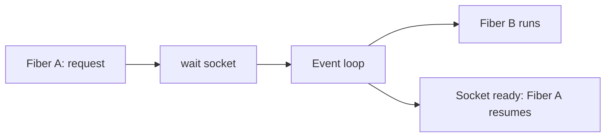

# Language Runtimes: C, C++, Java, Python, Ruby, JavaScript

Previous: [Races, Locks, Semaphores, And Atomics](08-races-locks-semaphores-and-atomics.md) | [Index](index.md) | Next: [Coroutines And Golang](10-coroutines-and-golang.md)

**Section purpose:** Compare runtime models, threading models, GC, GIL/GVL, and event-loop choices.

## Section Bridge

**Arriving from:** [Races, Locks, Semaphores, And Atomics](08-races-locks-semaphores-and-atomics.md). The previous section covered: Explain races, mutexes, semaphores, critical sections, interrupt locking, multicore requirements, and atomics.

**This section answers:** Compare runtime models, threading models, GC, GIL/GVL, and event-loop choices.

**Listen for the next question:** once this section lands, the audience should naturally ask why we need **Coroutines And Golang** next.

> **Teaching note:** Read this as one continuous block. The slide-level `Flow` notes explain local transitions; the section-level handoff at the end tells you how to move the room into the next topic.

---

## 76. What Kind Of Language Is C In Runtime

> **Flow:** From **Summary So Far**, move into **What Kind Of Language Is C In Runtime**. This page should answer the natural follow-up and prepare the room for **Threading Model In C**.


C is a compiled, native, manual-memory language with a small runtime model.

Runtime characteristics:

- Compiled to machine code.
- Uses platform ABI.
- Startup code initializes process and calls `main`.
- No mandatory garbage collector.
- No mandatory exception runtime.
- No mandatory threading runtime in the core language model before C11.
- Manual memory management through `malloc/free` or custom allocators.
- Undefined behavior gives compiler freedom and gives engineers sharp edges.

C depends heavily on:

- OS process/thread model.
- C standard library.
- Linker/loader.
- ABI calling convention.
- Hardware memory model.

> **Speaker side-note:** C is close to the machine, but not the machine. The compiler is an aggressive optimizing participant. In concurrent C, undefined behavior can turn "seems to work" into nonsense.

---

## 77. Threading Model In C

> **Flow:** From **What Kind Of Language Is C In Runtime**, move into **Threading Model In C**. This page should answer the natural follow-up and prepare the room for **What Kind Of Language Is C++ In Runtime**.


C threading options:

- POSIX threads (`pthread`) on UNIX-like systems.
- C11 threads (`thrd_t`, `mtx_t`, atomics), where implemented.
- Platform APIs such as Windows threads.
- Embedded RTOS task APIs.

Important C11 additions:

- `_Atomic`.
- `atomic_load`, `atomic_store`, `atomic_fetch_add`.
- Memory orders: relaxed, acquire, release, acq_rel, seq_cst.
- `mtx_t`, `cnd_t`, `thrd_t` in `<threads.h>` where available.

Example:

```c
#include <stdatomic.h>

atomic_int counter = 0;

void increment(void) {
    atomic_fetch_add_explicit(&counter, 1, memory_order_relaxed);
}
```

C does not protect you from:

- Data races.
- Use-after-free across threads.
- Incorrect memory ordering.
- Lifetime bugs.
- Lock ordering deadlocks.

> **Speaker side-note:** C concurrency is honest. If you share memory, you must define synchronization. The compiler will not infer your intention.

---

## 78. What Kind Of Language Is C++ In Runtime

> **Flow:** From **Threading Model In C**, move into **What Kind Of Language Is C++ In Runtime**. This page should answer the natural follow-up and prepare the room for **Threading Model In C++**.


C++ is a compiled, native, deterministic-lifetime language with a richer runtime than C but still close to OS/hardware.

Runtime characteristics:

- Compiled to machine code.
- Uses constructors/destructors.
- RAII is central.
- Exceptions may require runtime unwind metadata.
- Templates produce compile-time specialization.
- Virtual dispatch uses vtables in common implementations.
- Standard library includes threads, atomics, futures, mutexes.
- No mandatory garbage collector.

C++ gives abstractions but keeps costs explicit:

- `std::vector` owns contiguous memory.
- `std::unique_ptr` owns single object.
- `std::shared_ptr` uses reference counting.
- `std::mutex` maps to OS/runtime locking primitives.
- `std::thread` maps to native threads in common implementations.

> **Speaker side-note:** Modern C++ is not "C with classes" for concurrency. RAII changes lock and lifetime discipline dramatically.

---

## 79. Threading Model In C++

> **Flow:** From **What Kind Of Language Is C++ In Runtime**, move into **Threading Model In C++**. This page should answer the natural follow-up and prepare the room for **What Is GC**.


C++ standard threading includes:

- `std::thread`
- `std::jthread`
- `std::mutex`
- `std::shared_mutex`
- `std::condition_variable`
- `std::future`
- `std::promise`
- `std::async`
- `std::atomic`
- memory order model
- C++20 coroutines as language machinery

Example:

```cpp
#include <mutex>

std::mutex m;
int counter = 0;

void increment() {
    std::lock_guard<std::mutex> lock(m);
    ++counter;
}
```

RAII benefit:

- Lock releases automatically when scope exits.
- Exceptions do not leak locks if wrappers are used.

Risk areas:

- Detached threads.
- Capturing references into async work.
- Misusing `shared_ptr` cycles.
- Data races causing undefined behavior.
- Atomics without a design-level memory-order story.

> **Speaker side-note:** C++ makes high-performance concurrency possible, but it will not save a weak ownership model.

---

## 80. What Is GC

> **Flow:** From **Threading Model In C++**, move into **What Is GC**. This page should answer the natural follow-up and prepare the room for **Why Do We Need GC**.


Garbage Collection, or GC, is automatic memory reclamation.

The runtime detects objects that are no longer reachable and frees them.

Common GC concepts:

- Roots: stacks, globals, registers, runtime handles.
- Reachability graph.
- Mark phase.
- Sweep phase.
- Copying/compacting collectors.
- Generational collection.
- Write barriers.
- Stop-the-world pauses.
- Concurrent marking.
- Incremental collection.

GC solves:

- Many memory leaks.
- Use-after-free from manual reclamation.
- Double-free.

GC does not solve:

- Logical resource leaks.
- File/socket lifecycle.
- Data races.
- Holding references too long.
- Latency pauses unless collector is designed for it.

> **Speaker side-note:** GC manages memory, not all resources. A socket, lock, thread, transaction, and file descriptor still need disciplined lifecycle.

---

## 81. Why Do We Need GC

> **Flow:** From **What Is GC**, move into **Why Do We Need GC**. This page should answer the natural follow-up and prepare the room for **What C++ Does With GC In The New Release**.


GC exists because manual memory management is hard at scale.

It helps when:

- Object graphs are complex.
- Ownership is shared or unclear.
- Exceptions/errors create many exit paths.
- Developer productivity matters.
- Safety matters more than absolute predictability.

GC tradeoffs:

- Higher memory overhead.
- Runtime CPU overhead.
- Possible pauses.
- Less deterministic destruction.
- Tuning complexity under high allocation rates.

Concurrency interaction:

- GC may stop application threads.
- GC may run concurrently with application threads.
- Write barriers add overhead to pointer writes.
- Thread stacks are scanned as roots.
- Safepoints coordinate threads with collector.

> **Speaker side-note:** GC is a concurrency subsystem. It coordinates with all application threads while they mutate the heap.

---

## 82. What C++ Does With GC In The New Release

> **Flow:** From **Why Do We Need GC**, move into **What C++ Does With GC In The New Release**. This page should answer the natural follow-up and prepare the room for **What Kind Of Language Is Java In Runtime**.


C++ does not have a standard mandatory garbage collector.

Important status:

- C++11 once included limited library hooks related to "garbage collection support" and pointer safety.
- Those facilities were not widely useful.
- C++23 removed the old garbage-collection support hooks.
- Modern C++ memory management is centered on RAII, smart pointers, containers, allocators, and ownership types.

C++ memory lifetime tools:

- `std::unique_ptr` for exclusive ownership.
- `std::shared_ptr` for reference-counted shared ownership.
- `std::weak_ptr` to break cycles.
- Containers owning elements.
- Scope-bound cleanup.
- Custom allocators and memory resources.

C++ can still use GC-like systems:

- Third-party conservative collectors.
- Game-engine object systems.
- Region/arena allocators.
- Reference counting.
- Hazard pointers/epoch reclamation for lock-free structures.

> **Speaker side-note:** The C++ community chose deterministic lifetime as the idiom. That is powerful for concurrency because lock/file/memory release can be tied to scope.

---

## 83. What Kind Of Language Is Java In Runtime

> **Flow:** From **What C++ Does With GC In The New Release**, move into **What Kind Of Language Is Java In Runtime**. This page should answer the natural follow-up and prepare the room for **Threading Model In Java**.


Java is a managed, bytecode-based language running on the JVM.

Runtime characteristics:

- Source compiles to bytecode.
- JVM interprets and JIT-compiles hot code.
- Garbage-collected heap.
- Strong runtime type model.
- Built-in threading model.
- Memory model specified by Java Language Specification.
- Rich synchronization primitives.
- Runtime services: class loading, JIT, GC, profiling, safepoints.

JVM is a major concurrency runtime:

- Application threads.
- GC threads.
- JIT compiler threads.
- Signal/VM service threads.
- ForkJoin pools.
- Virtual threads in modern Java.

> **Speaker side-note:** Java is not "slow because VM." The JVM is an adaptive runtime that can optimize based on production behavior, but it also has runtime systems you must understand.

---

## 84. Threading Model In Java

> **Flow:** From **What Kind Of Language Is Java In Runtime**, move into **Threading Model In Java**. This page should answer the natural follow-up and prepare the room for **What Is GC In Java**.


Java threads historically map to OS threads in mainstream JVMs.

Core tools:

- `Thread`
- `synchronized`
- `volatile`
- `wait/notify`
- `java.util.concurrent`
- `ExecutorService`
- `ForkJoinPool`
- `CompletableFuture`
- Locks, semaphores, latches, barriers.
- Virtual threads in modern Java.

Example:

```java
class Counter {
    private int value;

    synchronized void inc() {
        value++;
    }
}
```

Java memory model defines:

- Happens-before relationships.
- Visibility through `volatile`.
- Monitor lock acquire/release semantics.
- Safe publication rules.

> **Speaker side-note:** Java's great gift to concurrent programming is not just threads. It is a specified memory model plus a mature standard concurrency library.

---

## 85. What Is GC In Java

> **Flow:** From **Threading Model In Java**, move into **What Is GC In Java**. This page should answer the natural follow-up and prepare the room for **What Kind Of Language Is Python In Runtime**.


Java GC automatically reclaims unreachable heap objects.

Modern JVM collectors may optimize for different goals:

- Throughput.
- Low latency.
- Small heap.
- Large heap.
- Predictable pauses.

Common collector ideas:

- Generational hypothesis: most objects die young.
- Young generation collection.
- Old generation collection.
- Concurrent marking.
- Compaction to reduce fragmentation.
- Safepoints.
- Thread-local allocation buffers.

Concurrency interaction:

- Application threads allocate rapidly.
- GC threads track reachability.
- JVM coordinates safepoints.
- Some collectors run parts concurrently.
- Bad allocation patterns can create GC pressure and latency spikes.

> **Speaker side-note:** Java services often fail not because "GC is bad", but because allocation rate, object retention, and latency targets were never treated as architecture constraints.

---

## 86. What Kind Of Language Is Python In Runtime

> **Flow:** From **What Is GC In Java**, move into **What Kind Of Language Is Python In Runtime**. This page should answer the natural follow-up and prepare the room for **Threading Model In Python**.


Python, specifically CPython in common production use, is an interpreted bytecode language with a managed object runtime.

Runtime characteristics:

- Source compiled to bytecode.
- Bytecode executed by interpreter.
- Objects live on managed heap.
- Reference counting is primary memory management in CPython.
- Cycle detector handles reference cycles.
- Dynamic typing.
- Rich C extension ecosystem.
- Historically protected by Global Interpreter Lock, or GIL.

Python runtime strengths:

- Developer speed.
- Expressiveness.
- Glue code.
- I/O-heavy services.
- Data processing orchestration.

Runtime costs:

- Per-object overhead.
- Interpreter overhead.
- GIL constraints in classic CPython.
- C extension behavior can dominate concurrency.

> **Speaker side-note:** "Python is slow" is too crude. Python is often fast enough at orchestration and I/O, while native extensions do heavy CPU work.

---

## 87. Threading Model In Python

> **Flow:** From **What Kind Of Language Is Python In Runtime**, move into **Threading Model In Python**. This page should answer the natural follow-up and prepare the room for **What Python Threads Included New That Other Languages Discussed Did Not Have**.


Python supports OS threads through `threading`.

In classic CPython:

- Multiple Python threads can exist.
- The GIL allows only one thread to execute Python bytecode at a time.
- Threads can still overlap I/O because the GIL may be released during blocking operations.
- Native extensions may release the GIL for CPU-heavy native work.

Python concurrency options:

- `threading` for I/O-bound overlap and blocking API integration.
- `multiprocessing` for CPU parallelism through processes.
- `asyncio` for event-loop cooperative concurrency.
- `concurrent.futures` for thread/process pools.
- Native libraries such as NumPy may use native parallelism.

> **Speaker side-note:** Python threads are real OS threads. The GIL does not mean "fake threads." It means Python bytecode execution is serialized in classic CPython.

---

## 88. What Python Threads Included New That Other Languages Discussed Did Not Have

> **Flow:** From **Threading Model In Python**, move into **What Python Threads Included New That Other Languages Discussed Did Not Have**. This page should answer the natural follow-up and prepare the room for **Why Python Chose A Different Way**.


Python's distinct historical feature is the GIL in CPython:

- A global interpreter lock protecting interpreter internals.
- Makes many C-level object operations simpler.
- Allows reference counting updates without making every object operation independently thread-safe.
- Serializes Python bytecode execution in classic builds.

Current important update:

- CPython 3.13 introduced an optional experimental free-threaded build that can disable the GIL.
- This is not yet the default mainstream assumption for all deployments.
- Compatibility, extension safety, and performance tradeoffs matter.

What this means:

- Python threading discussions must say "which Python implementation and build?"
- Classic CPython threading differs from Java/C++ native-thread CPU parallelism.
- Future Python may increasingly support true parallel bytecode execution in free-threaded builds.

> **Speaker side-note:** Teach this carefully. Many engineers learned "Python has GIL" as timeless law. It is still the practical default in much production CPython, but the ecosystem is actively changing.

---

## 89. Why Python Chose A Different Way

> **Flow:** From **What Python Threads Included New That Other Languages Discussed Did Not Have**, move into **Why Python Chose A Different Way**. This page should answer the natural follow-up and prepare the room for **What Is GIL In Python**.


CPython's GIL was a pragmatic design tradeoff.

Reasons:

- Simpler interpreter implementation.
- Efficient reference counting in single-threaded common case.
- Easier C extension model historically.
- Many Python workloads were I/O-bound or extension-backed.
- Lower overhead than fine-grained locking everywhere.

Tradeoff:

- CPU-bound Python bytecode does not scale across cores with threads in classic CPython.
- C extensions must be careful about GIL behavior.
- Multicore CPU parallelism often uses processes or native libraries.

> **Speaker side-note:** The GIL was not stupidity. It was a trade made for simplicity, safety, performance of common cases, and extension compatibility.

---

## 90. What Is GIL In Python

> **Flow:** From **Why Python Chose A Different Way**, move into **What Is GIL In Python**. This page should answer the natural follow-up and prepare the room for **What Kind Of Language Is Ruby In Runtime**.


The Global Interpreter Lock is a mutex around execution of CPython interpreter bytecode and internal object machinery.

Effects:

- Only one thread runs Python bytecode at a time in classic CPython.
- Threads still switch periodically.
- Blocking I/O can release the GIL.
- Native extensions can release the GIL.
- Reference counting is simpler.

Bad fit:

- CPU-bound pure Python multithreading.

Good enough fit:

- I/O-bound concurrency.
- Wrapping blocking APIs.
- Programs where native extensions release the GIL.

Example:

```python
from threading import Thread

def cpu_work():
    total = 0
    for i in range(10_000_000):
        total += i

threads = [Thread(target=cpu_work) for _ in range(4)]
for t in threads: t.start()
for t in threads: t.join()
```

In classic CPython, this is unlikely to speed up pure Python CPU work across cores.

> **Speaker side-note:** For CPU-bound Python, reach first for vectorized native libraries, multiprocessing, or another runtime/language. Threads are still fine for I/O.

---

## 91. What Kind Of Language Is Ruby In Runtime

> **Flow:** From **What Is GIL In Python**, move into **What Kind Of Language Is Ruby In Runtime**. This page should answer the natural follow-up and prepare the room for **Threading Model Of Ruby**.


Ruby is a dynamic, object-oriented language with a managed runtime.

Common production runtime:

- CRuby/MRI.
- Bytecode VM.
- Garbage-collected heap.
- Dynamic dispatch.
- Native extensions.
- Global VM Lock, or GVL, in CRuby.

Other Ruby implementations:

- JRuby on JVM.
- TruffleRuby.

Concurrency implications depend on implementation.

CRuby:

- Native threads exist.
- GVL limits parallel Ruby execution.
- I/O can release GVL.

JRuby:

- JVM threading model.
- Can allow more true parallel Ruby execution depending on workload.

> **Speaker side-note:** Like Python, "Ruby threading" must specify implementation. CRuby and JRuby do not have identical runtime constraints.

---

## 92. Threading Model Of Ruby

> **Flow:** From **What Kind Of Language Is Ruby In Runtime**, move into **Threading Model Of Ruby**. This page should answer the natural follow-up and prepare the room for **What Ruby Did With Event-Synchrony**.


Ruby supports:

- Threads.
- Fibers.
- Ractors in newer Ruby for actor-like parallelism constraints.
- Event-driven libraries.

CRuby threading:

- Threads are native OS threads.
- Global VM Lock prevents simultaneous execution of Ruby bytecode.
- Blocking I/O may allow other threads to run.
- CPU-bound Ruby threads do not scale like C++/Java threads.

Ruby synchronization:

- `Mutex`
- `Queue`
- `ConditionVariable`
- `Monitor`

Example:

```ruby
mutex = Mutex.new
counter = 0

threads = 4.times.map do
  Thread.new do
    mutex.synchronize { counter += 1 }
  end
end

threads.each(&:join)
```

> **Speaker side-note:** Ruby threads are useful for I/O and structure, but CRuby's GVL limits CPU parallelism similarly to classic CPython's GIL.

---

## 93. What Ruby Did With Event-Synchrony

> **Flow:** From **Threading Model Of Ruby**, move into **What Ruby Did With Event-Synchrony**. This page should answer the natural follow-up and prepare the room for **What Kind Of Language Is Javascript In Runtime**.


Ruby has a strong ecosystem around evented and fiber-based concurrency.

Key ideas:

- Fibers are lightweight cooperative execution units.
- Event loops multiplex I/O readiness.
- Fiber schedulers allow non-blocking behavior behind synchronous-looking code.
- Libraries can yield when waiting on I/O.

Why this matters:

- Avoids one OS thread per connection.
- Keeps code readable compared with deeply nested callbacks.
- Works well for I/O-heavy workloads.
- Does not automatically solve CPU-bound parallelism.

Conceptual flow:



> **Speaker side-note:** Evented Ruby is about not wasting OS threads during I/O waits. It is not magic multicore CPU parallelism.

---

## 94. What Kind Of Language Is Javascript In Runtime

> **Flow:** From **What Ruby Did With Event-Synchrony**, move into **What Kind Of Language Is Javascript In Runtime**. This page should answer the natural follow-up and prepare the room for **Threading Model In Javascript**.


JavaScript is a dynamic language standardized as ECMAScript.

Runtime depends on host:

- Browser.
- Node.js.
- Deno.
- Bun.

Common runtime traits:

- Garbage-collected heap.
- Event loop.
- Promise/microtask queue.
- Usually one main JavaScript execution thread per isolate/event loop.
- Native engine JIT compilation.
- Host APIs for I/O, timers, networking.

Node.js adds:

- libuv event loop.
- Thread pool for certain blocking operations.
- Worker threads for parallel JS execution.
- Cluster/process models.

> **Speaker side-note:** JavaScript concurrency is host-defined around the language. The language gives promises and async functions; Node/browser decide event loop and I/O integration.

---

## 95. Threading Model In Javascript

> **Flow:** From **What Kind Of Language Is Javascript In Runtime**, move into **Threading Model In Javascript**. This page should answer the natural follow-up and prepare the room for **Why Javascript Picked This Kind Of Threading Model**.


JavaScript's mainstream model:

- Single-threaded execution per event loop.
- Run-to-completion for each task.
- Asynchronous I/O via event loop.
- Promises schedule microtasks.
- Timers, network events, file I/O callbacks schedule tasks.

Node.js:

- Main JS thread runs event loop.
- libuv handles I/O readiness.
- libuv thread pool handles some filesystem/DNS/crypto work.
- Worker threads can run JS in parallel with separate isolates.

Browser:

- Main thread handles JS, layout, painting coordination.
- Web Workers provide background parallelism.
- SharedArrayBuffer and Atomics enable shared-memory coordination with restrictions.

> **Speaker side-note:** Single-threaded JS avoids many shared-memory races in application code, but it creates event-loop blocking as the central failure mode.

---

## 96. Why Javascript Picked This Kind Of Threading Model

> **Flow:** From **Threading Model In Javascript**, move into **Why Javascript Picked This Kind Of Threading Model**. This page should answer the natural follow-up and prepare the room for **Deep Dive Into Coroutines**.


JavaScript began in browsers.

Design pressures:

- UI programming needed predictable event handling.
- DOM was not designed for arbitrary multithreaded mutation.
- A single event loop made browser scripting simpler.
- Run-to-completion avoided many lock-based application bugs.
- Asynchronous callbacks fit user events, timers, and network.

Node.js reused this model for servers:

- Most server time is I/O wait.
- Event loop can handle many connections.
- Avoids one thread per connection.
- Simplifies shared state within one process.

Costs:

- CPU-heavy JS blocks the event loop.
- One bad synchronous operation hurts all requests on that loop.
- Backpressure must be designed.
- Debugging async stack traces can be hard.

> **Speaker side-note:** JavaScript's model is excellent when you keep the event loop free. It becomes terrible when you treat the event loop like a CPU worker.

---

## Lead Into Next Section

**Core takeaway to close with:** Compare runtime models, threading models, GC, GIL/GVL, and event-loop choices.

**Verbal handoff:** JavaScript and Ruby introduce evented thinking, which sets up the deeper discussion of coroutines and lightweight runtime scheduling.

**Opening line for next file:** "Now open [Coroutines And Golang](10-coroutines-and-golang.md); it answers the next pressure point in the model."

**Pause check before moving on:** ask the room to summarize the section in one sentence and name the resource or boundary that became clearer.

Previous: [Races, Locks, Semaphores, And Atomics](08-races-locks-semaphores-and-atomics.md) | [Index](index.md) | Next: [Coroutines And Golang](10-coroutines-and-golang.md)
