# Language Runtimes: C, C++, Java, Python, Ruby, JavaScript

Previous: [Races, Locks, Semaphores, And Atomics](08-races-locks-semaphores-and-atomics.md) | [Index](index.md) | Next: [Coroutines And Golang](10-coroutines-and-golang.md)

**Section purpose:** Compare runtime models, threading models, GC, GIL/GVL, and event-loop choices.

## Section Bridge

**Arriving from:** [Races, Locks, Semaphores, And Atomics](08-races-locks-semaphores-and-atomics.md). The previous section covered: Explain races, mutexes, semaphores, critical sections, interrupt locking, multicore requirements, and atomics.

**This section answers:** Compare runtime models, threading models, GC, GIL/GVL, and event-loop choices.

**Watch for the next question:** once this section lands, the next natural question is why we need **Coroutines And Golang** next.

> **Reading note:** Read this as one continuous block. The slide-level `Flow` notes explain local transitions; the section-level transition at the end connects this topic to the next one.

---

## Runtime Lens: What This Section Is Really Comparing

Before comparing C, C++, Java, Python, Ruby, and JavaScript, keep the earlier OS model in mind.

Every language must eventually answer the same questions:

- What does the OS load: native executable, bytecode launcher, VM process, script interpreter, or runtime host?
- Where do function calls live: native stack, VM frame stack, coroutine frame, fiber stack, or interpreter frame?
- Where do objects live: manual heap, garbage-collected heap, reference-counted heap, arena, stack, or runtime-managed object store?
- Who schedules execution: kernel scheduler, language runtime scheduler, event loop, thread pool, or cooperative coroutine scheduler?
- What is shared: process memory, runtime heap, interpreter state, file descriptors, sockets, database connections, global variables?
- What protects shared state: mutex, atomic, monitor, GIL/GVL, event-loop serialization, ownership discipline, actor boundary?
- What pauses or blocks progress: syscall, page fault, lock wait, GC safepoint, event-loop blockage, runtime scheduler, native extension?

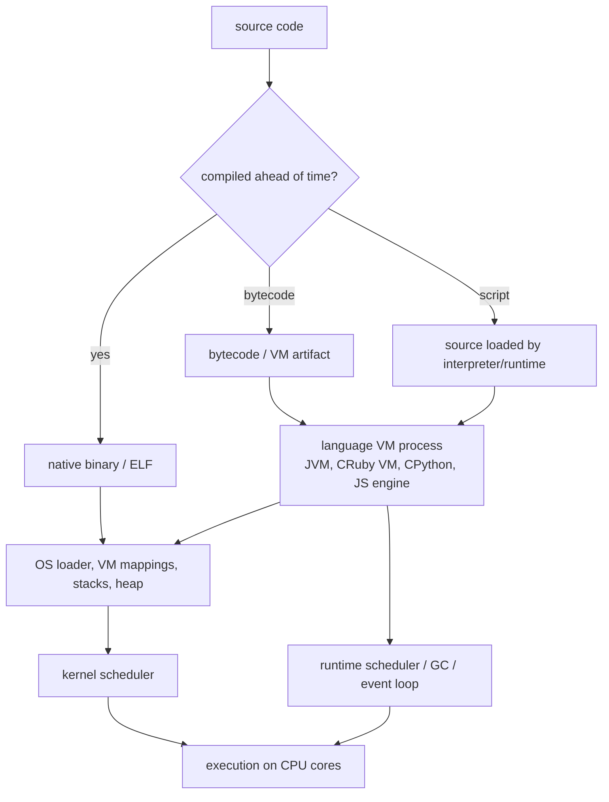

The important point is not whether a language is "fast" or "slow". The important point is where it places responsibility:

| Runtime style | What it gives you | What it makes you manage |
|---|---|---|
| C | direct control, small runtime, predictable representation | memory lifetime, synchronization, undefined behavior, portability |
| C++ | native control plus RAII and abstractions | ownership, data races, memory ordering, async lifetime |
| Java | managed heap, strong runtime, specified memory model | GC pressure, executor sizing, safepoints, heap retention |
| Python | fast development, rich libraries, orchestration | GIL assumptions, object overhead, process/async choices |
| Ruby | expressive app development, fibers/event ecosystem | GVL assumptions, I/O vs CPU split, runtime implementation choice |
| JavaScript | event-loop concurrency, non-blocking I/O culture | event-loop blockage, backpressure, worker boundaries |

> **Side note:** A language runtime is an operating-system guest with opinions. It sits on top of process, thread, memory, fd, and scheduler machinery, then exposes a friendlier model to the programmer.

---

## 76. What Kind Of Language Is C In Runtime

> **Flow:** From **Summary So Far**, move into **What Kind Of Language Is C In Runtime**. This page should answer the natural follow-up and prepare for **Threading Model In C**.


C is a compiled, native, manual-memory language with a small runtime model.

Runtime characteristics:

- Compiled to machine code.
- Uses platform ABI.
- Startup code initializes process and calls `main`.
- No mandatory garbage collector.
- No mandatory exception runtime.
- No mandatory threading runtime in the core language model before C11.
- Manual memory management through `malloc/free` or custom allocators.
- Undefined behavior gives compiler freedom and gives engineers sharp edges.

C depends heavily on:

- OS process/thread model.
- C standard library.
- Linker/loader.
- ABI calling convention.
- Hardware memory model.

Connect this to earlier sections:

- The ELF loader maps C program segments.
- C runtime startup calls `main`.
- Function calls use the native stack.
- `malloc` uses heap memory usually backed by `brk`, `mmap`, or allocator arenas.
- File descriptors are ordinary integers returned by syscalls or C library wrappers.
- Threads are OS threads or RTOS tasks exposed through platform APIs.
- Page faults, signals, and syscalls are not hidden by a large managed runtime.

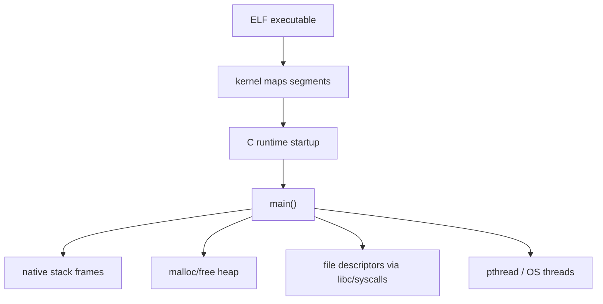

Why this matters for concurrency:

- C gives direct shared memory, so races are direct and brutal.
- There is no runtime lock like Python's GIL to serialize normal C code.
- There is no GC to keep objects alive while another thread still has a pointer.
- The compiler assumes data-race-free code for normal objects; violating that can produce undefined behavior.
- If an object is shared, the synchronization discipline must be designed explicitly.

> **Side note:** C is close to the machine, but not the machine. The compiler is an aggressive optimizing participant. In concurrent C, undefined behavior can turn "seems to work" into nonsense.

---

## 77. Threading Model In C

> **Flow:** From **What Kind Of Language Is C In Runtime**, move into **Threading Model In C**. This page should answer the natural follow-up and prepare for **What Kind Of Language Is C++ In Runtime**.


C threading options:

- POSIX threads (`pthread`) on UNIX-like systems.
- C11 threads (`thrd_t`, `mtx_t`, atomics), where implemented.
- Platform APIs such as Windows threads.
- Embedded RTOS task APIs.

Important C11 additions:

- `_Atomic`.
- `atomic_load`, `atomic_store`, `atomic_fetch_add`.
- Memory orders: relaxed, acquire, release, acq_rel, seq_cst.
- `mtx_t`, `cnd_t`, `thrd_t` in `<threads.h>` where available.

Example:

```c
#include <stdatomic.h>

atomic_int counter = 0;

void increment(void) {
    atomic_fetch_add_explicit(&counter, 1, memory_order_relaxed);
}
```

C does not protect you from:

- Data races.
- Use-after-free across threads.
- Incorrect memory ordering.
- Lifetime bugs.
- Lock ordering deadlocks.

C threading is really OS threading plus the C memory model.

When you call `pthread_create` on UNIX-like systems, the implementation generally arranges:

- a new schedulable kernel thread or kernel-supported thread context
- a user stack for that thread
- thread-local storage setup
- startup trampoline code that calls your function
- participation in the same process address space
- shared file descriptors and heap

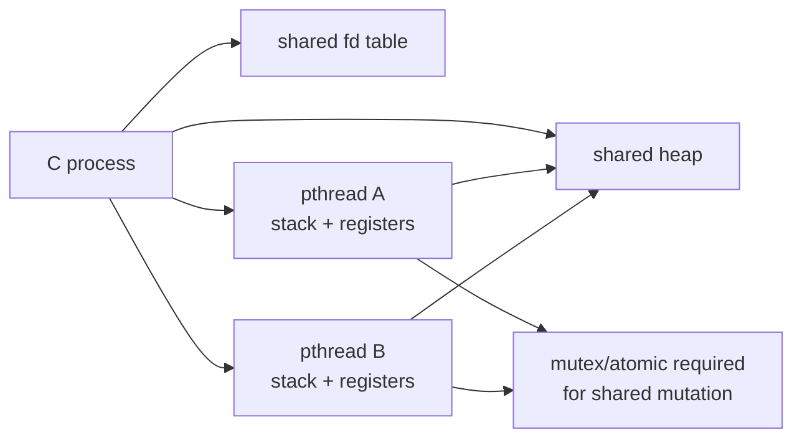

The hardest C threading bugs are often not the lock calls themselves. They are ownership questions:

- Who owns this pointer after it is placed on a queue?
- Can the producer free it while the consumer still reads it?
- Does the lock protect the object, the pointer, or the container?
- Does an atomic counter protect the data, or only the counter?
- Can a signal handler interrupt code that holds a lock?
- Does cancellation or early return skip cleanup?

> **Side note:** C concurrency is honest. If you share memory, you must define synchronization. The compiler will not infer your intention.

---

## 78. What Kind Of Language Is C++ In Runtime

> **Flow:** From **Threading Model In C**, move into **What Kind Of Language Is C++ In Runtime**. This page should answer the natural follow-up and prepare for **Threading Model In C++**.


C++ is a compiled, native, deterministic-lifetime language with a richer runtime than C but still close to OS/hardware.

Runtime characteristics:

- Compiled to machine code.
- Uses constructors/destructors.
- RAII is central.
- Exceptions may require runtime unwind metadata.
- Templates produce compile-time specialization.
- Virtual dispatch uses vtables in common implementations.
- Standard library includes threads, atomics, futures, mutexes.
- No mandatory garbage collector.

C++ gives abstractions but keeps costs explicit:

- `std::vector` owns contiguous memory.
- `std::unique_ptr` owns single object.
- `std::shared_ptr` uses reference counting.
- `std::mutex` maps to OS/runtime locking primitives.
- `std::thread` maps to native threads in common implementations.

C++ runtime depth:

- Constructors and destructors create deterministic lifetime hooks.
- RAII lets locks, files, sockets, memory, and transactions release on scope exit.
- Exceptions require stack unwinding, so cleanup must be exception-safe.
- Object lifetime is part of the concurrency story: a reference captured by a thread must remain valid until that thread stops using it.
- Move semantics let ownership transfer between threads without sharing.
- `shared_ptr` makes lifetime shared, but not object mutation safe.
- `thread_local` creates per-thread instances that behave differently from globals.

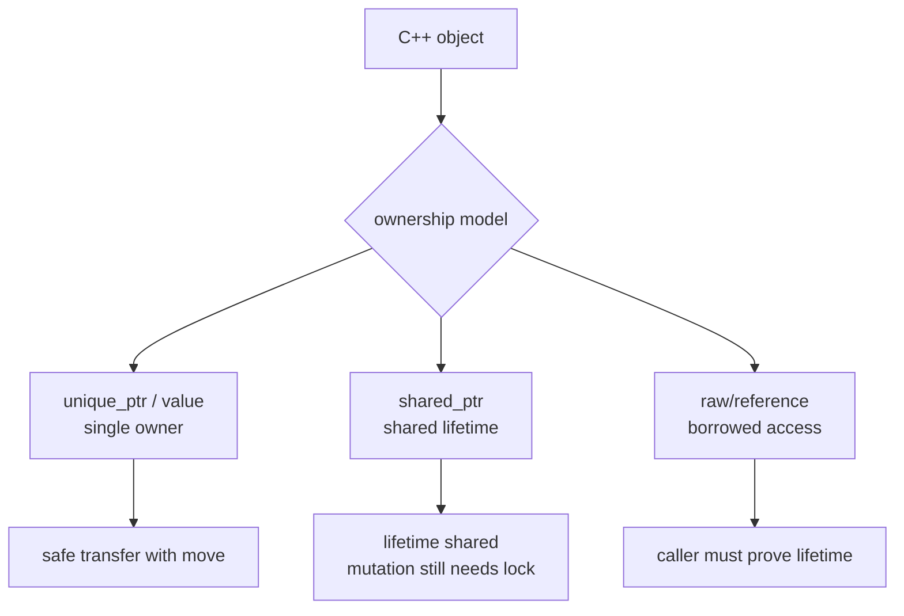

> **Side note:** Modern C++ is not "C with classes" for concurrency. RAII changes lock and lifetime discipline dramatically.

---

## 79. Threading Model In C++

> **Flow:** From **What Kind Of Language Is C++ In Runtime**, move into **Threading Model In C++**. This page should answer the natural follow-up and prepare for **What Is GC**.


C++ standard threading includes:

- `std::thread`
- `std::jthread`
- `std::mutex`
- `std::shared_mutex`
- `std::condition_variable`
- `std::future`
- `std::promise`
- `std::async`
- `std::atomic`
- memory order model
- C++20 coroutines as language machinery

Example:

```cpp
#include <mutex>

std::mutex m;
int counter = 0;

void increment() {
    std::lock_guard<std::mutex> lock(m);
    ++counter;
}
```

RAII benefit:

- Lock releases automatically when scope exits.
- Exceptions do not leak locks if wrappers are used.

Risk areas:

- Detached threads.
- Capturing references into async work.
- Misusing `shared_ptr` cycles.
- Data races causing undefined behavior.
- Atomics without a design-level memory-order story.

C++ concurrency should be read through three layers:

1. **Execution**
   - `std::thread`, `std::jthread`, thread pools, OS scheduling.
   - Threads run native code in the same process address space.

2. **Ownership**
   - RAII, move-only types, shared ownership, borrowed references.
   - A correct lock does not save an object whose lifetime already ended.

3. **Visibility**
   - Mutex lock/unlock establishes synchronization.
   - Atomics provide indivisible operations and ordering, but only for the design they are part of.
   - `memory_order_relaxed` can be correct for counters and wrong for publishing objects.

Example of the real design question:

```text
Bad question: should this be atomic?
Better question: what state is being published, who owns it, and what ordering makes that publication visible?
```

> **Side note:** C++ makes high-performance concurrency possible, but it will not save a weak ownership model.

---

## 80. What Is GC

> **Flow:** From **Threading Model In C++**, move into **What Is GC**. This page should answer the natural follow-up and prepare for **Why Do We Need GC**.


Garbage Collection, or GC, is automatic memory reclamation.

The runtime detects objects that are no longer reachable and frees them.

Common GC concepts:

- Roots: stacks, globals, registers, runtime handles.
- Reachability graph.
- Mark phase.
- Sweep phase.
- Copying/compacting collectors.
- Generational collection.
- Write barriers.
- Stop-the-world pauses.
- Concurrent marking.
- Incremental collection.

GC solves:

- Many memory leaks.
- Use-after-free from manual reclamation.
- Double-free.

GC does not solve:

- Logical resource leaks.
- File/socket lifecycle.
- Data races.
- Holding references too long.
- Latency pauses unless collector is designed for it.

> **Side note:** GC manages memory, not all resources. A socket, lock, thread, transaction, and file descriptor still need disciplined lifecycle.

---

## 81. Why Do We Need GC

> **Flow:** From **What Is GC**, move into **Why Do We Need GC**. This page should answer the natural follow-up and prepare for **What C++ Does With GC In The New Release**.


GC exists because manual memory management is hard at scale.

It helps when:

- Object graphs are complex.
- Ownership is shared or unclear.
- Exceptions/errors create many exit paths.
- Developer productivity matters.
- Safety matters more than absolute predictability.

GC tradeoffs:

- Higher memory overhead.
- Runtime CPU overhead.
- Possible pauses.
- Less deterministic destruction.
- Tuning complexity under high allocation rates.

Concurrency interaction:

- GC may stop application threads.
- GC may run concurrently with application threads.
- Write barriers add overhead to pointer writes.
- Thread stacks are scanned as roots.
- Safepoints coordinate threads with collector.

GC connects directly to the earlier process/thread model:

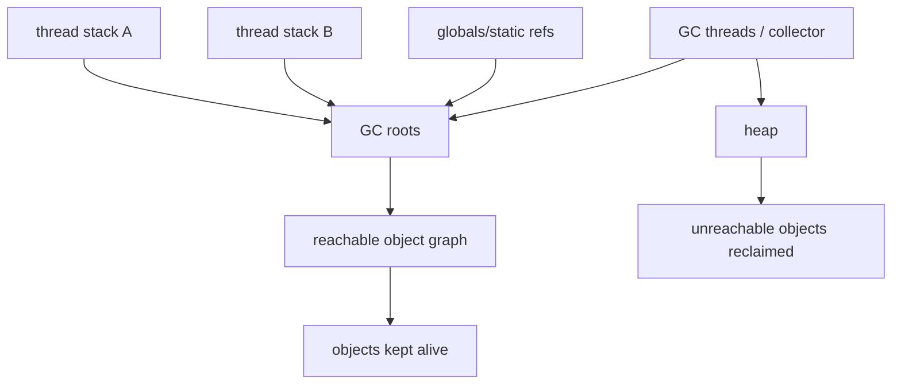

The collector must coordinate with application threads because application threads are changing the graph while the collector is trying to understand it. That is why terms such as safepoint, write barrier, concurrent marking, and stop-the-world matter.

> **Side note:** GC is a concurrency subsystem. It coordinates with all application threads while they mutate the heap.

---

## 82. What C++ Does With GC In The New Release

> **Flow:** From **Why Do We Need GC**, move into **What C++ Does With GC In The New Release**. This page should answer the natural follow-up and prepare for **What Kind Of Language Is Java In Runtime**.


C++ does not have a standard mandatory garbage collector.

Important status:

- C++11 once included limited library hooks related to "garbage collection support" and pointer safety.
- Those facilities were not widely useful.
- C++23 removed the old garbage-collection support hooks.
- Modern C++ memory management is centered on RAII, smart pointers, containers, allocators, and ownership types.

C++ memory lifetime tools:

- `std::unique_ptr` for exclusive ownership.
- `std::shared_ptr` for reference-counted shared ownership.
- `std::weak_ptr` to break cycles.
- Containers owning elements.
- Scope-bound cleanup.
- Custom allocators and memory resources.

C++ can still use GC-like systems:

- Third-party conservative collectors.
- Game-engine object systems.
- Region/arena allocators.
- Reference counting.
- Hazard pointers/epoch reclamation for lock-free structures.

> **Side note:** The C++ community chose deterministic lifetime as the idiom. That is powerful for concurrency because lock/file/memory release can be tied to scope.

---

## 83. What Kind Of Language Is Java In Runtime

> **Flow:** From **What C++ Does With GC In The New Release**, move into **What Kind Of Language Is Java In Runtime**. This page should answer the natural follow-up and prepare for **Threading Model In Java**.


Java is a managed, bytecode-based language running on the JVM.

Runtime characteristics:

- Source compiles to bytecode.
- JVM interprets and JIT-compiles hot code.
- Garbage-collected heap.
- Strong runtime type model.
- Built-in threading model.
- Memory model specified by Java Language Specification.
- Rich synchronization primitives.
- Runtime services: class loading, JIT, GC, profiling, safepoints.

JVM is a major concurrency runtime:

- Application threads.
- GC threads.
- JIT compiler threads.
- Signal/VM service threads.
- ForkJoin pools.
- Virtual threads in modern Java.

The JVM is not just "a program that runs Java". It is a managed execution environment inside an OS process:

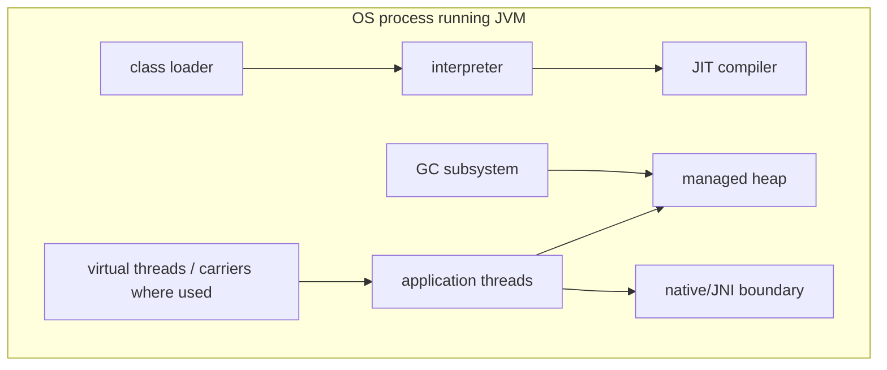

Connect to prior sections:

- The OS schedules JVM carrier/platform threads.
- The JVM schedules some runtime work internally.
- Java object allocation is usually fast because allocation can use thread-local buffers.
- The JVM can move objects during compaction, so raw stable object addresses are not the normal programming model.
- Safepoints require threads to reach known safe locations before some runtime operations complete.
- Native code can bypass some safety assumptions and must be treated carefully.

> **Side note:** Java is not "slow because VM." The JVM is an adaptive runtime that can optimize based on production behavior, but it also has runtime systems you must understand.

---

## 84. Threading Model In Java

> **Flow:** From **What Kind Of Language Is Java In Runtime**, move into **Threading Model In Java**. This page should answer the natural follow-up and prepare for **What Is GC In Java**.


Java threads historically map to OS threads in mainstream JVMs.

Core tools:

- `Thread`
- `synchronized`
- `volatile`
- `wait/notify`
- `java.util.concurrent`
- `ExecutorService`
- `ForkJoinPool`
- `CompletableFuture`
- Locks, semaphores, latches, barriers.
- Virtual threads in modern Java.

Example:

```java
class Counter {
    private int value;

    synchronized void inc() {
        value++;
    }
}
```

Java memory model defines:

- Happens-before relationships.
- Visibility through `volatile`.
- Monitor lock acquire/release semantics.
- Safe publication rules.

Java threading depth:

- `synchronized` is both mutual exclusion and memory visibility.
- `volatile` is visibility and ordering, not compound atomicity for operations like `count++`.
- `ExecutorService` separates task submission from thread ownership.
- ForkJoin is designed for work splitting and work stealing.
- Virtual threads make blocking-style code cheaper for many I/O-bound tasks, but they do not remove shared-state races.
- Pinning or blocking native sections can reduce the benefit of virtual threads depending on the runtime behavior.

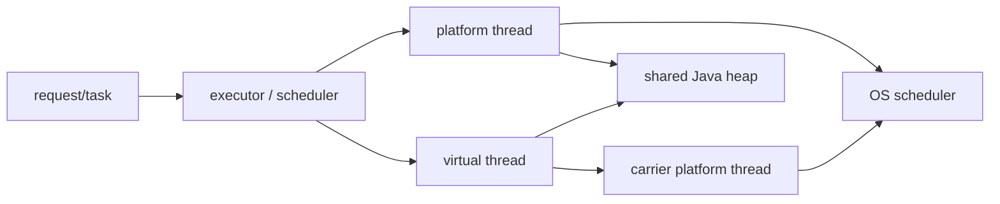

Seasoned Java concurrency is mostly about choosing the right boundary:

- thread-per-request
- bounded executor
- virtual-thread-per-task
- reactive/event-loop
- actor/message queue
- process/service boundary

> **Side note:** Java's great gift to concurrent programming is not just threads. It is a specified memory model plus a mature standard concurrency library.

---

## 85. What Is GC In Java

> **Flow:** From **Threading Model In Java**, move into **What Is GC In Java**. This page should answer the natural follow-up and prepare for **What Kind Of Language Is Python In Runtime**.


Java GC automatically reclaims unreachable heap objects.

Modern JVM collectors may optimize for different goals:

- Throughput.
- Low latency.
- Small heap.
- Large heap.
- Predictable pauses.

Common collector ideas:

- Generational hypothesis: most objects die young.
- Young generation collection.
- Old generation collection.
- Concurrent marking.
- Compaction to reduce fragmentation.
- Safepoints.
- Thread-local allocation buffers.

Concurrency interaction:

- Application threads allocate rapidly.
- GC threads track reachability.
- JVM coordinates safepoints.
- Some collectors run parts concurrently.
- Bad allocation patterns can create GC pressure and latency spikes.

> **Side note:** Java services often fail not because "GC is bad", but because allocation rate, object retention, and latency targets were never treated as architecture constraints.

---

## 86. What Kind Of Language Is Python In Runtime

> **Flow:** From **What Is GC In Java**, move into **What Kind Of Language Is Python In Runtime**. This page should answer the natural follow-up and prepare for **Threading Model In Python**.


Python, specifically CPython in common production use, is an interpreted bytecode language with a managed object runtime.

Runtime characteristics:

- Source compiled to bytecode.
- Bytecode executed by interpreter.
- Objects live on managed heap.
- Reference counting is primary memory management in CPython.
- Cycle detector handles reference cycles.
- Dynamic typing.
- Rich C extension ecosystem.
- Historically protected by Global Interpreter Lock, or GIL.

Python runtime strengths:

- Developer speed.
- Expressiveness.
- Glue code.
- I/O-heavy services.
- Data processing orchestration.

Runtime costs:

- Per-object overhead.
- Interpreter overhead.
- GIL constraints in classic CPython.
- C extension behavior can dominate concurrency.

CPython runtime shape:

- Python variables are references to objects.
- Most objects carry metadata such as type and reference count.
- Function calls create Python frame objects/interpreter frames in addition to native stack activity.
- Reference counting reclaims many objects immediately when the count reaches zero.
- Cyclic GC handles object cycles reference counting cannot free.
- C extensions can release the GIL around long native work.

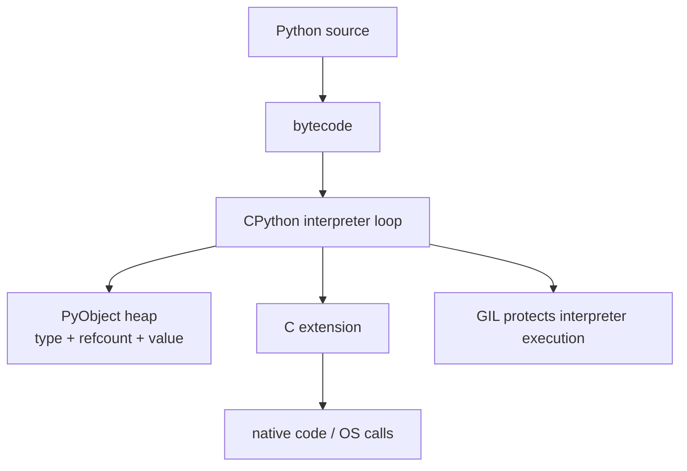

Connect to prior sections:

- The CPython interpreter is itself a native process loaded by the OS.
- Python threads are OS threads in that process.
- The Python heap is a runtime-managed object graph inside the process heap.
- File descriptors and sockets still come from the OS.
- `multiprocessing` returns to the UNIX process model for CPU parallelism.
- `asyncio` uses the event-loop/coroutine model to avoid one thread per wait.

> **Side note:** "Python is slow" is too crude. Python is often fast enough at orchestration and I/O, while native extensions do heavy CPU work.

---

## 87. Threading Model In Python

> **Flow:** From **What Kind Of Language Is Python In Runtime**, move into **Threading Model In Python**. This page should answer the natural follow-up and prepare for **What Python Threads Included New That Other Languages Discussed Did Not Have**.


Python supports OS threads through `threading`.

In classic CPython:

- Multiple Python threads can exist.
- The GIL allows only one thread to execute Python bytecode at a time.
- Threads can still overlap I/O because the GIL may be released during blocking operations.
- Native extensions may release the GIL for CPU-heavy native work.

Python concurrency options:

- `threading` for I/O-bound overlap and blocking API integration.
- `multiprocessing` for CPU parallelism through processes.
- `asyncio` for event-loop cooperative concurrency.
- `concurrent.futures` for thread/process pools.
- Native libraries such as NumPy may use native parallelism.

Python design choices map cleanly to earlier mechanisms:

| Need | Python tool | Underlying model |
|---|---|---|
| overlap blocking I/O | `threading` | OS threads, GIL released during waits |
| CPU parallelism in Python code | `multiprocessing` | multiple processes, IPC, serialization |
| many socket waits | `asyncio` | event loop, coroutines, readiness |
| native numeric compute | NumPy/PyTorch/etc. | native code, often releases GIL |
| background jobs | Celery/RQ/process workers | process/service boundary |

The common mistake is choosing by syntax instead of bottleneck:

```text
CPU-bound Python bytecode -> processes or native code
I/O-bound blocking calls  -> threads may be fine
I/O-bound async stack     -> asyncio may be fine
shared mutable objects    -> still need locks or ownership
```

> **Side note:** Python threads are real OS threads. The GIL does not mean "fake threads." It means Python bytecode execution is serialized in classic CPython.

---

## 88. What Python Threads Included New That Other Languages Discussed Did Not Have

> **Flow:** From **Threading Model In Python**, move into **What Python Threads Included New That Other Languages Discussed Did Not Have**. This page should answer the natural follow-up and prepare for **Why Python Chose A Different Way**.


Python's distinct historical feature is the GIL in CPython:

- A global interpreter lock protecting interpreter internals.
- Makes many C-level object operations simpler.
- Allows reference counting updates without making every object operation independently thread-safe.
- Serializes Python bytecode execution in classic builds.

Current important update:

- CPython 3.13 introduced an optional experimental free-threaded build that can disable the GIL.
- This is not yet the default mainstream assumption for all deployments.
- Compatibility, extension safety, and performance tradeoffs matter.

What this means:

- Python threading discussions must say "which Python implementation and build?"
- Classic CPython threading differs from Java/C++ native-thread CPU parallelism.
- Future Python may increasingly support true parallel bytecode execution in free-threaded builds.

> **Side note:** Teach this carefully. Many engineers learned "Python has GIL" as timeless law. It is still the practical default in much production CPython, but the ecosystem is actively changing.

---

## 89. Why Python Chose A Different Way

> **Flow:** From **What Python Threads Included New That Other Languages Discussed Did Not Have**, move into **Why Python Chose A Different Way**. This page should answer the natural follow-up and prepare for **What Is GIL In Python**.


CPython's GIL was a pragmatic design tradeoff.

Reasons:

- Simpler interpreter implementation.
- Efficient reference counting in single-threaded common case.
- Easier C extension model historically.
- Many Python workloads were I/O-bound or extension-backed.
- Lower overhead than fine-grained locking everywhere.

Tradeoff:

- CPU-bound Python bytecode does not scale across cores with threads in classic CPython.
- C extensions must be careful about GIL behavior.
- Multicore CPU parallelism often uses processes or native libraries.

Why this connects to C:

- CPython is implemented largely in C.
- Reference counts are mutable fields on Python objects.
- Without a global lock, those fields and many interpreter invariants need another synchronization strategy.
- Fine-grained locking can make single-threaded execution slower and extension compatibility harder.
- A free-threaded implementation has to revisit object layout, reference counting strategy, extension assumptions, and performance tradeoffs.

> **Side note:** The GIL was not stupidity. It was a trade made for simplicity, safety, performance of common cases, and extension compatibility.

---

## 90. What Is GIL In Python

> **Flow:** From **Why Python Chose A Different Way**, move into **What Is GIL In Python**. This page should answer the natural follow-up and prepare for **What Kind Of Language Is Ruby In Runtime**.


The Global Interpreter Lock is a mutex around execution of CPython interpreter bytecode and internal object machinery.

Effects:

- Only one thread runs Python bytecode at a time in classic CPython.
- Threads still switch periodically.
- Blocking I/O can release the GIL.
- Native extensions can release the GIL.
- Reference counting is simpler.

Bad fit:

- CPU-bound pure Python multithreading.

Good enough fit:

- I/O-bound concurrency.
- Wrapping blocking APIs.
- Programs where native extensions release the GIL.

Example:

```python
from threading import Thread

def cpu_work():
    total = 0
    for i in range(10_000_000):
        total += i

threads = [Thread(target=cpu_work) for _ in range(4)]
for t in threads: t.start()
for t in threads: t.join()
```

In classic CPython, this is unlikely to speed up pure Python CPU work across cores.

Classic CPython GIL mental model:

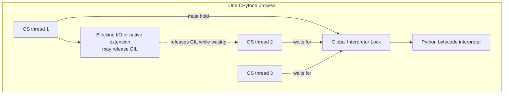

> **Side note:** For CPU-bound Python, reach first for vectorized native libraries, multiprocessing, or another runtime/language. Threads are still fine for I/O.

---

## 91. What Kind Of Language Is Ruby In Runtime

> **Flow:** From **What Is GIL In Python**, move into **What Kind Of Language Is Ruby In Runtime**. This page should answer the natural follow-up and prepare for **Threading Model Of Ruby**.


Ruby is a dynamic, object-oriented language with a managed runtime.

Common production runtime:

- CRuby/MRI.
- Bytecode VM.
- Garbage-collected heap.
- Dynamic dispatch.
- Native extensions.
- Global VM Lock, or GVL, in CRuby.

Other Ruby implementations:

- JRuby on JVM.
- TruffleRuby.

Concurrency implications depend on implementation.

CRuby:

- Native threads exist.
- GVL limits parallel Ruby execution.
- I/O can release GVL.

JRuby:

- JVM threading model.
- Can allow more true parallel Ruby execution depending on workload.

Ruby runtime lens:

- Ruby code usually runs through a VM/interpreter/JIT depending on implementation.
- Objects live on a managed heap.
- Blocks, closures, dynamic dispatch, and metaprogramming make the runtime powerful and flexible.
- CRuby's GVL simplifies VM internals similarly in spirit to CPython's GIL.
- Ruby web apps often scale through multiple worker processes plus I/O-friendly concurrency inside each worker.

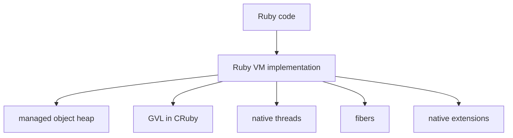

> **Side note:** Like Python, "Ruby threading" must specify implementation. CRuby and JRuby do not have identical runtime constraints.

---

## 92. Threading Model Of Ruby

> **Flow:** From **What Kind Of Language Is Ruby In Runtime**, move into **Threading Model Of Ruby**. This page should answer the natural follow-up and prepare for **What Ruby Did With Event-Synchrony**.


Ruby supports:

- Threads.
- Fibers.
- Ractors in newer Ruby for actor-like parallelism constraints.
- Event-driven libraries.

CRuby threading:

- Threads are native OS threads.
- Global VM Lock prevents simultaneous execution of Ruby bytecode.
- Blocking I/O may allow other threads to run.
- CPU-bound Ruby threads do not scale like C++/Java threads.

Ruby synchronization:

- `Mutex`
- `Queue`
- `ConditionVariable`
- `Monitor`

Ruby concurrency depth:

- A CRuby thread is an OS thread, but Ruby bytecode execution is constrained by the GVL.
- Blocking I/O can release the GVL, so threads remain useful for I/O-bound applications.
- A `Queue` is often better than hand-rolled locking because it expresses ownership transfer.
- Fibers are cooperative; they are excellent when waiting is explicit or scheduler-integrated.
- Ractors aim to make parallelism safer by restricting object sharing, but they require a different programming style.

Example:

```ruby
mutex = Mutex.new
counter = 0

threads = 4.times.map do
  Thread.new do
    mutex.synchronize { counter += 1 }
  end
end

threads.each(&:join)
```

> **Side note:** Ruby threads are useful for I/O and structure, but CRuby's GVL limits CPU parallelism similarly to classic CPython's GIL.

---

## 93. What Ruby Did With Event-Synchrony

> **Flow:** From **Threading Model Of Ruby**, move into **What Ruby Did With Event-Synchrony**. This page should answer the natural follow-up and prepare for **What Kind Of Language Is Javascript In Runtime**.


Ruby has a strong ecosystem around evented and fiber-based concurrency.

Key ideas:

- Fibers are lightweight cooperative execution units.
- Event loops multiplex I/O readiness.
- Fiber schedulers allow non-blocking behavior behind synchronous-looking code.
- Libraries can yield when waiting on I/O.

Why this matters:

- Avoids one OS thread per connection.
- Keeps code readable compared with deeply nested callbacks.
- Works well for I/O-heavy workloads.
- Does not automatically solve CPU-bound parallelism.

Conceptual flow:

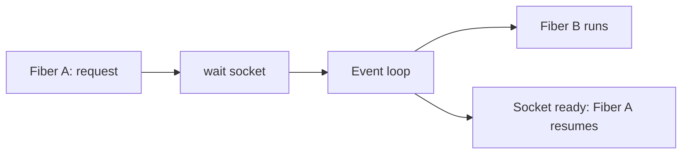

How this connects to earlier sections:

- Fibers are closer to coroutines than OS threads.
- The kernel is still responsible for socket readiness and OS scheduling.
- The Ruby runtime decides which fiber resumes when I/O is ready.
- Shared mutable Ruby objects still need discipline if multiple threads or ractors are involved.
- The benefit is not "more CPU"; it is avoiding idle OS threads during waits.

> **Side note:** Evented Ruby is about not wasting OS threads during I/O waits. It is not magic multicore CPU parallelism.

---

## 94. What Kind Of Language Is Javascript In Runtime

> **Flow:** From **What Ruby Did With Event-Synchrony**, move into **What Kind Of Language Is Javascript In Runtime**. This page should answer the natural follow-up and prepare for **Threading Model In Javascript**.


JavaScript is a dynamic language standardized as ECMAScript.

Runtime depends on host:

- Browser.
- Node.js.
- Deno.
- Bun.

Common runtime traits:

- Garbage-collected heap.
- Event loop.
- Promise/microtask queue.
- Usually one main JavaScript execution thread per isolate/event loop.
- Native engine JIT compilation.
- Host APIs for I/O, timers, networking.

Node.js adds:

- libuv event loop.
- Thread pool for certain blocking operations.
- Worker threads for parallel JS execution.
- Cluster/process models.

JavaScript runtime lens:

- ECMAScript defines language behavior, but the host defines I/O and event integration.
- V8/SpiderMonkey/JavaScriptCore execute JS and manage the heap.
- Browser runtimes integrate JS with DOM, rendering, timers, network, and workers.
- Node integrates JS with libuv, OS sockets, timers, filesystem, DNS, crypto, worker threads, and child processes.
- A single event loop gives run-to-completion semantics for ordinary JS code on that loop.

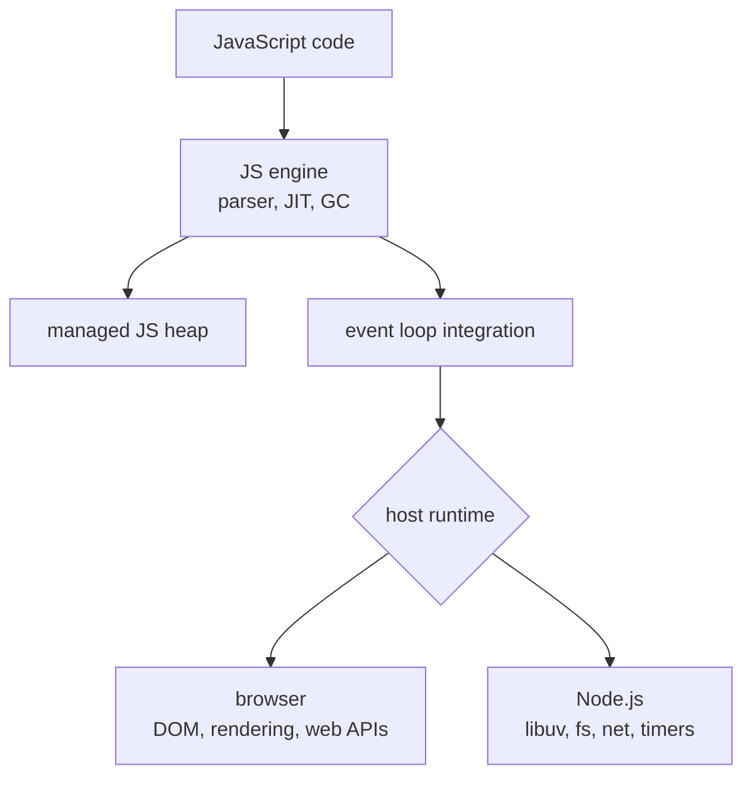

> **Side note:** JavaScript concurrency is host-defined around the language. The language gives promises and async functions; Node/browser decide event loop and I/O integration.

---

## 95. Threading Model In Javascript

> **Flow:** From **What Kind Of Language Is Javascript In Runtime**, move into **Threading Model In Javascript**. This page should answer the natural follow-up and prepare for **Why Javascript Picked This Kind Of Threading Model**.


JavaScript's mainstream model:

- Single-threaded execution per event loop.
- Run-to-completion for each task.
- Asynchronous I/O via event loop.
- Promises schedule microtasks.
- Timers, network events, file I/O callbacks schedule tasks.

The event loop has two important promises:

- A JavaScript task runs to completion before another task starts on the same loop.
- Awaiting a promise yields control; it does not create CPU parallelism by itself.

That gives a simpler shared-state model than arbitrary preemptive threads, but it creates a harsh rule:

```text
If one callback blocks the loop, every request/timer/promise behind it waits.
```

Node.js:

- Main JS thread runs event loop.
- libuv handles I/O readiness.
- libuv thread pool handles some filesystem/DNS/crypto work.
- Worker threads can run JS in parallel with separate isolates.

Node.js execution map:

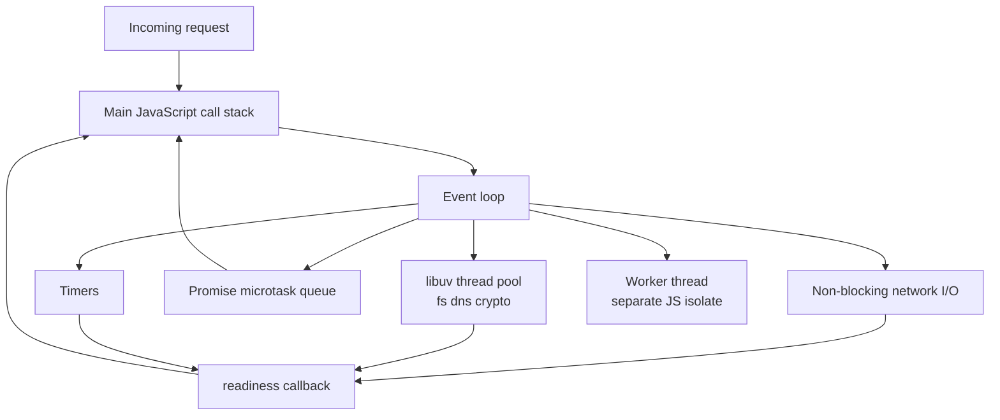

Browser:

- Main thread handles JS, layout, painting coordination.
- Web Workers provide background parallelism.
- SharedArrayBuffer and Atomics enable shared-memory coordination with restrictions.

Node's "single-threaded" phrase is incomplete:

- JS application code usually runs on one main thread per isolate.
- Some I/O readiness is evented by the OS.
- Some operations use libuv's thread pool.
- Worker threads can run JS in parallel but do not share the same ordinary JS heap.
- Cluster or multiple processes return to the UNIX process model.

> **Side note:** Single-threaded JS avoids many shared-memory races in application code, but it creates event-loop blocking as the central failure mode.

---

## 96. Why Javascript Picked This Kind Of Threading Model

> **Flow:** From **Threading Model In Javascript**, move into **Why Javascript Picked This Kind Of Threading Model**. This page should answer the natural follow-up and prepare for **Deep Dive Into Coroutines**.


JavaScript began in browsers.

Design pressures:

- UI programming needed predictable event handling.
- DOM was not designed for arbitrary multithreaded mutation.
- A single event loop made browser scripting simpler.
- Run-to-completion avoided many lock-based application bugs.
- Asynchronous callbacks fit user events, timers, and network.

Node.js reused this model for servers:

- Most server time is I/O wait.
- Event loop can handle many connections.
- Avoids one thread per connection.
- Simplifies shared state within one process.

Costs:

- CPU-heavy JS blocks the event loop.
- One bad synchronous operation hurts all requests on that loop.
- Backpressure must be designed.
- Debugging async stack traces can be hard.

Why JavaScript is the right bridge into coroutines:

- `async`/`await` makes continuation passing look sequential.
- Promises represent future completion, not OS threads.
- The event loop resumes work when awaited operations settle.
- Interleavings happen at `await` boundaries rather than arbitrary machine instructions on the same JS thread.
- This prepares the learner for the next section: coroutines are execution state machines managed by a runtime.

> **Side note:** JavaScript's model is excellent when you keep the event loop free. It becomes terrible when you treat the event loop like a CPU worker.

---

## Runtime Summary: Same OS Machinery, Different Promises

All six languages eventually sit on the same lower layers:

- CPU cores execute instructions.
- The OS schedules threads/processes.
- Virtual memory maps code, heap, stacks, and libraries.
- File descriptors or handles represent kernel resources.
- Shared state needs synchronization or ownership.
- Waiting must be represented somewhere: blocked thread, parked coroutine, event-loop callback, queue, future, or process boundary.

What changes is the contract the language runtime gives the programmer.

| Language | What usually schedules application work? | Memory ownership model | Main concurrency win | Main concurrency trap |
|---|---|---|---|---|
| C | OS/RTOS threads or tasks | manual ownership | precise control, small runtime | undefined behavior, lifetime bugs, weak guardrails |
| C++ | OS threads plus library abstractions | RAII, values, smart pointers, manual design | high performance with deterministic cleanup | async lifetime, data races, memory ordering mistakes |
| Java | JVM over OS threads, executors, virtual threads | garbage-collected heap | strong memory model and mature concurrency libraries | GC pressure, pool misuse, shared-state complexity |
| Python | interpreter, OS threads, processes, event loop | refcount + GC in CPython | orchestration, I/O overlap, rich native libraries | GIL assumptions, CPU-bound thread disappointment |
| Ruby | Ruby VM, OS threads, fibers/event loop | managed heap | expressive I/O-heavy app concurrency | GVL assumptions, CPU-bound limits in CRuby |
| JavaScript | host event loop, workers/processes when needed | GC heap per isolate/context | high I/O concurrency with simple run-to-completion state | event-loop blocking and unbounded async fan-out |

The senior way to compare runtimes is not:

```text
Which language has threads?
```

It is:

```text
Where does execution wait?
Where is state shared?
Who owns memory lifetime?
Who schedules work?
What can run in parallel?
What is the failure mode under load?
```

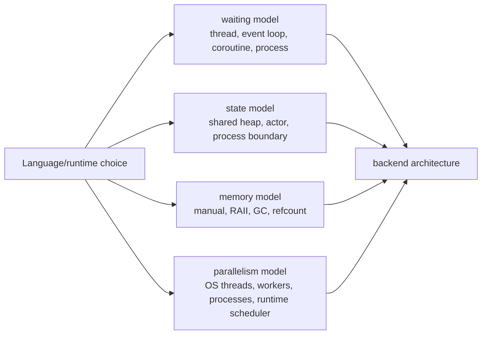

This is why the next section moves into coroutines and Go. Once you understand OS threads and language runtimes, the next question is how runtimes create lighter execution units that are not simply UNIX processes or kernel threads.

---

## References For This Section

- [Oracle Java Tutorial: Concurrency](https://docs.oracle.com/javase/tutorial/essential/concurrency/)
- [Java SE 21 API: `ExecutorService`](https://docs.oracle.com/en/java/javase/21/docs/api/java.base/java/util/concurrent/ExecutorService.html)
- [Oracle Java 21 docs: Virtual Threads](https://docs.oracle.com/en/java/javase/21/core/virtual-threads.html)
- [Python docs: `threading`](https://docs.python.org/3/library/threading.html)
- [Python docs: Global Interpreter Lock](https://docs.python.org/3/glossary.html#term-global-interpreter-lock)
- [Python docs: `asyncio`](https://docs.python.org/3/library/asyncio.html)
- [Node.js guide: The Event Loop](https://nodejs.org/learn/asynchronous-work/event-loop-timers-and-nexttick)
- [Node.js guide: Don't Block the Event Loop or Worker Pool](https://nodejs.org/learn/asynchronous-work/dont-block-the-event-loop)
- [Ruby docs: Thread](https://docs.ruby-lang.org/en/master/Thread.html)
- [Ruby docs: Fiber](https://docs.ruby-lang.org/en/master/Fiber.html)

Use these when checking language/runtime-specific claims about threads, GIL/GVL-style limits, event loops, virtual threads, and async APIs.

---

## Lead Into Next Section

**Core takeaway to close with:** Compare runtime models, threading models, GC, GIL/GVL, and event-loop choices.

**Transition to next section:** JavaScript and Ruby introduce evented thinking, which sets up the deeper discussion of coroutines and lightweight runtime scheduling.

**Continue reading:** Continue with [Coroutines And Golang](10-coroutines-and-golang.md) to follow the next layer of the model.

**Pause check before moving on:** pause and summarize the section in one sentence and name the resource or boundary that became clearer.

Previous: [Races, Locks, Semaphores, And Atomics](08-races-locks-semaphores-and-atomics.md) | [Index](index.md) | Next: [Coroutines And Golang](10-coroutines-and-golang.md)
