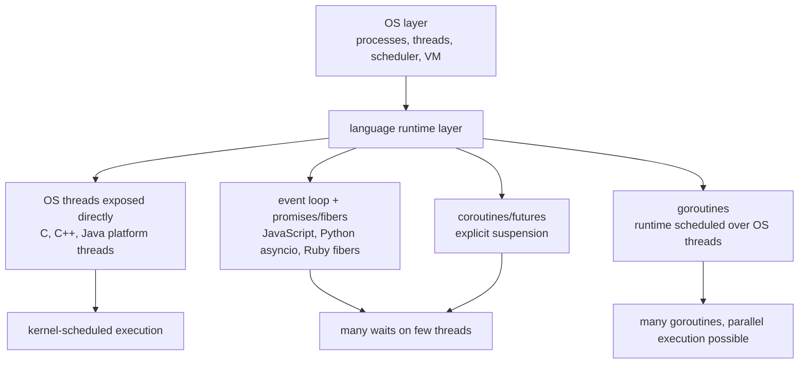
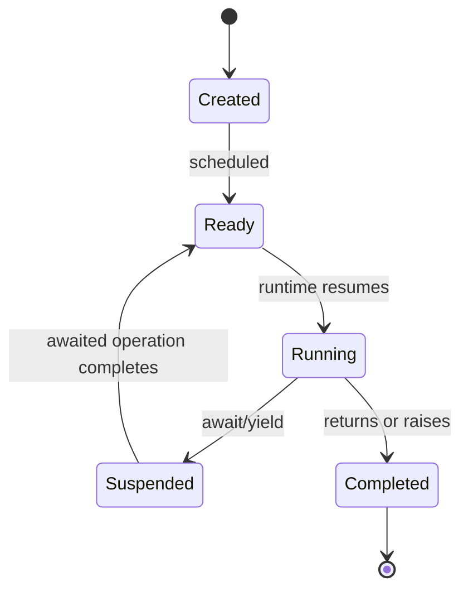
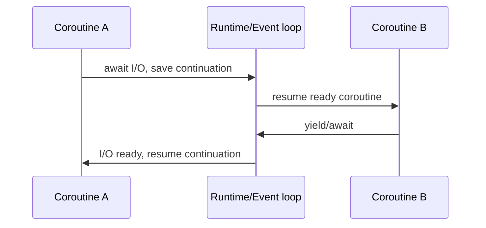
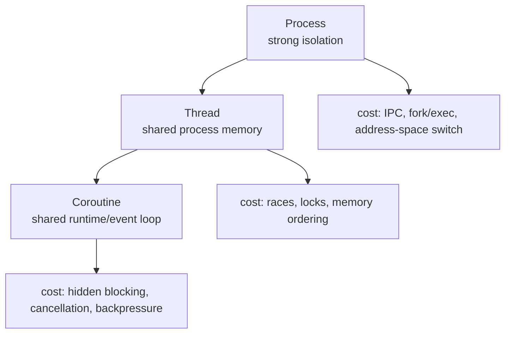
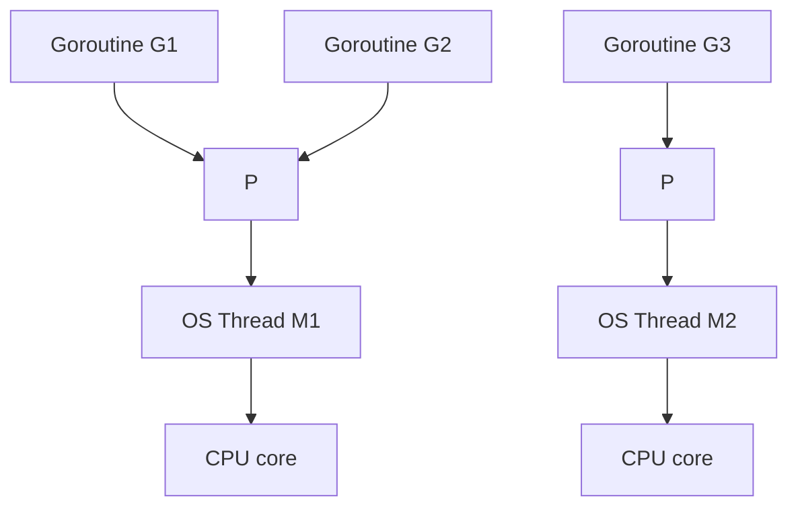
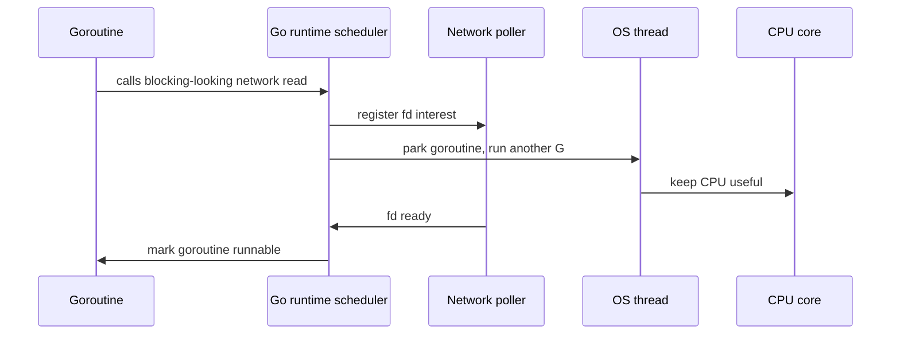
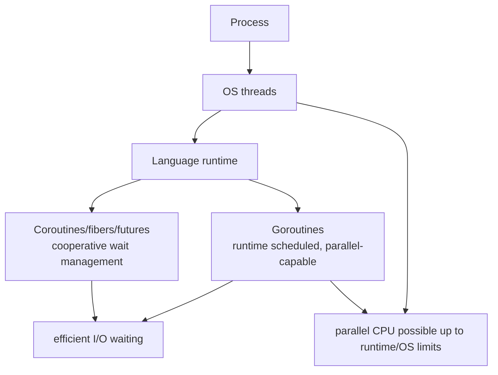

# Coroutines And Golang

Previous: [Language Runtimes: C, C++, Java, Python, Ruby, JavaScript](09-language-runtimes-c-cpp-java-python-ruby-js.md) | [Index](index.md) | Next: [Backend Concurrency Architecture](11-backend-concurrency-architecture.md)

**Section purpose:** Explain coroutine context switches, coroutine tradeoffs, Go's goroutine model, and language summary.

## Section Bridge

**Arriving from:** [Language Runtimes: C, C++, Java, Python, Ruby, JavaScript](09-language-runtimes-c-cpp-java-python-ruby-js.md). The previous section covered: Compare runtime models, threading models, GC, GIL/GVL, and event-loop choices.

**This section answers:** Explain coroutine context switches, coroutine tradeoffs, Go's goroutine model, and language summary.

**Watch for the next question:** once this section lands, the next natural question is why we need **Backend Concurrency Architecture** next.

> **Reading note:** Read this as one continuous block. The slide-level `Flow` notes explain local transitions; the section-level transition at the end connects this topic to the next one.

---

## Why This Chapter Exists

This chapter gets its own space because coroutines and goroutines are the point where the course stops treating "concurrent execution" as only an operating-system thread problem.

Earlier sections built the foundation:

- A **process** is a protected resource container.
- A **thread** is a schedulable execution stream inside a process.
- A **context switch** saves and restores execution state.
- A **runtime** can add its own scheduler, GC, event loop, and helper threads.
- JavaScript and Ruby showed that many concurrent waits can be handled without one OS thread per wait.

The next question is natural:

```text
Can a runtime create lighter execution units than OS threads
while still giving programmers a useful sequential-looking style?
```

Coroutines answer part of that question.

Go answers a related but different question:

```text
Can a language make lightweight concurrent execution the default programming model
and multiplex huge numbers of tasks over a smaller number of OS threads?
```

This distinction deserves a dedicated chapter because many engineers collapse these ideas into one phrase: "lightweight threads." That phrase hides the important differences:

- cooperative vs preemptive scheduling
- stackless coroutine frames vs growable stacks
- event-loop concurrency vs multicore parallelism
- explicit `await` points vs blocking-looking calls
- runtime scheduler vs kernel scheduler
- structured cancellation vs orphaned background work
- cheap waiting vs cheap CPU parallelism



The core idea:

```text
Threads are an OS-visible execution abstraction.
Coroutines are a runtime-visible control-flow abstraction.
Goroutines are runtime-scheduled execution units that can run in parallel on OS threads.
```

> **Side note:** This chapter is the bridge from "what does the OS schedule?" to "what does the runtime schedule?" Without that bridge, async/await, goroutines, fibers, and event loops look like syntax features instead of concurrency architecture.

---

## 97. Deep Dive Into Coroutines

> **Flow:** From **Why Javascript Picked This Kind Of Threading Model**, move into **Deep Dive Into Coroutines**. This page should answer the natural follow-up and prepare for **How Is Context Switch Going To Happen In Coroutine**.


A coroutine is an execution unit that can suspend and resume without relying on kernel preemption.

Coroutine characteristics:

- Cooperative.
- Lightweight compared with OS threads.
- Suspension occurs at explicit yield/await points.
- State is stored in coroutine frame or stack-like structure.
- Scheduler may be language runtime/event loop.

Examples:

- Python `async def`.
- JavaScript `async function`.
- Kotlin coroutines.
- C++20 coroutines.
- Rust async futures.
- Go goroutines are not exactly coroutines, but share lightweight scheduling ideas.

Coroutine vs thread:

- Thread can be preempted almost anywhere.
- Coroutine yields at known points.
- Thread stack is usually larger.
- Coroutine state can be much smaller.

The reason coroutines exist:

- OS threads are powerful, but each thread carries stack memory, scheduler overhead, and kernel-visible state.
- Many backend workloads spend most of their time waiting on sockets, timers, databases, files, or queues.
- Keeping one OS thread blocked for every wait can waste memory and scheduler capacity.
- Callback-based async code avoids blocked threads but can destroy readability.
- Coroutines try to preserve sequential-looking code while turning waits into explicit suspension points.

Think of a coroutine as a resumable function:

```text
normal function:
  call -> runs -> returns once

coroutine:
  start -> runs -> suspends -> resumes -> suspends -> resumes -> completes
```

When a coroutine suspends, it is not "running slowly." It is not running at all. Its state is parked somewhere by the runtime until the awaited condition is ready.

Coroutine lifecycle:



> **Side note:** Coroutines are a control-flow abstraction. They are not automatically parallel, and they do not automatically make blocking code non-blocking.

---

## 98. How Is Context Switch Going To Happen In Coroutine

> **Flow:** From **Deep Dive Into Coroutines**, move into **How Is Context Switch Going To Happen In Coroutine**. This page should answer the natural follow-up and prepare for **Languages Which Offer Coroutines**.


Coroutine switch:

1. Coroutine reaches `await` or `yield`.
2. Runtime saves continuation state.
3. Coroutine is marked suspended.
4. Runtime/event loop runs another ready coroutine.
5. Awaited operation completes.
6. Coroutine is marked ready.
7. Runtime resumes from saved continuation point.

What gets saved:

- Continuation/program point.
- Live local variables.
- Awaited future/promise handle.
- Exception/cancellation state.
- Sometimes stack segment or heap-allocated frame.

No kernel mode switch is required if the coroutine yields in user space.

This is the key contrast with the context-switch chapters:

| Switch type | Who switches? | What is saved? | Why it happens |
|---|---|---|---|
| Process switch | kernel | registers, kernel stack, address-space context, scheduler state | time slice, block, wakeup, priority |
| Thread switch | kernel/runtime | registers, stack pointer, scheduler state | time slice, block, wakeup, priority |
| Coroutine switch | language runtime | continuation, live locals, await state | explicit `await` / `yield` / runtime suspension |

In many coroutine systems, the compiler rewrites the function into a state machine.

Conceptually:

```python
async def handler():
    user = await fetch_user()
    orders = await fetch_orders(user.id)
    return render(user, orders)
```

becomes something like:

```text
state 0: start fetch_user, suspend
state 1: resume with user, start fetch_orders, suspend
state 2: resume with orders, render result, complete
```

That is why local variables survive across `await`. They are no longer just ordinary stack locals in the simple native-call sense; they are part of the coroutine's saved continuation/frame.



> **Side note:** Coroutine context switch is cheaper partly because it avoids kernel scheduler involvement, but the cost can still include allocations, promise/future machinery, and callback dispatch.

---

## 99. Languages Which Offer Coroutines

> **Flow:** From **How Is Context Switch Going To Happen In Coroutine**, move into **Languages Which Offer Coroutines**. This page should answer the natural follow-up and prepare for **Why Is Coroutine Better Than Threads**.


Languages/runtimes with coroutine-like features:

- Python: `asyncio`, `async def`, `await`.
- JavaScript: async functions and promises.
- Kotlin: coroutines.
- C#: async/await.
- C++20: coroutine language support.
- Rust: async/await futures.
- Lua: coroutines.
- Ruby: Fibers.
- Swift: async/await.
- Go: goroutines, lightweight scheduled functions with different semantics.
- Erlang/Elixir: lightweight processes, actor-style rather than classic coroutines.

Important distinction:

- Some coroutines are stackless.
- Some fibers are stackful.
- Some runtimes multiplex onto OS threads.
- Some require async-compatible libraries.

Important implementation axis:

| Axis | Meaning | Why learner should care |
|---|---|---|
| Stackless | state stored in compiler/runtime frame | usually explicit await points; good memory profile |
| Stackful | coroutine/fiber has its own stack | can suspend deeper in call stack; more stack management |
| Cooperative | yields only at known points | easier interleaving reasoning; blocking bugs hurt badly |
| Preemptive | runtime can interrupt execution | better fairness; harder reasoning |
| Single-threaded loop | one execution at a time | fewer shared-memory races; no CPU parallelism on that loop |
| Multi-threaded runtime | work can run across cores | more parallelism; shared-state discipline returns |

Do not ask only:

```text
Does this language have coroutines?
```

Ask:

```text
What resumes them, where is their state stored, can they run in parallel,
and what happens if they call a blocking function?
```

> **Side note:** Do not teach "coroutine" as one universal implementation. Ask whether it is stackful, stackless, preemptive, cooperative, single-threaded, or work-stealing.

---

## 100. Why Is Coroutine Better Than Threads

> **Flow:** From **Languages Which Offer Coroutines**, move into **Why Is Coroutine Better Than Threads**. This page should answer the natural follow-up and prepare for **Why Is Coroutine Worse Than Thread**.


Coroutines can be better when:

- Work is I/O-bound.
- You need many concurrent waits.
- You want lower memory per task.
- You want fewer kernel context switches.
- You want explicit suspension points.
- You want easier reasoning about where interleavings happen.
- You want structured cancellation and scopes.
- You want high connection counts without huge thread pools.

Operational wins:

- Millions of parked coroutines may be feasible where millions of OS threads are not.
- Backpressure can be modeled through awaitable queues.
- Less lock contention if single-threaded event loop owns state.

What "better" really means:

```text
coroutine better than thread
  does not mean: always faster
  does mean: often cheaper to park while waiting
```

Coroutines are especially strong when the workload is shaped like this:

```text
receive request
  await database
  await cache
  await service A
  await service B
  combine results
  send response
```

During each await, the runtime can run other ready work on the same OS thread instead of leaving that OS thread blocked.

```mermaid
sequenceDiagram
  participant H1 as Handler coroutine A
  participant LOOP as Event loop/runtime
  participant DB as Database socket
  participant H2 as Handler coroutine B
  H1->>DB: send query
  H1->>LOOP: await response, suspend
  LOOP->>H2: run another ready handler
  DB->>LOOP: response ready
  LOOP->>H1: resume with result
```

> **Side note:** Coroutines are excellent for wait-heavy workloads. They are not a replacement for CPU parallelism unless the runtime schedules them across multiple OS threads and the code is parallel-safe.

---

## 101. Why Is Coroutine Worse Than Thread

> **Flow:** From **Why Is Coroutine Better Than Threads**, move into **Why Is Coroutine Worse Than Thread**. This page should answer the natural follow-up and prepare for **Summary Of Context Switch Between Process, Thread, Coroutine**.


Coroutines can be worse when:

- Libraries block OS threads and do not yield.
- CPU-bound work blocks the event loop.
- Call stacks become async state machines.
- Debugging crosses scheduler boundaries.
- Cancellation is poorly handled.
- Backpressure is ignored.
- You need true parallelism but only have one event loop.
- Developers accidentally mix blocking and non-blocking APIs.

Thread advantages:

- Works naturally with blocking APIs.
- Can run CPU work on multiple cores.
- Kernel scheduler preempts long-running work.
- Stack traces can be more straightforward.
- Mature tooling for some ecosystems.

Coroutine failure modes:

- **Hidden blocking:** one blocking call freezes the event loop or carrier thread.
- **Unbounded fan-out:** launching 50,000 coroutines can still destroy a database or downstream service.
- **Forgotten await:** work may not run, errors may be lost, or promises/tasks may leak.
- **Cancellation leaks:** a parent request times out, but child tasks keep running.
- **Priority blindness:** event loops often need explicit fairness and backpressure design.
- **Async contamination:** once one layer is async, callers often need to become async too.
- **Hard stack reconstruction:** logical call stacks span callbacks, futures, and runtime queues.

Threads and coroutines fail differently:

```text
thread failure: too many stacks, too much blocking, lock contention, race/deadlock
coroutine failure: blocked loop, leaked tasks, missing backpressure, hidden synchronous call
```

> **Side note:** Coroutine systems fail when one function lies: it looks async but blocks, or it forgets to await/backpressure. That one lie can freeze the event loop.

---

## 102. Summary Of Context Switch Between Process, Thread, Coroutine

> **Flow:** From **Why Is Coroutine Worse Than Thread**, move into **Summary Of Context Switch Between Process, Thread, Coroutine**. This page should answer the natural follow-up and prepare for **What Kind Of Language Is Golang In Runtime**.


| Unit | Scheduler | Isolation | Switch cost | Shared memory | Parallelism |
|---|---|---:|---:|---:|---:|
| Process | Kernel | Strong | Higher | Explicit | Yes |
| Thread | Kernel/runtime | Process-level | Medium | Yes | Yes |
| Coroutine | Runtime/event loop | Usually none inside process | Lower | Depends on host thread | Not by itself |

Process switch:

- Save CPU context.
- May switch address space.
- Strong isolation.

Thread switch:

- Save CPU context.
- Same address space if same process.
- Shared state risk.

Coroutine switch:

- Save continuation.
- Usually cooperative.
- No kernel switch if purely user-space.

Read this table as a ladder:

```text
Process: isolate strongly, pay more to communicate.
Thread: share process resources, pay more correctness cost.
Coroutine: share runtime thread cooperatively, pay more discipline around blocking and cancellation.
```

The deeper lesson is that every step down the ladder buys cheaper coordination by weakening some boundary:

- Process boundary protects memory strongly.
- Thread boundary shares memory, so synchronization becomes mandatory.
- Coroutine boundary may share one thread, so blocking and fairness become mandatory design concerns.



> **Side note:** When someone says "coroutines are lightweight threads", ask which properties they mean: memory, scheduling, isolation, preemption, or parallelism.

---

## 103. What Kind Of Language Is Golang In Runtime

> **Flow:** From **Summary Of Context Switch Between Process, Thread, Coroutine**, move into **What Kind Of Language Is Golang In Runtime**. This page should answer the natural follow-up and prepare for **What Is The Threading Model In Golang**.


Go is a compiled language with a managed runtime designed around concurrency.

Runtime characteristics:

- Compiled to native code.
- Garbage-collected heap.
- Built-in goroutines.
- Built-in channels.
- Runtime scheduler.
- Growing goroutine stacks.
- Network poller integration.
- Standard library designed for blocking-looking concurrent code.

Go's design center:

- Simple syntax.
- Cheap concurrent units.
- CSP-inspired communication.
- Production network services.
- Runtime-managed scheduling over OS threads.

Why Go belongs in this chapter:

- It is not just "C with easier threads."
- It is not just "Python async without await."
- It is not just "Java threads with different syntax."
- It is a language/runtime/standard-library design where lightweight concurrency is a first-class assumption.

Go deliberately makes this cheap:

```go
go handle(conn)
```

That line creates a goroutine, not a kernel thread. The runtime decides where and when it runs.

Go connects prior sections in one place:

- Native compiled code and OS process model like C/C++.
- Garbage-collected heap like Java/Python/Ruby/JS.
- Runtime scheduler like managed runtimes.
- Blocking-looking I/O integrated with a network poller like event-loop systems.
- Shared memory still possible, so mutexes and atomics still matter.
- Channels provide a structured communication style, but they do not remove all races.

> **Side note:** Go did not merely add a thread library. It designed the language, runtime, standard library, and tooling around concurrent services.

---

## 104. What Is The Threading Model In Golang

> **Flow:** From **What Kind Of Language Is Golang In Runtime**, move into **What Is The Threading Model In Golang**. This page should answer the natural follow-up and prepare for **How Golang Goroutines Are Different From Python Coroutines**.


Go uses an M:N scheduler:

- Many goroutines are multiplexed over fewer OS threads.
- Runtime scheduler maps goroutines onto processors and machine threads.

Classic terms:

- **G:** goroutine.
- **M:** machine, an OS thread.
- **P:** processor, runtime scheduling resource needed to execute Go code.

Goroutines:

- Start with small stacks that grow/shrink.
- Block cheaply on channels, timers, network I/O.
- Can run in parallel across multiple OS threads up to `GOMAXPROCS`.
- Are preempted by runtime mechanisms.

The G/M/P model in plain terms:

- **Goroutine (G):** the work to run; includes stack, instruction state, and metadata.
- **Machine (M):** an OS thread that can execute Go code.
- **Processor (P):** runtime permission/resource needed to execute Go code; roughly the scheduler token that connects runnable goroutines to OS threads.

Why the P exists:

- It lets Go limit how many OS threads run Go code at once.
- It holds local run queues and scheduler/cache-related state.
- It helps the runtime avoid one global lock around all runnable goroutines.
- `GOMAXPROCS` controls how many Ps can execute Go code simultaneously.



Blocking-aware scheduling intuition:



What happens on common blocking points:

| Blocking point | Runtime behavior |
|---|---|
| network I/O | park goroutine, register with netpoller, run another goroutine |
| channel receive with no value | park goroutine on channel wait queue |
| channel send with no receiver/buffer | park goroutine on channel wait queue |
| timer/sleep | park goroutine until timer fires |
| syscall that blocks OS thread | runtime may detach P and let another M use it |
| mutex contention | goroutine waits; runtime/lock implementation coordinates wakeup |

This is why Go code can look blocking but still scale well for many network services. The runtime often turns blocking-looking operations into goroutine parking rather than OS-thread parking.

> **Side note:** A goroutine is not an OS thread, but it can run on one. That distinction explains both Go's scalability and its runtime complexity.

---

## 105. How Golang Goroutines Are Different From Python Coroutines

> **Flow:** From **What Is The Threading Model In Golang**, move into **How Golang Goroutines Are Different From Python Coroutines**. This page should answer the natural follow-up and prepare for **Summary Of All Languages In Terms Of Process, Threads, Goroutines So Far**.


Go goroutines:

- Can run in parallel on multiple OS threads.
- Are scheduled by Go runtime.
- Can call blocking-looking APIs that runtime often integrates with scheduler.
- Use channels and locks.
- Preemption exists in modern Go runtime.
- Do not require `await` syntax at every suspension point.

Python `asyncio` coroutines:

- Cooperative.
- Usually run on one event loop thread.
- Require `await` to yield.
- Do not provide CPU parallelism by themselves.
- Need async-compatible libraries.
- Can be combined with thread/process pools.

Comparison:

| Feature | Go goroutine | Python asyncio coroutine |
|---|---|---|
| Scheduling | Go runtime | Event loop |
| Parallel CPU | Yes, with multiple Ps | No, not by itself |
| Yield style | Runtime/blocking integration | Explicit `await` |
| Stack | Growable goroutine stack | Coroutine frame/state |
| Blocking APIs | Often okay if Go-aware | Dangerous if blocks event loop |

The most important distinction:

```text
Python asyncio asks the programmer to mark suspension with await.
Go asks the runtime and standard library to hide much of the suspension behind blocking-looking calls.
```

That difference changes how code feels:

```python
# Python asyncio
async def handle(reader, writer):
    data = await reader.read(1024)
    await write_response(writer, data)
```

```go
// Go
func handle(conn net.Conn) {
    n, _ := conn.Read(buf)
    conn.Write(buf[:n])
}
```

The Go version looks synchronous, but if the operation is integrated with the Go runtime's network poller, the goroutine can park while another goroutine runs.

But this does not make Go race-free:

- Two goroutines can still mutate the same map unsafely.
- Channels can deadlock.
- Goroutines can leak.
- Unbounded goroutine creation can overload memory or downstream systems.
- Blocking C calls or syscalls can still complicate scheduling.

> **Side note:** Go lets code look synchronous while runtime multiplexes. Python async makes suspension visible in the syntax.

---

## 106. Summary Of All Languages In Terms Of Process, Threads, Goroutines So Far

> **Flow:** From **How Golang Goroutines Are Different From Python Coroutines**, move into **Summary Of All Languages In Terms Of Process, Threads, Goroutines So Far**. This page should answer the natural follow-up and prepare for **Backend Systems As Case: Better Written In Javascript With NodeJS For Threading Model**.


| Language | Runtime style | Main concurrency tools | CPU parallelism caveat |
|---|---|---|---|
| C | Native/manual | OS threads, atomics, RTOS APIs | Full power, full responsibility |
| C++ | Native/RAII | `std::thread`, atomics, coroutines | Strong but easy to misuse |
| Java | JVM managed | Threads, executors, virtual threads | Strong JVM support |
| Python | Managed/interpreted | Threads, processes, asyncio | Classic CPython GIL limits bytecode parallelism |
| Ruby | Managed/dynamic | Threads, fibers, event loops | CRuby GVL limits Ruby parallelism |
| JavaScript | Event-loop managed | Promises, async/await, workers | Main event loop must not block |
| Go | Native + managed runtime | Goroutines, channels, mutexes | Runtime handles M:N scheduling |

What this chapter added to the previous language-runtime chapter:

- Coroutines explain how a runtime can save and resume user-level execution state.
- Event loops explain how many waits can share a small number of OS threads.
- Go explains how a runtime can make lightweight execution units cheap while still allowing multicore parallelism.
- The same old problems remain: shared memory, backpressure, cancellation, observability, scheduler fairness, and lifecycle ownership.

Final mental model:



> **Side note:** Runtime choice is architecture. The same business service in Java, Node, Python, C++, and Go will have different failure modes under load.

---

## Lead Into Next Section

**Core takeaway to close with:** Explain coroutine context switches, coroutine tradeoffs, Go's goroutine model, and language summary.

**Transition to next section:** With OS processes, threads, coroutines, and goroutines compared, move from mechanisms into backend architecture choices.

**Continue reading:** Continue with [Backend Concurrency Architecture](11-backend-concurrency-architecture.md) to follow the next layer of the model.

**Pause check before moving on:** pause and summarize the section in one sentence and name the resource or boundary that became clearer.

Previous: [Language Runtimes: C, C++, Java, Python, Ruby, JavaScript](09-language-runtimes-c-cpp-java-python-ruby-js.md) | [Index](index.md) | Next: [Backend Concurrency Architecture](11-backend-concurrency-architecture.md)
