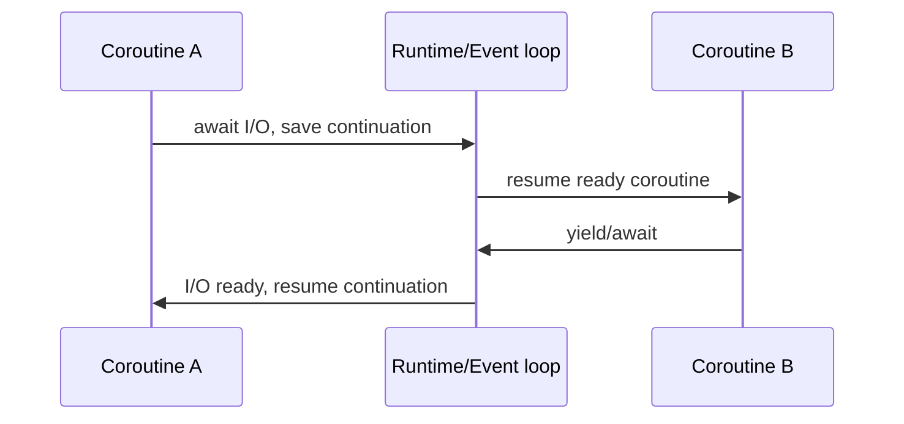
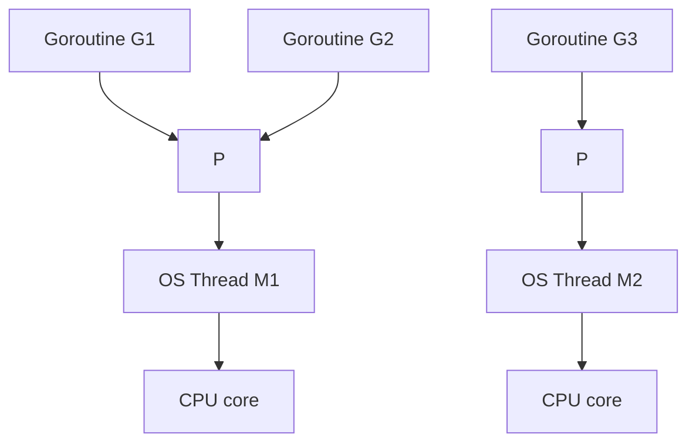

# Coroutines And Golang

Previous: [Language Runtimes: C, C++, Java, Python, Ruby, JavaScript](09-language-runtimes-c-cpp-java-python-ruby-js.md) | [Index](index.md) | Next: [Backend Concurrency Architecture](11-backend-concurrency-architecture.md)

**Section purpose:** Explain coroutine context switches, coroutine tradeoffs, Go's goroutine model, and language summary.

## Section Bridge

**Arriving from:** [Language Runtimes: C, C++, Java, Python, Ruby, JavaScript](09-language-runtimes-c-cpp-java-python-ruby-js.md). The previous section covered: Compare runtime models, threading models, GC, GIL/GVL, and event-loop choices.

**This section answers:** Explain coroutine context switches, coroutine tradeoffs, Go's goroutine model, and language summary.

**Watch for the next question:** once this section lands, the next natural question is why we need **Backend Concurrency Architecture** next.

> **Reading note:** Read this as one continuous block. The slide-level `Flow` notes explain local transitions; the section-level transition at the end connects this topic to the next one.

---

## 97. Deep Dive Into Coroutines

> **Flow:** From **Why Javascript Picked This Kind Of Threading Model**, move into **Deep Dive Into Coroutines**. This page should answer the natural follow-up and prepare for **How Is Context Switch Going To Happen In Coroutine**.

A coroutine is an execution unit that can suspend and resume without relying on kernel preemption.

Coroutine characteristics:

- Cooperative.
- Lightweight compared with OS threads.
- Suspension occurs at explicit yield/await points.
- State is stored in coroutine frame or stack-like structure.
- Scheduler may be language runtime/event loop.

Examples:

- Python `async def`.
- JavaScript `async function`.
- Kotlin coroutines.
- C++20 coroutines.
- Rust async futures.
- Go goroutines are not exactly coroutines, but share lightweight scheduling ideas.

Coroutine vs thread:

- Thread can be preempted almost anywhere.
- Coroutine yields at known points.
- Thread stack is usually larger.
- Coroutine state can be much smaller.

> **Side note:** Coroutines are a control-flow abstraction. They are not automatically parallel, and they do not automatically make blocking code non-blocking.

---

## 98. How Is Context Switch Going To Happen In Coroutine

> **Flow:** From **Deep Dive Into Coroutines**, move into **How Is Context Switch Going To Happen In Coroutine**. This page should answer the natural follow-up and prepare for **Languages Which Offer Coroutines**.

Coroutine switch:

1. Coroutine reaches `await` or `yield`.
2. Runtime saves continuation state.
3. Coroutine is marked suspended.
4. Runtime/event loop runs another ready coroutine.
5. Awaited operation completes.
6. Coroutine is marked ready.
7. Runtime resumes from saved continuation point.

What gets saved:

- Continuation/program point.
- Live local variables.
- Awaited future/promise handle.
- Exception/cancellation state.
- Sometimes stack segment or heap-allocated frame.

No kernel mode switch is required if the coroutine yields in user space.

> **Side note:** Coroutine context switch is cheaper partly because it avoids kernel scheduler involvement, but the cost can still include allocations, promise/future machinery, and callback dispatch.

---

## 99. Languages Which Offer Coroutines

> **Flow:** From **How Is Context Switch Going To Happen In Coroutine**, move into **Languages Which Offer Coroutines**. This page should answer the natural follow-up and prepare for **Why Is Coroutine Better Than Threads**.

Languages/runtimes with coroutine-like features:

- Python: `asyncio`, `async def`, `await`.
- JavaScript: async functions and promises.
- Kotlin: coroutines.
- C#: async/await.
- C++20: coroutine language support.
- Rust: async/await futures.
- Lua: coroutines.
- Ruby: Fibers.
- Swift: async/await.
- Go: goroutines, lightweight scheduled functions with different semantics.
- Erlang/Elixir: lightweight processes, actor-style rather than classic coroutines.

Important distinction:

- Some coroutines are stackless.
- Some fibers are stackful.
- Some runtimes multiplex onto OS threads.
- Some require async-compatible libraries.

> **Side note:** Do not teach "coroutine" as one universal implementation. Ask whether it is stackful, stackless, preemptive, cooperative, single-threaded, or work-stealing.

---

## 100. Why Is Coroutine Better Than Threads

> **Flow:** From **Languages Which Offer Coroutines**, move into **Why Is Coroutine Better Than Threads**. This page should answer the natural follow-up and prepare for **Why Is Coroutine Worse Than Thread**.

Coroutines can be better when:

- Work is I/O-bound.
- You need many concurrent waits.
- You want lower memory per task.
- You want fewer kernel context switches.
- You want explicit suspension points.
- You want easier reasoning about where interleavings happen.
- You want structured cancellation and scopes.
- You want high connection counts without huge thread pools.

Operational wins:

- Millions of parked coroutines may be feasible where millions of OS threads are not.
- Backpressure can be modeled through awaitable queues.
- Less lock contention if single-threaded event loop owns state.

> **Side note:** Coroutines are excellent for wait-heavy workloads. They are not a replacement for CPU parallelism unless the runtime schedules them across multiple OS threads and the code is parallel-safe.

---

## 101. Why Is Coroutine Worse Than Thread

> **Flow:** From **Why Is Coroutine Better Than Threads**, move into **Why Is Coroutine Worse Than Thread**. This page should answer the natural follow-up and prepare for **Summary Of Context Switch Between Process, Thread, Coroutine**.

Coroutines can be worse when:

- Libraries block OS threads and do not yield.
- CPU-bound work blocks the event loop.
- Call stacks become async state machines.
- Debugging crosses scheduler boundaries.
- Cancellation is poorly handled.
- Backpressure is ignored.
- You need true parallelism but only have one event loop.
- Developers accidentally mix blocking and non-blocking APIs.

Thread advantages:

- Works naturally with blocking APIs.
- Can run CPU work on multiple cores.
- Kernel scheduler preempts long-running work.
- Stack traces can be more straightforward.
- Mature tooling for some ecosystems.

> **Side note:** Coroutine systems fail when one function lies: it looks async but blocks, or it forgets to await/backpressure. That one lie can freeze the event loop.

---

## 102. Summary Of Context Switch Between Process, Thread, Coroutine

> **Flow:** From **Why Is Coroutine Worse Than Thread**, move into **Summary Of Context Switch Between Process, Thread, Coroutine**. This page should answer the natural follow-up and prepare for **What Kind Of Language Is Golang In Runtime**.

| Unit | Scheduler | Isolation | Switch cost | Shared memory | Parallelism |
|---|---|---:|---:|---:|---:|
| Process | Kernel | Strong | Higher | Explicit | Yes |
| Thread | Kernel/runtime | Process-level | Medium | Yes | Yes |
| Coroutine | Runtime/event loop | Usually none inside process | Lower | Depends on host thread | Not by itself |

Process switch:

- Save CPU context.
- May switch address space.
- Strong isolation.

Thread switch:

- Save CPU context.
- Same address space if same process.
- Shared state risk.

Coroutine switch:

- Save continuation.
- Usually cooperative.
- No kernel switch if purely user-space.

> **Side note:** When someone says "coroutines are lightweight threads", ask which properties they mean: memory, scheduling, isolation, preemption, or parallelism.

---

## 103. What Kind Of Language Is Golang In Runtime

> **Flow:** From **Summary Of Context Switch Between Process, Thread, Coroutine**, move into **What Kind Of Language Is Golang In Runtime**. This page should answer the natural follow-up and prepare for **What Is The Threading Model In Golang**.

Go is a compiled language with a managed runtime designed around concurrency.

Runtime characteristics:

- Compiled to native code.
- Garbage-collected heap.
- Built-in goroutines.
- Built-in channels.
- Runtime scheduler.
- Growing goroutine stacks.
- Network poller integration.
- Standard library designed for blocking-looking concurrent code.

Go's design center:

- Simple syntax.
- Cheap concurrent units.
- CSP-inspired communication.
- Production network services.
- Runtime-managed scheduling over OS threads.

> **Side note:** Go did not merely add a thread library. It designed the language, runtime, standard library, and tooling around concurrent services.

---

## 104. What Is The Threading Model In Golang

> **Flow:** From **What Kind Of Language Is Golang In Runtime**, move into **What Is The Threading Model In Golang**. This page should answer the natural follow-up and prepare for **How Golang Goroutines Are Different From Python Coroutines**.

Go uses an M:N scheduler:

- Many goroutines are multiplexed over fewer OS threads.
- Runtime scheduler maps goroutines onto processors and machine threads.

Classic terms:

- **G:** goroutine.
- **M:** machine, an OS thread.
- **P:** processor, runtime scheduling resource needed to execute Go code.

Goroutines:

- Start with small stacks that grow/shrink.
- Block cheaply on channels, timers, network I/O.
- Can run in parallel across multiple OS threads up to `GOMAXPROCS`.
- Are preempted by runtime mechanisms.

> **Side note:** A goroutine is not an OS thread, but it can run on one. That distinction explains both Go's scalability and its runtime complexity.

---

## 105. How Golang Goroutines Are Different From Python Coroutines

> **Flow:** From **What Is The Threading Model In Golang**, move into **How Golang Goroutines Are Different From Python Coroutines**. This page should answer the natural follow-up and prepare for **Summary Of All Languages In Terms Of Process, Threads, Goroutines So Far**.

Go goroutines:

- Can run in parallel on multiple OS threads.
- Are scheduled by Go runtime.
- Can call blocking-looking APIs that runtime often integrates with scheduler.
- Use channels and locks.
- Preemption exists in modern Go runtime.
- Do not require `await` syntax at every suspension point.

Python `asyncio` coroutines:

- Cooperative.
- Usually run on one event loop thread.
- Require `await` to yield.
- Do not provide CPU parallelism by themselves.
- Need async-compatible libraries.
- Can be combined with thread/process pools.

Comparison:

| Feature | Go goroutine | Python asyncio coroutine |
|---|---|---|
| Scheduling | Go runtime | Event loop |
| Parallel CPU | Yes, with multiple Ps | No, not by itself |
| Yield style | Runtime/blocking integration | Explicit `await` |
| Stack | Growable goroutine stack | Coroutine frame/state |
| Blocking APIs | Often okay if Go-aware | Dangerous if blocks event loop |

> **Side note:** Go lets code look synchronous while runtime multiplexes. Python async makes suspension visible in the syntax.

---

## 106. Summary Of All Languages In Terms Of Process, Threads, Goroutines So Far

> **Flow:** From **How Golang Goroutines Are Different From Python Coroutines**, move into **Summary Of All Languages In Terms Of Process, Threads, Goroutines So Far**. This page should answer the natural follow-up and prepare for **Backend Systems As Case: Better Written In Javascript With NodeJS For Threading Model**.

| Language | Runtime style | Main concurrency tools | CPU parallelism caveat |
|---|---|---|---|
| C | Native/manual | OS threads, atomics, RTOS APIs | Full power, full responsibility |
| C++ | Native/RAII | `std::thread`, atomics, coroutines | Strong but easy to misuse |
| Java | JVM managed | Threads, executors, virtual threads | Strong JVM support |
| Python | Managed/interpreted | Threads, processes, asyncio | Classic CPython GIL limits bytecode parallelism |
| Ruby | Managed/dynamic | Threads, fibers, event loops | CRuby GVL limits Ruby parallelism |
| JavaScript | Event-loop managed | Promises, async/await, workers | Main event loop must not block |
| Go | Native + managed runtime | Goroutines, channels, mutexes | Runtime handles M:N scheduling |

> **Side note:** Runtime choice is architecture. The same business service in Java, Node, Python, C++, and Go will have different failure modes under load.

---

## Lead Into Next Section

**Core takeaway to close with:** Explain coroutine context switches, coroutine tradeoffs, Go's goroutine model, and language summary.

**Transition to next section:** With OS processes, threads, coroutines, and goroutines compared, move from mechanisms into backend architecture choices.

**Continue reading:** Continue with [Backend Concurrency Architecture](11-backend-concurrency-architecture.md) to follow the next layer of the model.

**Pause check before moving on:** pause and summarize the section in one sentence and name the resource or boundary that became clearer.

Previous: [Language Runtimes: C, C++, Java, Python, Ruby, JavaScript](09-language-runtimes-c-cpp-java-python-ruby-js.md) | [Index](index.md) | Next: [Backend Concurrency Architecture](11-backend-concurrency-architecture.md)
