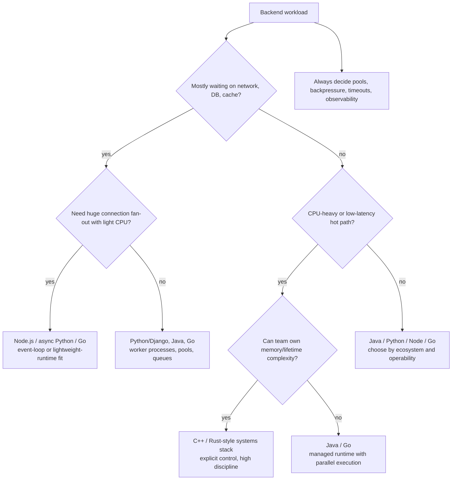
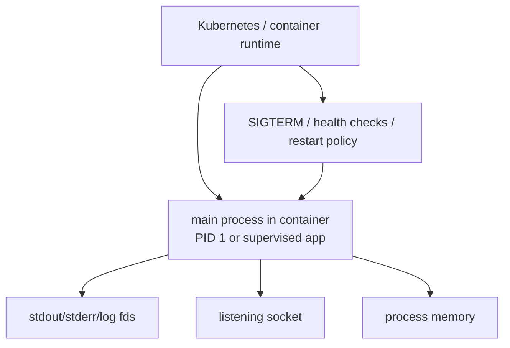
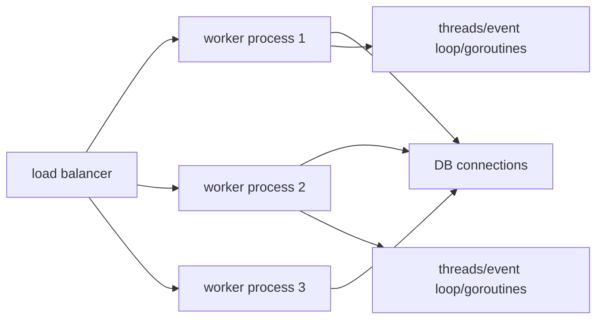
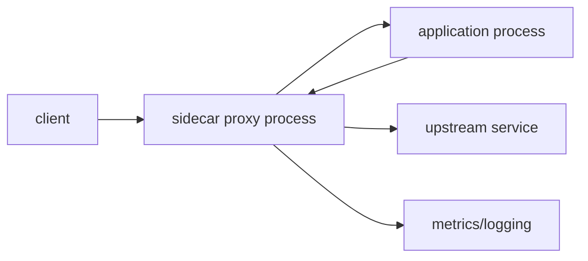
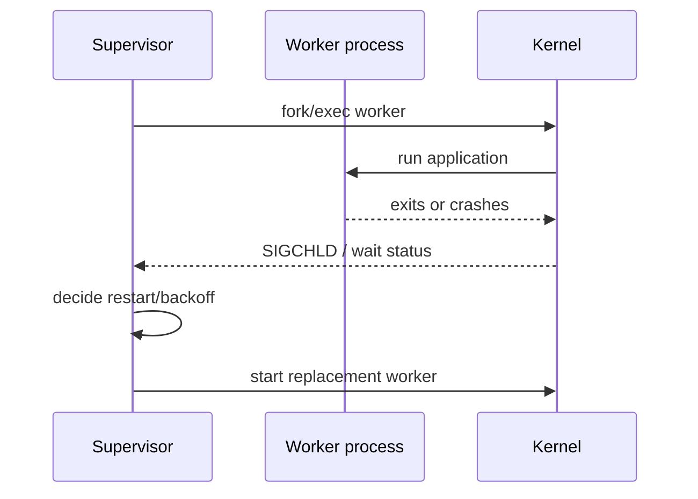
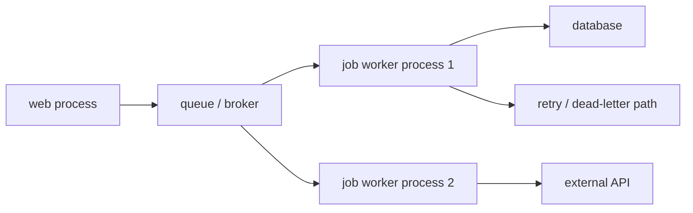

# Backend Concurrency Architecture

Previous: [Embedded-To-Cloud Concurrency Dictionary](10A-embedded-to-cloud-dictionary.md) | [Index](index.md) | Next: [Production Glue And Closing Mental Model](12-production-glue-and-closing.md)

**Focus:** Discuss when Node, Python, Java, and C++ fit backend systems based on concurrency model.

## Bridge

**Coming from:** [Embedded-To-Cloud Concurrency Dictionary](10A-embedded-to-cloud-dictionary.md). The previous section translated RTOS concepts into cloud/backend equivalents: probes, deadlines, event loops, shared caches, queues, and restart behavior.

**Read this for:** Discuss when Node, Python, Java, and C++ fit backend systems based on concurrency model.

**Then:** move into **Production Glue And Closing Mental Model**.

---

## 107. Backend Systems As Case: Better Written In Javascript With NodeJS For Threading Model

> **Flow:** From **Summary Of All Languages In Terms Of Process, Threads, Goroutines So Far**, move into **Backend Systems As Case: Better Written In Javascript With NodeJS For Threading Model**. This page should answer the natural follow-up and prepare for **Why Backend Systems Are Better Written In Javascript For Its Threading Model**.


Node.js is a strong fit for:

- I/O-heavy APIs.
- Real-time WebSocket services.
- API gateways.
- BFF/backend-for-frontend services.
- JSON-heavy orchestration.
- High fan-out calls to other services.
- Teams already strong in TypeScript.

Threading/concurrency fit:

- Single event loop keeps application state simpler.
- Non-blocking I/O handles many concurrent connections.
- Promises model request fan-out naturally.
- Worker threads can handle isolated CPU tasks.
- Cluster/process model scales across cores.

Bad fits:

- CPU-heavy request handlers on main loop.
- Blocking filesystem/crypto/compression in hot path without offload.
- Long synchronous JSON processing for huge payloads.
- Unbounded promise fan-out without backpressure.

> **Side note:** Node is not "single-threaded server." It is event-loop JavaScript plus native I/O plus thread pool plus optional workers/processes.

---

## 108. Why Backend Systems Are Better Written In Javascript For Its Threading Model

> **Flow:** From **Backend Systems As Case: Better Written In Javascript With NodeJS For Threading Model**, move into **Why Backend Systems Are Better Written In Javascript For Its Threading Model**. This page should answer the natural follow-up and prepare for **Backend Systems As Case: Better Written In Python With Django Or Otherwise For The Threading Model**.


Node's concurrency model is better when the service waits more than it computes.

Strengths:

- Event loop avoids one thread per connection.
- Shared mutable state is naturally serialized on one loop.
- Async I/O libraries are mature.
- TypeScript improves maintainability.
- The mental model maps well to request orchestration:
  - receive request
  - call service A and B
  - await database
  - combine result
  - respond

Architecture rules:

- Keep CPU work off event loop.
- Set timeouts on all awaits.
- Limit concurrency with pools/semaphores.
- Use streams for large payloads.
- Use worker threads/processes for CPU-heavy work.
- Monitor event-loop lag.

> **Side note:** The key Node metric is not just CPU. Watch event-loop lag. If the loop is blocked, your service is unavailable even if the machine has idle cores.

---

## 109. Backend Systems As Case: Better Written In Python With Django Or Otherwise For The Threading Model

> **Flow:** From **Why Backend Systems Are Better Written In Javascript For Its Threading Model**, move into **Backend Systems As Case: Better Written In Python With Django Or Otherwise For The Threading Model**. This page should answer the natural follow-up and prepare for **Why Backend Systems Are Better Written In Python For Its Threading Model**.


Python/Django is strong for:

- CRUD-heavy applications.
- Admin/business workflows.
- Data-backed products.
- Fast feature development.
- Teams needing rich libraries.
- I/O-bound web apps with database/cache/network calls.

Concurrency options:

- WSGI with multiple worker processes.
- Threaded workers for I/O overlap.
- ASGI for async views and WebSockets.
- Celery/RQ/background workers.
- Multiprocessing for CPU-bound jobs.
- Native libraries for heavy compute.

The deployment model matters more than language slogans:

- Gunicorn/uwsgi workers.
- Process count.
- Thread count.
- Async worker class.
- Database connection pool.
- Task queue architecture.

> **Side note:** Python web scalability often comes from process-level horizontal scaling and pushing CPU-heavy work into native libraries or workers, not from pure Python threads.

---

## 110. Why Backend Systems Are Better Written In Python For Its Threading Model

> **Flow:** From **Backend Systems As Case: Better Written In Python With Django Or Otherwise For The Threading Model**, move into **Why Backend Systems Are Better Written In Python For Its Threading Model**. This page should answer the natural follow-up and prepare for **Backend Systems As Case: Better Written In Java With Any Framework For The Threading Model**.


Python is better when:

- The concurrency bottleneck is I/O.
- Developer speed and library depth dominate.
- The app is database-centered.
- Business logic changes frequently.
- CPU-heavy work can be offloaded.

Threading model benefits:

- Threads can overlap blocking I/O.
- Process workers bypass classic GIL for parallel request handling.
- Async Python handles high-concurrency I/O when libraries are async-native.
- Background queues separate slow jobs from request latency.

Rules:

- Do not use pure Python threads for CPU scaling in classic CPython.
- Use process workers for parallelism.
- Use async only when the stack is async end-to-end.
- Bound DB connections; concurrency without DB capacity is self-harm.
- Measure queue latency, not just request latency.

> **Side note:** Python is excellent when architecture admits its runtime shape. It is painful when teams expect Java/C++ thread semantics from classic CPython.

---

## 111. Backend Systems As Case: Better Written In Java With Any Framework For The Threading Model

> **Flow:** From **Why Backend Systems Are Better Written In Python For Its Threading Model**, move into **Backend Systems As Case: Better Written In Java With Any Framework For The Threading Model**. This page should answer the natural follow-up and prepare for **Why Backend Systems Are Better Written With Java For Its Threading Model**.


Java is strong for:

- High-throughput services.
- Large teams.
- Complex business domains.
- Long-running backend systems.
- Strong observability/tooling.
- Mature JVM frameworks.
- Systems needing robust threading and memory model.

Concurrency models:

- Traditional thread-per-request pools.
- Reactive frameworks.
- ForkJoin and executor pools.
- CompletableFuture.
- Virtual threads in modern Java.

Java frameworks:

- Spring Boot.
- Micronaut.
- Quarkus.
- Vert.x.
- Netty-based stacks.

> **Side note:** Java remains one of the strongest general backend choices because the JVM has spent decades becoming good at long-running concurrent services.

---

## 112. Why Backend Systems Are Better Written With Java For Its Threading Model

> **Flow:** From **Backend Systems As Case: Better Written In Java With Any Framework For The Threading Model**, move into **Why Backend Systems Are Better Written With Java For Its Threading Model**. This page should answer the natural follow-up and prepare for **Backend Systems As Case: Better Written In CPP For The Threading Model**.


Java wins when:

- You need real CPU parallelism with managed safety.
- You want mature thread pools and concurrency collections.
- You need strong memory-model guarantees.
- You want high-quality profiling and GC tooling.
- You need stable performance under complex load.

Threading architecture:

- Use bounded executors.
- Separate CPU pools from blocking I/O pools where appropriate.
- Avoid unbounded queues.
- Watch GC allocation rate.
- Use structured concurrency/virtual threads where suitable.
- Keep database pools aligned with request concurrency.

Virtual thread impact:

- Makes blocking style scale better for many I/O waits.
- Reduces need for callback/reactive style in some services.
- Does not make CPU work free.
- Still requires synchronization around shared state.

> **Side note:** Virtual threads are not "no threads." They are a runtime-managed way to make blocking-style code cheaper at high concurrency.

---

## 113. Backend Systems As Case: Better Written In CPP For The Threading Model

> **Flow:** From **Why Backend Systems Are Better Written With Java For Its Threading Model**, move into **Backend Systems As Case: Better Written In CPP For The Threading Model**. This page should answer the natural follow-up and prepare for **Why Backend Systems Are Better Written With CPP For Its Threading Model**.


C++ is strong for:

- Low-latency services.
- Trading systems.
- Game servers.
- Databases/storage engines.
- Media pipelines.
- Network proxies.
- Infrastructure with tight CPU/memory budgets.
- Systems requiring custom memory/layout control.

Concurrency models:

- Thread pools.
- Lock-free queues.
- Async I/O frameworks.
- Reactor/proactor patterns.
- Fibers/coroutines.
- SIMD plus threads.
- Shared-nothing shards.

Risks:

- Memory unsafety.
- Data races are undefined behavior.
- Lifetime bugs under async callbacks.
- Complex builds/deployments.
- Harder hiring/debugging than managed stacks.

> **Side note:** C++ should be chosen because control matters, not because of ego. The engineering tax is real.

---

## 114. Why Backend Systems Are Better Written With CPP For Its Threading Model

> **Flow:** From **Backend Systems As Case: Better Written In CPP For The Threading Model**, move into **Why Backend Systems Are Better Written With CPP For Its Threading Model**. This page should answer the natural follow-up and prepare for **Missing Glue: Memory Model And Happens-Before**.


C++ is better when:

- Tail latency matters deeply.
- Allocation control matters.
- CPU efficiency matters.
- Memory layout matters.
- You need tight integration with kernel/network/storage APIs.
- You can afford senior-level discipline.

Concurrency advantages:

- Direct use of OS threads and epoll/kqueue/io_uring-style APIs.
- Precise atomics and memory ordering.
- Custom allocators per thread/shard.
- Avoid GC pauses.
- Shape cache locality explicitly.
- Use lock-free structures where justified.

Architecture rules:

- Prefer ownership clarity over clever lock-free code.
- Shard state to reduce sharing.
- Use RAII for locks/resources.
- Measure cache misses and tail latency.
- Use sanitizers and thread sanitizers.
- Keep async lifetimes explicit.

Concurrency-fit decision map:



> **Side note:** In C++, performance comes from design: fewer shared writes, better locality, bounded allocation, and predictable ownership. Threads alone do not create performance.

---

## 114A. Embedded-To-Web Concurrency Translation Guide

If you spent early years in embedded systems and later moved to web applications, you may carry strong instincts that are still valuable but need translation.

| Embedded / REX instinct | Web/backend translation |
|---|---|
| Task priority matters | Worker pool, event loop, queue priority, DB pool starvation matter |
| Interrupt latency matters | Event-loop lag, GC pause, scheduler delay, tail latency matter |
| Watchdog proves liveness | Health checks, deadlines, circuit breakers, and queue-age alerts prove liveness |
| Shared memory is dangerous | Shared cache, global singleton, DB row, and distributed lock are dangerous |
| Driver buffers matter | HTTP buffers, socket buffers, runtime buffers, DB pools, and queues matter |
| Direct hardware state matters | Source of truth, persistence, replication lag, and cache visibility matter |
| ISR must be short | Event-loop callback and critical section must be short |
| Priority inversion is real | Thread-pool starvation and lock contention create equivalent production pain |

Implicit assumption to drop:

```text
If I called the function successfully, the work is done.
```

Better web assumption:

```text
The work moved to another layer. I must know whether it was queued,
persisted, replicated, consumed, acknowledged, or merely accepted.
```

Examples:

- `send()` may mean bytes entered kernel buffer, not client processed response.
- Queue publish may mean broker accepted message, not worker completed job.
- DB commit may mean primary committed, not replicas caught up.
- Cache set may mean one cache node updated, not every reader sees it.
- HTTP 202 means accepted, not completed.

What remains the same:

- Bounded resources matter.
- Ownership matters.
- Latency budgets matter.
- Health signals must prove progress.
- Shared mutable state creates races.
- Observability must show waiting, not only execution.

> **Side note:** Your embedded background is not obsolete. It is a strong advantage if you translate "interrupts, buffers, watchdogs, and shared memory" into "event loops, queues, health checks, and distributed state."

---

## 114B. Bach-To-Web Translation: UNIX Concepts Still Under Web Apps

Classic UNIX concepts still sit under modern web systems.

Process model:

UNIX teaches that a process is not just "code running." It is a resource container:

- PID and parent relationship.
- Address space.
- File descriptor table.
- Credentials and permissions.
- Environment variables.
- Current working directory.
- Signal handling.
- Exit status.
- Resource limits.

Modern web systems still build architecture out of these containers.

### Container Process

A container usually has one main process as its unit of life.

In Docker/Kubernetes language, people often say "the container crashed", but what often happened is simpler:

```text
the main process exited
```

Why it matters:

- The container runtime watches a process.
- Kubernetes restarts a container because the main process exits or health checks fail.
- Logs are often stdout/stderr file descriptors of that process.
- Signals such as `SIGTERM` are sent to the process so it can shut down.
- If PID 1 inside the container handles signals poorly, shutdown behavior becomes unreliable.

Concurrency connection:

- A web server process may contain many threads, an event loop, or many goroutines.
- If that process dies, all in-process concurrency dies with it.
- If it leaks fds, memory, goroutines, or threads, the container may still look "running" while becoming unhealthy.
- If it ignores termination, rolling deploys can drop requests or exceed shutdown budgets.



### Worker Process

A worker process is a process that performs application work.

Common examples:

- Gunicorn workers running Python web app code.
- Puma/Unicorn workers running Ruby app code.
- Node.js cluster workers.
- PHP-FPM workers.
- Java service processes behind a load balancer.
- C++ or Go service workers.

Why systems use workers:

- Use multiple CPU cores.
- Isolate crashes between workers.
- Limit memory growth by restarting workers.
- Avoid one giant process becoming the only failure domain.
- Keep one worker from blocking all application traffic.

Worker concurrency can be shaped several ways:

```text
one worker process
  -> one event loop
  -> many threads
  -> many goroutines
  -> many request handlers
```

The process is the outer boundary. Inside it, the runtime chooses threads, event loops, coroutines, or goroutines.

Concurrency connection:

- More worker processes means more isolation, but also more memory and more DB connections.
- More threads per worker means more in-process concurrency, but also more lock contention and stack memory.
- More async tasks per worker means more concurrent waits, but also more pressure on downstream services.
- Restarting a worker can clear leaked memory, but active requests must drain or be retried.



The senior question is not "how many workers?" It is:

```text
How many independent process containers can the machine, database,
cache, downstream services, and deployment system actually support?
```

### Sidecar Process

A sidecar process is a helper process deployed next to the main application process.

Common examples:

- Envoy or service-mesh proxy.
- Log shipper.
- Metrics collector.
- Secret refresh agent.
- Local cache or adapter.
- TLS proxy.

The sidecar is not a library in your process. It is another process with its own:

- PID.
- memory.
- file descriptors.
- sockets.
- CPU usage.
- failure modes.
- logs.
- lifecycle.

Why this matters:

- Traffic may flow through the sidecar before reaching the app.
- The app may appear slow because the sidecar is saturated.
- The app may fail readiness because the sidecar is not ready.
- The sidecar may hold open sockets after the app changes state.
- Shutdown ordering can matter: proxy drains, app drains, then container exits.

Concurrency connection:

- A sidecar introduces another scheduler participant on the same node.
- It adds queues and buffers that can hide or amplify backpressure.
- It may create another retry layer.
- It may multiplex many app requests over fewer upstream connections.
- It can protect the app, but it can also become the bottleneck.



### Supervisor Process

A supervisor process manages other processes.

Classic UNIX examples:

- `init`
- `systemd`
- service supervisors
- shell scripts that fork and wait

Modern examples:

- container runtime
- Kubernetes kubelet
- process managers such as `supervisord`
- Node process managers
- application master processes such as older pre-fork servers

What a supervisor does:

- starts child processes
- watches exit status
- restarts failed children
- sends signals
- reaps zombies
- coordinates graceful shutdown
- may rotate workers
- may enforce resource policy

Concurrency connection:

- Supervision is process-level concurrency control.
- A supervisor decides when to create, stop, restart, or replace execution containers.
- Bad supervision creates zombie processes, restart storms, dropped requests, and half-dead deployments.
- Good supervision gives bounded recovery and predictable lifecycle.



The Bach-style point is direct: process exit and wait status are not ancient trivia. They are still the basis of service lifecycle.

### Job Worker Process

A job worker process consumes work from a queue rather than serving a request directly.

Examples:

- Celery worker.
- Sidekiq worker.
- Resque worker.
- BullMQ worker.
- Kafka consumer process.
- background image/video processing worker.
- email delivery worker.

Why job workers exist:

- Move slow work out of request latency.
- Retry failed work.
- Smooth spikes through queues.
- Run CPU-heavy or I/O-heavy work separately.
- Scale background work independently from web traffic.

Concurrency connection:

- A job worker process often has its own internal concurrency: threads, async tasks, goroutines, or child processes.
- Queue depth becomes a scheduling signal.
- Queue age becomes a latency signal.
- Retry storms can multiply load.
- One poisoned job can block a worker if isolation is weak.
- Too many workers can overwhelm the database or downstream APIs.



The important UNIX-style lesson:

```text
The queue is not magic concurrency.
It is a scheduling boundary between producer processes and consumer processes.
```

If you do not bound producers, consumers, retries, and downstream capacity, a queue only moves the overload to a different place.

### Process Model Summary

Modern backend process design is UNIX thinking with new names:

| Web term | UNIX-shaped reality | Concurrency lesson |
|---|---|---|
| container | one main process plus namespaces/cgroups around it | process exit and signals define lifecycle |
| worker | process handling app work | process count controls isolation and resource multiplication |
| sidecar | helper process beside app | another queue, buffer, socket owner, and failure point |
| supervisor | parent/manager process | restart, reap, signal, and lifecycle control |
| job worker | queue-consuming process | queue scheduling, retry, backpressure, and downstream capacity |

When debugging, ask:

- Which process owns the socket?
- Which process owns the memory growth?
- Which process owns the queue wait?
- Which process receives the signal?
- Which process should be restarted?
- Which process has the leaked fd?
- Which process is blocked, and what wakes it?

File descriptor model:

- HTTP sockets are fds.
- DB connections are sockets backed by fds.
- Log files are fds.
- Pipes connect processes.
- Leaked fds still kill services.

Sleep/wakeup model:

- Thread waits on socket.
- Thread waits on futex.
- Event loop waits on readiness.
- Worker waits on queue.
- DB client waits on response.

Buffer cache / buffering model:

- Kernel buffers socket data.
- Runtime buffers streams.
- Proxy buffers requests/responses.
- Broker buffers messages.
- Database buffers writes.

Scheduler model:

- OS schedules threads/processes.
- Runtime schedules coroutines/goroutines/fibers.
- Queue schedules jobs.
- Load balancer schedules requests.

The durable lesson:

> UNIX taught us to ask: what object is this handle connected to, what queue can it sleep on, what wakes it, and what state is shared?

Those questions still work for web apps.

> **Side note:** This is the clean bridge from Bach to backend architecture. You do not need to force old implementation details onto modern systems; preserve the questions.

---

## Lead Into Next Section

**Core takeaway to close with:** Discuss when Node, Python, Java, and C++ fit backend systems based on concurrency model.

**Transition to next section:** Backend choices are not complete without the missing glue that causes real incidents: memory visibility, cache behavior, backpressure, cancellation, and debugging.

**Continue reading:** Continue with [Production Glue And Closing Mental Model](12-production-glue-and-closing.md) to follow the next layer of the model.

**Pause check before moving on:** pause and summarize the section in one sentence and name the resource or boundary that became clearer.

Previous: [Embedded-To-Cloud Concurrency Dictionary](10A-embedded-to-cloud-dictionary.md) | [Index](index.md) | Next: [Production Glue And Closing Mental Model](12-production-glue-and-closing.md)
