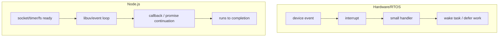

# Embedded-To-Backend Concurrency Dictionary

Previous: [Coroutines And Golang](10-coroutines-and-golang.md) | [Index](index.md) | Next: [Backend Concurrency Architecture](12-backend-concurrency-architecture.md)

**Focus:** Translate the embedded/RTOS instincts used earlier into backend concurrency language without pretending the two worlds are identical.

## Bridge

**Coming from:** [Coroutines And Golang](10-coroutines-and-golang.md). The previous section separated OS threads, coroutines, goroutines, event loops, and runtime schedulers.

**Read this for:** why the earlier REX/RTOS material still matters when the code now runs in services, runtimes, containers, caches, queues, and timeouts.

**Then:** compare backend runtime choices with the same concurrency instincts in mind.

---

## Why This Bridge Exists

If you have spent years in web systems, the REX material can look like a side road. Read it instead as the simplest version of the problem.

Earlier chapters used REX-style systems to show the bare shape of concurrency:

- a task runs
- a task blocks
- an interrupt wakes work
- shared memory is fast and dangerous
- a watchdog asks whether the system is still alive
- a missed deadline is not just slow; it can be failure

UNIX then added protection: processes, virtual memory, file descriptors, kernel/user boundaries, `fork`, `exec`, and scheduling policy.

Language runtimes then added another layer: Java executors, Python async, Ruby fibers, JavaScript event loops, Go goroutines.

Backend systems add one more layer: the work is now split across processes, machines, queues, caches, databases, and deployment systems.

The jump can feel abrupt:

```text
REX task -> UNIX process -> VM -> thread -> coroutine -> backend service
```

The practical bridge is this:

> Embedded systems make resource pressure visible. Backend systems hide it behind frameworks, but they do not remove it.

A backend service still has schedulable work. It still waits. It still shares state. It still needs queues, deadlines, liveness checks, restart policy, failure boundaries, and backpressure.

The vocabulary changed. The old pressure is still there.

---

## 11.1 Grandma Explanation: Same Household, Bigger Building

Imagine a small house.

Everyone shares the same kitchen. If one person leaves the gas on, the whole house is in danger. That is close to the RTOS/shared-memory feeling: fast coordination, but weak isolation.

Now imagine an apartment building.

Each flat has its own door. One family burning dinner should not burn every kitchen. But now you need building rules, maintenance, water lines, electricity meters, lifts, guards, and emergency procedures. That is closer to UNIX/Linux: stronger boundaries, more management.

Now imagine a city.

Food comes from shops, water from a utility, deliveries from roads, and messages from phones. A failure may not be in your kitchen at all. It may be a blocked road, a power cut, a delivery backlog, or a shop that is open but cannot serve. That is backend architecture.

The concurrency lesson is the same at all three scales:

- Who owns the shared thing?
- Who is waiting?
- Who wakes whom?
- Who proves the system is alive?
- What happens when one part is stuck?
- How far does the failure spread?

This chapter is only a translation guide between those scales.

---

## 11.2 RTOS-To-Backend Mapping Table

| Embedded / REX-style concept | Backend equivalent | What carries over | Where the analogy breaks |
|---|---|---|---|
| Task | Thread, goroutine, async task, worker, request handler | Unit of work that can run, block, wake, or leak | Backend tasks may be runtime-managed or distributed |
| Priority | Queue priority, worker-pool sizing, QoS, service priority | Some work must run before other work | Backend priority is softer and mediated by pools, queues, and resource limits |
| Interrupt | I/O readiness event, signal, timer callback, event-loop callback turn | External event makes work runnable | Hardware interrupts can preempt CPU; JavaScript callbacks do not preempt running JS |
| ISR | Small event handler, signal handler, native callback path | Do minimal work and defer heavy work | Backend handlers usually run at safer abstraction levels |
| Kickdog/watchdog | Kubernetes liveness probe, supervisor restart, health check, Go context timeout | System demands proof of liveness before trusting continued execution | Probes are coarse process/container checks, not hard real-time watchdogs |
| Shared address space | In-process cache, shared heap, shared memory segment, Redis/Memcached state | Shared state is fast and dangerous without ownership rules | Backend shared state may cross process or machine boundaries |
| No VM protection | Intentional shared-memory or shared-state design | Trust and discipline replace hard isolation | Backend systems often add process/container boundaries around shared components |
| Message queue | RTOS queue, channel, Kafka topic, SQS queue, worker backlog | Decouple producer and consumer; absorb bursts | Backend queues add retries, persistence, visibility timeouts, and duplicates |
| Deadline | Timer tick, watchdog window, request timeout, context deadline, SLO | Work that finishes too late may be equivalent to failure | Backend deadlines interact with network hops and retries |
| Reset | Board reset, task restart, pod restart, process supervisor restart | Sometimes recovery means killing state and starting clean | Distributed restart can duplicate work or break in-flight requests |

Do not force these as one-to-one mappings. Use them as a translation table for instincts.

---

## 11.3 Watchdog, Kickdog, Liveness Probe, Timeout

In an RTOS-style system, the watchdog is not a timer you casually reset. It is a liveness contract backed by hardware.

Bad version:

```c
// Terrible: proves only that the timer interrupt is alive.
void timer_isr(void) {
    kick_watchdog();
}
```

Better version:

```c
void dog_task(void) {
    for (;;) {
        wait_for_period();

        if (radio_task_ok() &&
            storage_task_ok() &&
            scheduler_heartbeat_ok() &&
            no_critical_queue_stuck()) {
            kick_watchdog();
        }
    }
}
```

The real question is not "did some code run?" That is too weak. The question is:

> Did the system make enough real progress that we should allow it to keep running?

Kubernetes liveness probes ask a related but higher-level question:

```yaml
livenessProbe:
  httpGet:
    path: /healthz
    port: 8080
  initialDelaySeconds: 10
  periodSeconds: 5
```

A useful liveness endpoint is designed around the failure mode:

- If the process deadlocks, liveness should fail.
- If the event loop is wedged, liveness should fail or time out.
- If a required internal worker is permanently stuck, liveness may need to fail.
- If a downstream database is temporarily down, liveness usually should not fail; readiness should fail instead.

Go `context.Context` handles the other half of this discipline: do not let work run forever after the caller has stopped caring.

```go
ctx, cancel := context.WithTimeout(r.Context(), 200*time.Millisecond)
defer cancel()

resp, err := callInventory(ctx, itemID)
if err != nil {
    return err
}
```

RTOS lesson:

```text
Do not kick the dog unless forward progress is real.
```

Backend translation:

```text
Do not keep work alive without deadline, cancellation, and a truthful health signal.
```

---

## 11.4 Interrupts And The Node.js Event Loop

Do not map hardware interrupts to Node.js event-loop ticks literally. That would be sloppy.

The useful comparison is narrower:

```text
external event makes waiting work runnable
```

In hardware:

- A device raises an interrupt.
- CPU enters privileged interrupt handling.
- The handler records the event, wakes a waiter, or schedules deferred work.
- Current code can be preempted.

In Node.js:

- The OS/libuv observes timers, sockets, filesystem completion, DNS, or worker-pool completion.
- The event loop picks ready callbacks by phase.
- JavaScript callback code runs to completion on the main JS thread.
- Running JavaScript is not preempted by another JavaScript callback.



The old RTOS instinct still helps:

- Keep interrupt handlers tiny.
- Keep event-loop callbacks short.
- Defer heavy work.
- Avoid unbounded processing inside a high-priority path.
- Measure latency from event arrival to useful handling.

Production failure:

```js
app.post("/bulk", async (req, res) => {
  const payload = JSON.parse(req.body.largeJsonString);
  const result = expensiveCpuTransform(payload);
  res.json(result);
});
```

The production symptom is familiar once you know the shape:

- The process is still "up."
- Liveness may still pass.
- Latency explodes.
- Requests time out because the event loop cannot return to I/O.

RTOS translation:

> You did too much work in the interrupt-adjacent path.

Node translation:

> You blocked the loop turn that must keep the service breathing.

---

## 11.5 Non-VM Shared Memory And Backend Shared State

In a non-VM RTOS-style system, tasks may share one address space. Pointers are cheap. So are mistakes. One bad owner can corrupt the whole product.

Backend systems sometimes reintroduce shared state deliberately:

- in-process LRU cache shared by request threads
- shared heap objects in a Java service
- Python process-global cache inside a worker
- Node module-level state shared by all requests on one event loop
- shared memory segment between processes
- Redis or Memcached used as shared state service
- database row used as the serialization point for distributed workers

That does not mean "backend has no VM." It means backend architecture sometimes chooses a shared-state component because speed or coordination is worth the correctness risk.

RTOS-style rule:

```text
If everyone can touch it, nobody owns it unless ownership is designed.
```

Backend translation:

```text
Every shared cache needs an owner, invalidation rule, concurrency rule, and failure rule.
```

Concrete failure:

```java
// Looks harmless. Fails under concurrent mutation.
static final Map<String, Session> sessions = new HashMap<>();

Session getOrCreate(String id) {
    Session s = sessions.get(id);
    if (s == null) {
        s = loadSession(id);
        sessions.put(id, s);
    }
    return s;
}
```

Safer shape:

```java
private final ConcurrentHashMap<String, Session> sessions = new ConcurrentHashMap<>();

Session getOrCreate(String id) {
    return sessions.computeIfAbsent(id, this::loadSession);
}
```

The lesson was never "avoid shared memory forever." That would be too simple. The lesson was:

> Shared memory is a contract. Write the contract down, then enforce it with locks, atomics, ownership, queues, or isolation.

---

## 11.6 Production Dictionary: Same Failure, Larger Boundary

| Production symptom | Embedded reading | Backend reading |
|---|---|---|
| Watchdog reset | Scheduler or critical task stopped proving liveness | Pod/process restart from liveness failure or supervisor |
| ISR too slow | Latency stolen from urgent work | Event loop blocked, callback too heavy, worker starvation |
| Shared buffer corruption | Ownership/race bug | Shared cache/session/global map race |
| Priority inversion | Low-priority holder blocks high-priority task | Thread pool starvation, DB pool starvation, queue head-of-line blocking |
| Missed kick | No trustworthy progress signal | Missing timeout/cancellation/health signal |
| Queue overflow | Producer outruns consumer | Backlog growth, retry storm, message broker lag |
| Single bad pointer kills product | Weak memory isolation | Shared component failure poisons many request paths |

This is why embedded systems were not a detour. They expose the same truths without much decoration:

- work must be scheduled
- waiting must be bounded
- shared state must have ownership
- liveness must be proven
- overload must be visible
- recovery has a cost

Once this dictionary is in place, backend architecture stops looking like a separate subject. It is the same concurrency problem with larger boundaries, slower communication, and more independent owners.

---

## References For This Section

- [Kubernetes docs: Liveness, Readiness, and Startup Probes](https://kubernetes.io/docs/concepts/workloads/pods/probes/)
- [Go `context` package](https://pkg.go.dev/context)
- [Node.js guide: The Event Loop](https://nodejs.org/learn/asynchronous-work/event-loop-timers-and-nexttick)
- [Node.js guide: Don't Block the Event Loop or Worker Pool](https://nodejs.org/learn/asynchronous-work/dont-block-the-event-loop)

Use these when checking probes, deadline/cancellation propagation, event-loop phases, and worker-pool blocking.

---

## Lead Into Next Section

**Core takeaway to close with:** Embedded and backend systems use different vocabulary, but both are about scheduled work, shared state, liveness, deadlines, and failure containment.

**Transition to next section:** Now move into backend runtime choices. Node, Python, Java, C++, and Go are easier to compare once their concurrency failure modes have names.

**Continue reading:** Continue with [Backend Concurrency Architecture](12-backend-concurrency-architecture.md) to apply the model to backend systems.

**Pause check before moving on:** name one embedded concept and its backend equivalent, then name one way the analogy breaks.

Previous: [Coroutines And Golang](10-coroutines-and-golang.md) | [Index](index.md) | Next: [Backend Concurrency Architecture](12-backend-concurrency-architecture.md)
