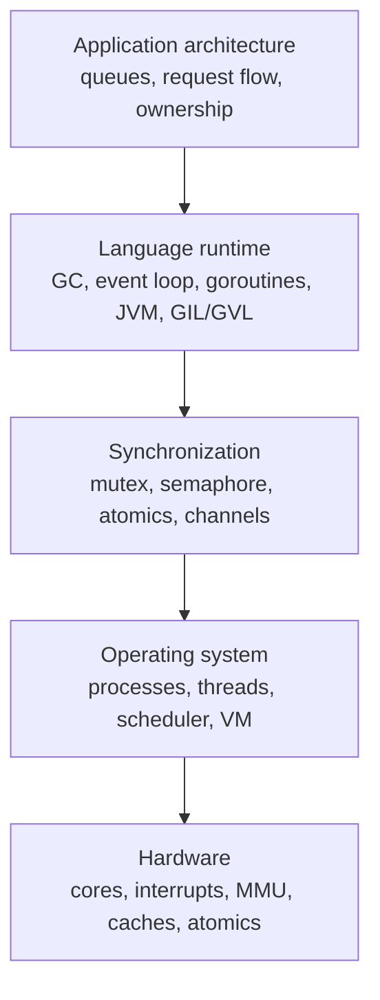

# Production Glue And Closing Mental Model

Previous: [Backend Concurrency Architecture](12-backend-concurrency-architecture.md) | [Index](index.md) | Next: [Appendices](14-appendices.md)

**Focus:** Add memory model, false sharing, backpressure, structured concurrency, debugging, and final advice.

## Bridge

**Coming from:** [Backend Concurrency Architecture](12-backend-concurrency-architecture.md).

**Read this for:** Add memory model, false sharing, backpressure, structured concurrency, debugging, and final advice.

**Then:** move into **Appendices**.

---

## 116. Missing Glue: Memory Model And Happens-Before

> **Flow:** From **UNIX Process Models Under Web Apps**, move into **Missing Glue: Memory Model And Happens-Before**. Backend runtime choice is not enough; the final layer is the production glue that decides whether concurrent work is visible, bounded, cancellable, and debuggable.

A memory model defines what reads and writes can be observed by concurrent execution units.

The dangerous misconception:

> If thread A writes a value and thread B later reads, B must see A's write.

That is only guaranteed when the program establishes the right synchronization relationship.

Important ideas:

- **Program order:** order inside one thread as the language defines it.
- **Visibility:** whether another thread can observe a write.
- **Reordering:** compiler or CPU may change execution order when semantics allow it.
- **Happens-before:** a guarantee that one operation's effects are visible to another.
- **Data race:** conflicting unsynchronized access, at least one write.

Examples of synchronization that commonly create happens-before relationships:

- Mutex unlock happens-before a later lock on the same mutex.
- Java `volatile` write happens-before later read of that variable.
- C++ release store pairs with acquire load.
- Channel send/receive often establishes ordering in channel-based languages.

> **Side note:** Most young engineers think locks are only about mutual exclusion. Locks are also about visibility. A lock says "not together" and "you can now see what the previous holder published."

---

## 117. Missing Glue: Cache Coherence, False Sharing, And Why Atomics Hurt

> **Flow:** From **Missing Glue: Memory Model And Happens-Before**, move into **Missing Glue: Cache Coherence, False Sharing, And Why Atomics Hurt**. This page should answer the natural follow-up and prepare for **Missing Glue: Backpressure Is Part Of Concurrency**.

On multicore machines, each core has caches.

Cache coherence tries to keep memory consistent across cores, but it is not free.

Important concepts:

- **Cache line:** memory moves through caches in fixed-size chunks, often 64 bytes.
- **Coherence traffic:** cores coordinate ownership of cache lines.
- **True sharing:** multiple cores need the same variable.
- **False sharing:** unrelated variables sit on the same cache line and cause contention.
- **Atomic operations:** often require exclusive cache-line ownership.

False sharing example:

```c
struct Counters {
    atomic_long request_count;  // core 0 writes
    atomic_long error_count;    // core 1 writes, same cache line maybe
};
```

Even though the counters are logically independent, hardware may bounce the same cache line between cores.

Mitigations:

- Shard counters per thread/core.
- Pad hot variables onto separate cache lines.
- Reduce shared writes.
- Batch updates.
- Prefer ownership over shared mutation.

> **Side note:** Many "lock-free" designs are not fast. They replace a mutex with cache-line warfare. Measure before celebrating.

---

## 118. Missing Glue: Backpressure Is Part Of Concurrency

> **Flow:** From **Missing Glue: Cache Coherence, False Sharing, And Why Atomics Hurt**, move into **Missing Glue: Backpressure Is Part Of Concurrency**. This page should answer the natural follow-up and prepare for **Missing Glue: Structured Concurrency And Cancellation**.

Backpressure means a system can tell upstream producers to slow down.

Without backpressure:

- Queues grow without bound.
- Memory usage rises.
- Latency explodes.
- Retries amplify load.
- Timeouts create more work.
- A downstream dependency failure becomes whole-system failure.

Backpressure mechanisms:

- Bounded queues.
- Connection limits.
- Thread-pool limits.
- Semaphore around expensive resources.
- Rate limiting.
- Load shedding.
- Circuit breakers.
- Deadlines and cancellation.
- Streaming flow control.

Bad pattern:

```text
accept unlimited requests
spawn unlimited work
queue unlimited database calls
retry aggressively
```

Better pattern:

```text
admit bounded work
fail fast when saturated
preserve latency for accepted work
recover without backlog explosion
```

> **Side note:** Concurrency without backpressure is just a more dramatic way to crash. The mature question is not "how many can I start?" It is "how many can I finish within the SLA?"

---

## 119. Missing Glue: Structured Concurrency And Cancellation

> **Flow:** From **Missing Glue: Backpressure Is Part Of Concurrency**, move into **Missing Glue: Structured Concurrency And Cancellation**. This page should answer the natural follow-up and prepare for **Missing Glue: Debugging Production Concurrency**.

Structured concurrency says concurrent work should have clear lifetimes and ownership.

Instead of launching background work casually, structure it so:

- Child tasks belong to a parent scope.
- Parent waits for children or cancels them.
- Errors propagate predictably.
- Cancellation is not an afterthought.
- Resources are released when scope exits.

Unstructured pattern:

```text
request starts task A
task A starts task B
request returns
task B keeps running
no one owns failure or cancellation
```

Structured pattern:

```text
request scope starts A and B
deadline applies to both
failure cancels siblings
scope exits only after cleanup
```

Where it appears:

- Kotlin coroutine scopes.
- Swift structured concurrency.
- Java structured concurrency APIs.
- Go `context.Context` discipline.
- Python `asyncio.TaskGroup`.
- C++ designs using RAII scope guards and task groups.

> **Side note:** A leaked task is the concurrency version of a leaked file descriptor. It may not fail now, but it means ownership is broken.

---

## 120. Missing Glue: Debugging Production Concurrency

> **Flow:** From **Missing Glue: Structured Concurrency And Cancellation**, move into **Missing Glue: Debugging Production Concurrency**. This page should answer the natural follow-up and prepare for **Summary Overall**.

Concurrency debugging needs symptoms mapped to layers.

Application symptoms:

- High tail latency.
- Timeouts.
- Duplicate work.
- Stuck requests.
- Inconsistent state.
- Rare crashes.

Runtime symptoms:

- Event-loop lag.
- Thread-pool exhaustion.
- GC pauses.
- Too many goroutines/coroutines.
- Blocked executor queues.

OS/hardware symptoms:

- High run queue length.
- Context switch storm.
- Lock contention.
- Page faults.
- CPU migration.
- Cache misses.

Useful tools and habits:

- Add request IDs and causality IDs.
- Track queue depth and age.
- Measure p50, p95, p99, and max latency.
- Dump thread stacks during incidents.
- Use race detectors and sanitizers where available.
- Profile CPU and wall-clock time separately.
- Record lock wait time, not just lock count.

> **Side note:** The production question is not "is it concurrent?" The question is "where is progress blocked, and who owns the resource everyone is waiting for?"

---

## 121. Summary Overall

> **Flow:** From **Missing Glue: Debugging Production Concurrency**, move into **Summary Overall**. This page should answer the natural follow-up and prepare for **Final Mental Model: The Concurrency Stack**.

Concurrency is not a feature. It is a system property that emerges from:

- Hardware execution resources.
- Interrupts.
- OS scheduling.
- Processes.
- Virtual memory.
- Kernel/user separation.
- Threads.
- Synchronization primitives.
- Language runtime.
- Garbage collection.
- Event loops.
- Coroutines.
- Backend architecture.

The senior-engineer lens:

- Processes buy isolation at higher cost.
- Threads buy shared memory and parallelism at correctness cost.
- Coroutines buy cheap waiting and explicit suspension at blocking-library risk.
- Event loops buy simple state ownership at event-loop-lag risk.
- RTOS task models buy determinism at isolation cost.
- UNIX buys protection and generality at abstraction and switching cost.
- Managed runtimes buy productivity and safety at runtime-system complexity.
- Native runtimes buy control at ownership and memory-safety cost.

> **Side note:** The right concurrency architecture is the one whose failure modes your team can understand, observe, test, and operate.

---

## 122. Final Mental Model: The Concurrency Stack

> **Flow:** From **Summary Overall**, move into **Final Mental Model: The Concurrency Stack**. This page should answer the natural follow-up and prepare for **Closing Slide: Advice To Younger Engineers**.



If something goes wrong, debug down the stack:

- Is the app creating too much concurrency?
- Is the runtime blocking or collecting?
- Is synchronization contended or incorrect?
- Is the OS scheduling or paging heavily?
- Is hardware cache/memory behavior dominating?

> **Side note:** Senior debugging is stack-aware. Do not stop at "threads are slow" or "Node is blocked" or "GC happened." Ask which layer created the symptom.

---

## 123. Closing Slide: Advice To Younger Engineers

> **Flow:** After **Final Mental Model: The Concurrency Stack**, close with **Closing Slide: Advice To Younger Engineers** so the reader leaves with practical rules, not only mechanisms.

Rules worth carrying:

- Know what owns each piece of mutable state.
- Prefer isolation before sharing.
- Use threads for parallelism or blocking compatibility, not as decoration.
- Use coroutines for I/O waits, not CPU miracles.
- Bound concurrency at every external resource.
- Treat queues as load-bearing architecture, not dumping grounds.
- Measure tail latency.
- Watch event-loop lag, GC pauses, lock contention, run queue length, and DB pool saturation.
- Learn your runtime's memory model.
- Learn your OS scheduler enough to read production symptoms.
- Keep critical sections boring.
- Never confuse "works locally" with "safe under interleaving."

> **Side note:** Concurrency bugs are often design bugs wearing timing costumes. The fix is usually ownership, boundaries, and measurement before clever primitives.

---

## Lead Into Next Section

**Core takeaway to close with:** Add memory model, false sharing, backpressure, structured concurrency, debugging, and final advice.

**Transition to next section:** Close the main path by using the appendices as optional exercises, comparison tables, and pacing guidance for a multi-hour session.

**Continue reading:** Continue with [Appendices](14-appendices.md) to follow the next layer of the model.

**Pause check before moving on:** pause and summarize the section in one sentence and name the resource or boundary that became clearer.

Previous: [Backend Concurrency Architecture](12-backend-concurrency-architecture.md) | [Index](index.md) | Next: [Appendices](14-appendices.md)
