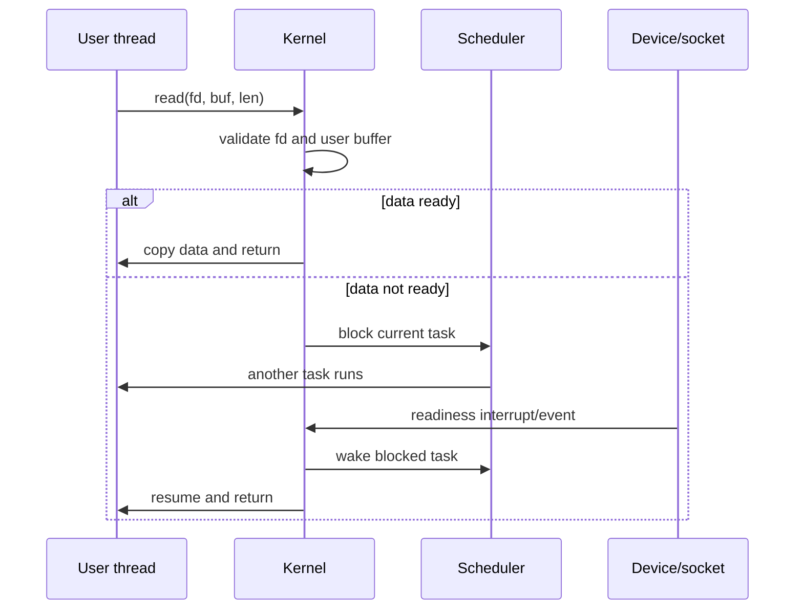
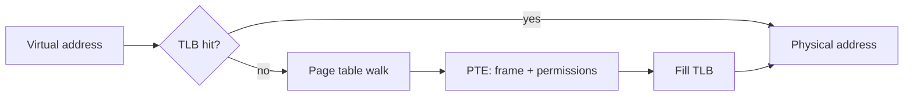
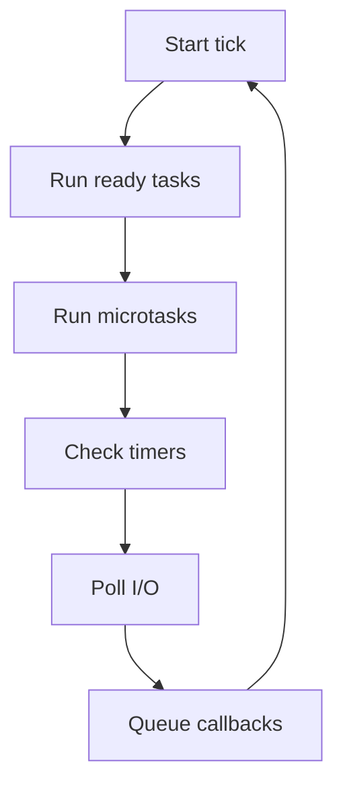
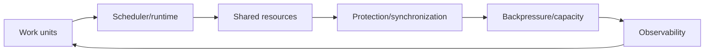

# Deep Expansion Pack

Previous: [Appendices](13-appendices.md) | [Index](index.md) | Next: none

**Focus:** Fill in topics that were easy to skim in the main deck: deeper OS internals, synchronization internals, runtime behavior, async I/O, observability, and architecture review heuristics.

## Bridge

**Coming from:** [Appendices](13-appendices.md). The main deck has already given the learning path.

**Read this for:** what a senior engineer usually adds when readers or the team start asking "but how exactly does that work?"

**How to use it:** do not teach this file end-to-end unless you have a very long session. Pull individual modules into the main sequence when readers need more depth.

---

## Expansion 1. System Calls Are Scheduling And Trust Boundaries

System calls are often introduced as "the way user code asks the kernel for work." That is true, but incomplete.

A system call is also:

- A privilege transition.
- A validation boundary.
- A possible blocking point.
- A possible scheduling point.
- A resource-accounting point.
- A security policy enforcement point.
- A place where user memory and kernel memory interact carefully.

Example:

```c
ssize_t n = read(fd, buf, len);
```

From user code this looks like one function call. Underneath:

1. C library wrapper puts syscall number and arguments in ABI-defined registers.
2. CPU executes a syscall/trap instruction.
3. CPU enters privileged mode at a kernel-defined entry point.
4. Kernel identifies current task.
5. Kernel validates `fd`.
6. Kernel validates `buf` as user memory.
7. Kernel checks whether data is available.
8. If data is available, kernel copies to user memory.
9. If data is not available and fd is blocking, task sleeps.
10. Scheduler may run another task.
11. Later, device/network readiness wakes the sleeping task.
12. Kernel returns result to user mode.



> **Side note:** A blocking syscall is not "CPU doing nothing." It is the calling task leaving the runnable set so another task can use the CPU.

---

## Expansion 2. User Pointers In Kernel Are Dangerous

When user code passes a pointer to the kernel, the kernel cannot trust it.

Why:

- Pointer may be invalid.
- Pointer may point to unmapped memory.
- Pointer may point to read-only memory.
- Pointer may cross a page boundary.
- Another thread may unmap or modify the memory concurrently.
- A malicious process may intentionally pass hostile addresses.

For this call:

```c
write(fd, user_buffer, len);
```

Kernel must not simply dereference `user_buffer` like ordinary C code.

It must use controlled copy routines conceptually like:

```text
copy_from_user(kernel_buffer, user_buffer, len)
copy_to_user(user_buffer, kernel_buffer, len)
```

These routines handle page faults and permission checks safely.

Concurrency consequence:

- Even copying user memory can fault.
- A syscall can sleep while resolving a page fault.
- Data observed by the kernel may not be stable if another user thread mutates it.
- Kernel APIs must define when data is copied and what is atomic.

> **Side note:** Kernel code assumes user memory is unstable. That is not paranoia; it is required for correctness and security.

---

## Expansion 3. Page Tables, TLB, And Why VM Has Runtime Cost

Virtual memory is not free.

Address translation path:

1. CPU sees a virtual address.
2. CPU checks Translation Lookaside Buffer, or TLB.
3. If TLB hit: translation is fast.
4. If TLB miss: hardware or kernel walks page tables.
5. Page table walk finds physical frame and permissions.
6. TLB is filled.
7. Memory access proceeds.



What page table entries typically encode:

- Physical frame number.
- Present/not-present.
- Read/write permission.
- User/supervisor permission.
- Execute-disable or executable.
- Dirty bit.
- Accessed bit.
- COW or software metadata in OS structures.

Context-switch relevance:

- Switching processes may switch page-table root.
- TLB entries from previous address space may be unusable.
- Address Space Identifiers can reduce flushing.
- Large working sets can cause TLB pressure.

> **Side note:** TLB misses are invisible in source code but visible in performance. VM is an abstraction, and abstractions have machinery.

---

## Expansion 4. Demand Paging And Lazy Work Everywhere

Modern operating systems avoid doing expensive work until necessary.

Lazy mechanisms:

- Demand-load executable pages.
- Demand-map shared library pages.
- Copy-on-write after `fork`.
- Lazy allocation of anonymous pages.
- Lazy stack growth.
- Lazy symbol resolution in dynamic linking.

Example:

```c
char *p = malloc(1024 * 1024 * 1024);
```

This may not immediately allocate 1 GB of physical RAM.

Physical pages may appear only when touched:

```c
p[0] = 1;              // first page materialized
p[4096 * 100] = 2;     // another page materialized
```

Concurrency consequence:

- First access may be slower than later access.
- Page faults can happen inside code that looks like plain memory access.
- Latency spikes can occur when touching many new pages.
- Real-time systems often avoid this by pre-faulting or static allocation.

> **Side note:** Lazy work is great for throughput and memory efficiency. It is dangerous for hard latency unless you force the work earlier.

---

## Expansion 5. Signals Are User-Space Interrupts, But Messier

Signals are asynchronous notifications delivered to processes or threads.

Examples:

- `SIGINT`: terminal interrupt.
- `SIGTERM`: polite termination request.
- `SIGKILL`: uncatchable kill.
- `SIGSEGV`: invalid memory access.
- `SIGCHLD`: child process changed state.
- `SIGALRM`: timer.

Signal handling is tricky because a signal can interrupt user code at awkward points.

Async-signal-safe rule:

- A signal handler may only safely call a small set of async-signal-safe functions.
- Calling complex library code from a signal handler can deadlock or corrupt state.

Bad idea:

```c
void handler(int sig) {
    printf("got signal\n"); // not safe in strict POSIX signal handler context
}
```

Better pattern:

```c
volatile sig_atomic_t stop = 0;

void handler(int sig) {
    stop = 1;
}
```

Concurrency relevance:

- Signals can interrupt normal control flow.
- Signals interact with threads through signal masks.
- System calls may return `EINTR`.
- Signal delivery can wake or disturb blocking code.

> **Side note:** Signals are old, powerful, and sharp. Treat them as low-level control-plane events, not normal application callbacks.

---

## Expansion 6. IPC Is Concurrency Without Shared Heap

Inter-process communication lets isolated processes coordinate.

Common IPC mechanisms:

- Pipes.
- Unix domain sockets.
- TCP sockets.
- Shared memory.
- Message queues.
- Signals.
- Files.
- Memory-mapped files.
- Eventfd/timerfd/signalfd on Linux-style systems.

Tradeoff:

| Mechanism | Strength | Cost |
|---|---|---|
| Pipe | Simple byte stream | Parent/child or fd passing setup |
| Unix socket | Local bidirectional communication | Serialization/framing needed |
| TCP socket | Network boundary | Latency and failure modes |
| Shared memory | Fast data exchange | Must design synchronization |
| File | Durable handoff | Slow and coarse |
| Signal | Lightweight notification | Tiny payload, tricky semantics |

Shared memory warning:

- Shared memory removes copying.
- It also removes process-isolation simplicity for that memory region.
- You need mutexes, atomics, semaphores, or lock-free protocol.

> **Side note:** IPC is not only a performance tool. It is an architecture tool for containing failure.

---

## Expansion 7. Futex: Why Modern Mutexes Are Usually Hybrid

A naive mutex could enter the kernel every time.

That would be expensive.

Modern mutexes often follow a hybrid pattern:

1. Try to acquire lock in user space with atomic instruction.
2. If uncontended, no syscall.
3. If contended, ask kernel to sleep.
4. Unlock path wakes one or more waiters if needed.

Linux-style futex idea:

- Futex means "fast user-space mutex."
- User space owns the lock word.
- Kernel only participates when waiting/waking is needed.

Conceptual lock path:

```text
atomic compare_exchange lock from 0 to 1
if success:
    enter critical section
else:
    futex_wait(lock_word, expected_value)
```

Unlock path:

```text
atomic store lock = 0
if waiters exist:
    futex_wake(lock_word, 1)
```

Why this matters:

- Uncontended locks are cheap.
- Contended locks are still expensive.
- Lock design should minimize contention, not merely choose a fast primitive.

> **Side note:** A mutex is not "a kernel object" in all implementations. Often it is a user-space word with kernel help only in the slow path.

---

## Expansion 8. Condition Variables Are Not Events

Condition variables let threads sleep until a condition may have changed.

They are used with a mutex.

Correct pattern:

```c
pthread_mutex_lock(&m);
while (!condition_is_true) {
    pthread_cond_wait(&cv, &m);
}
// condition is true while holding m
pthread_mutex_unlock(&m);
```

Why `while`, not `if`:

- Spurious wakeups are allowed.
- Another thread may consume the condition first.
- Wakeup means "check again", not "condition guaranteed true."

What `pthread_cond_wait` conceptually does atomically:

1. Releases mutex.
2. Puts thread to sleep.
3. Later wakes.
4. Re-acquires mutex before returning.

Common bug:

```c
if (!ready) {
    pthread_cond_wait(&cv, &m);
}
```

That can proceed when `ready` is still false.

> **Side note:** A condition variable is not the condition. The condition is your predicate over protected state.

---

## Expansion 9. Read-Write Locks Are Not Free Throughput

Read-write locks allow:

- Many readers simultaneously.
- One writer exclusively.

They help when:

- Reads are frequent.
- Writes are rare.
- Read critical sections are long enough to matter.
- Data structure supports consistent read snapshots.

They hurt when:

- Writes are frequent.
- Readers are very short.
- Writer starvation occurs.
- Lock implementation is heavy.
- Cache-line contention dominates.

Alternative designs:

- Immutable snapshots.
- Copy-on-write data structures.
- RCU-style read-copy-update.
- Sharding.
- Per-core state.
- Actor ownership.

> **Side note:** Read-write locks are seductive. Many systems get faster with a plain mutex because the read sections are too tiny for RW-lock overhead to pay back.

---

## Expansion 10. Deadlock, Livelock, Starvation, Priority Inversion

Concurrency failure vocabulary matters.

Deadlock:

- A waits for B.
- B waits for A.
- Neither can progress.

Classic conditions:

- Mutual exclusion.
- Hold and wait.
- No preemption.
- Circular wait.

Livelock:

- Threads are active.
- State keeps changing.
- No useful progress happens.

Starvation:

- Some task could run in theory.
- Scheduler/lock/resource policy keeps denying it progress.

Priority inversion:

- High-priority task waits on low-priority task.
- Medium-priority task prevents low-priority task from running.
- High-priority task is indirectly blocked by medium-priority work.

Mitigation:

- Lock ordering.
- Timeouts.
- Try-lock with backoff.
- Priority inheritance.
- Smaller critical sections.
- Avoid nested locks.
- Design ownership to avoid shared locks.

> **Side note:** A system can consume 100% CPU and still make zero progress. Progress is a semantic property, not a CPU metric.

---

## Expansion 11. Thread Pools Need Queue Discipline

A thread pool is a concurrency limiter, not just a convenience wrapper.

Important parameters:

- Number of worker threads.
- Queue size.
- Queue policy.
- Rejection policy.
- Task timeout.
- Task cancellation behavior.
- Metrics.

Bad thread pool:

```text
unbounded queue
unbounded retries
no timeout
no per-dependency pool
no queue-age metric
```

Better thread pool:

```text
bounded queue
bounded workers
deadline on task
rejection under saturation
separate pools for different blocking resources
queue depth and age visible
```

Why one global pool is risky:

- Slow dependency can fill all workers.
- Fast operations get stuck behind slow operations.
- Retries can occupy the same pool needed for recovery.
- A single bad task class can starve unrelated work.

> **Side note:** A thread pool is a bulkhead. If everything shares one pool, you did not build compartments; you built one floodable room.

---

## Expansion 12. Async I/O: Readiness Vs Completion

Async I/O APIs commonly follow two models.

Readiness model:

- Kernel tells you an fd is ready.
- Your code must perform the read/write.
- Examples: `select`, `poll`, `epoll`, `kqueue` style.

Completion model:

- You submit operation.
- Kernel/runtime tells you operation completed.
- Examples: IOCP-style models, io_uring-style completion thinking.

Readiness example:

```text
epoll says socket readable
application calls read()
read drains available bytes
application returns to event loop
```

Completion example:

```text
application submits read request
kernel performs or coordinates read
completion queue reports result
```

Common event-loop mistakes:

- Assuming readiness means full message is available.
- Forgetting partial reads/writes.
- Ignoring backpressure.
- Doing CPU-heavy work inside event callback.
- Blocking on DNS/filesystem unexpectedly.

> **Side note:** Async I/O does not remove state machines. It moves state machines into your runtime and protocol code.

---

## Expansion 13. Event Loop Internals

An event loop repeatedly:

1. Runs ready callbacks/tasks.
2. Runs due timers.
3. Polls I/O readiness/completions.
4. Runs microtasks or continuation queues depending on runtime.
5. Handles close/error callbacks.
6. Repeats.

Simplified:



Event loop lag means:

- A callback was ready at time T.
- It actually ran at time T + delay.

Causes:

- CPU-heavy callback.
- Huge synchronous JSON parse/stringify.
- Too many microtasks.
- Blocking library call.
- GC pause.
- Native extension blocking.

Production metric:

- Track event-loop delay/lag.
- Track queue depth.
- Track callback duration.
- Track slow synchronous sections.

> **Side note:** Event loops fail by not coming back around. Anything that delays the next tick delays every other task.

---

## Expansion 14. Coroutine Cancellation Is A Correctness Feature

Coroutines make it easy to start many tasks.

They also make it easy to leak many tasks.

Cancellation questions:

- Who owns this coroutine?
- What happens when parent request times out?
- What happens when one sibling fails?
- Does cleanup run?
- Are locks released?
- Are partial writes rolled back?
- Are child tasks awaited?

Bad pattern:

```python
asyncio.create_task(do_background_work())
# no handle retained, no cancellation path, no error observation
```

Better pattern:

```python
async with asyncio.TaskGroup() as tg:
    tg.create_task(call_service_a())
    tg.create_task(call_service_b())
```

Key idea:

- Starting work creates ownership responsibility.
- Cancellation must be propagated intentionally.
- Cleanup must be idempotent.

> **Side note:** In async systems, orphan tasks are a serious production bug. They keep doing work after the reason for the work disappeared.

---

## Expansion 15. Garbage Collection Safepoints And Concurrency

GC needs to know what objects are reachable.

Threads are mutating the object graph while GC wants to inspect it.

Coordination techniques:

- Stop-the-world pauses.
- Safepoints where threads can be paused.
- Concurrent marking.
- Write barriers.
- Read barriers in some collectors.
- Thread-local allocation buffers.

Safepoint concept:

```text
runtime requests safepoint
threads reach safe locations
threads pause or cooperate
GC scans roots/heap
threads resume
```

Latency effect:

- Even if GC is concurrent, some phases may pause.
- Threads in native code may delay safepoints.
- High allocation rate can force more frequent GC.
- Retained references make heap larger and scanning harder.

Concurrency consequence:

- GC is itself a concurrent subsystem.
- Application thread behavior affects GC behavior.
- GC tuning is workload-specific.

> **Side note:** In managed runtimes, allocation is a concurrency decision. Allocation rate influences GC threads, pauses, CPU, and tail latency.

---

## Expansion 16. Memory Allocators Under Threads

Heap allocation must scale under concurrency.

Naive allocator:

- One global heap lock.
- Every allocation contends.
- Multi-threaded performance collapses.

Modern allocator strategies:

- Per-thread caches.
- Size classes.
- Arenas.
- Slabs.
- Bump allocation for short-lived objects.
- Thread-local allocation buffers in managed runtimes.

Tradeoffs:

- Per-thread caches improve speed.
- They can increase memory footprint.
- Cross-thread free can be more expensive.
- Fragmentation still matters.
- Object lifetime patterns dominate performance.

Design advice:

- Avoid allocating in hot critical sections.
- Reuse buffers carefully.
- Prefer ownership clarity over pooling everything.
- Measure allocation rate.
- Watch allocator lock contention.

> **Side note:** "malloc is slow" is rarely the full diagnosis. Ask which size, which thread, which lifetime, which contention pattern.

---

## Expansion 17. NUMA And CPU Affinity

On larger machines, memory is not equally close to every CPU.

NUMA means Non-Uniform Memory Access.

Implications:

- CPU socket A accesses local memory faster than socket B memory.
- Threads moving across sockets may access remote memory.
- Shared data can bounce across sockets.
- Lock contention can become interconnect traffic.

Scheduler choices:

- Keep task near its memory.
- Balance CPU load.
- Respect affinity.
- Avoid excessive migration.

Application strategies:

- Shard by core/socket.
- Keep ownership local.
- Use per-thread/per-core buffers.
- Pin carefully only when measured.
- Avoid global hot counters.

> **Side note:** On small systems you can ignore NUMA. On large systems NUMA can turn an elegant shared-memory design into a remote-memory benchmark.

---

## Expansion 18. False Sharing Deep Example

False sharing occurs when independent variables share one cache line.

Example:

```c
struct Stats {
    alignas(64) atomic_long requests;
    alignas(64) atomic_long errors;
};
```

Without padding/alignment:

```c
struct Stats {
    atomic_long requests;
    atomic_long errors;
};
```

If core 0 updates `requests` and core 1 updates `errors`, both may fight over the same cache line.

Symptom:

- CPU high.
- Lock contention low.
- Throughput poor.
- Performance improves mysteriously with padding or sharding.

Better design:

- Per-thread counters.
- Aggregate periodically.
- Keep write-heavy fields apart.
- Avoid global shared metrics in hot path.

> **Side note:** False sharing is humiliating because the code looks independent. Hardware sees cache lines, not your struct field intentions.

---

## Expansion 19. Data Race Vs Race Condition

These terms are related but not identical.

Data race:

- Two execution units access same memory.
- At least one access is a write.
- Accesses are not properly synchronized.
- In C/C++, this can be undefined behavior.

Race condition:

- Correctness depends on timing/interleaving.
- May happen even without low-level data race.

Race condition example without data race:

```text
Request A checks "user has no active subscription"
Request B checks same condition
Both insert a subscription in separate transactions
Database now has duplicate active subscriptions
```

The memory accesses may be synchronized perfectly. The business invariant still raced.

Mitigation:

- Unique constraints.
- Transactions.
- Idempotency keys.
- Compare-and-set at storage layer.
- Distributed locks only when necessary.

> **Side note:** Race conditions exist at every layer: CPU memory, process state, database rows, message queues, and distributed workflows.

---

## Expansion 20. Database Concurrency Is Still Concurrency

Backend engineers often move races from memory into the database.

Database concurrency concepts:

- Transactions.
- Isolation levels.
- Locks.
- MVCC.
- Deadlocks.
- Optimistic concurrency.
- Pessimistic locking.
- Unique constraints.

Classic lost update:

```text
T1 reads balance = 100
T2 reads balance = 100
T1 writes balance = 90
T2 writes balance = 80
Expected 70, got 80
```

Fixes:

- Atomic update: `balance = balance - amount`.
- Row lock: `SELECT ... FOR UPDATE`.
- Version column compare-and-swap.
- Serializable isolation where appropriate.

> **Side note:** If your app is "single-threaded" but handles concurrent requests against a database, you still have concurrency bugs.

---

## Expansion 21. Distributed Concurrency: Time, Order, Idempotency

Distributed systems remove shared memory but add harder concurrency.

Problems:

- Messages arrive out of order.
- Messages are duplicated.
- Messages are delayed.
- Nodes retry after timeout.
- Clocks disagree.
- Partial failure is normal.

Core tools:

- Idempotency keys.
- Monotonic sequence numbers.
- Version checks.
- Leases with care.
- Consensus for critical coordination.
- At-least-once processing with dedupe.
- Outbox pattern.
- Sagas/compensating actions.

Bad assumption:

> "The request timed out, so the operation did not happen."

Correct assumption:

> "The request timed out, so I do not know whether it happened."

> **Side note:** Distributed concurrency is concurrency plus uncertainty. You must design for duplicate, delayed, and partially completed work.

---

## Expansion 22. Observability For Concurrency

Concurrency needs observability that shows waiting, not just work.

Metrics to add:

- Queue depth.
- Queue age.
- Worker utilization.
- Thread count.
- Runnable thread count.
- Context switches.
- Lock wait time.
- Lock hold time.
- Event-loop lag.
- Goroutine/coroutine count.
- GC pause time.
- Allocation rate.
- DB pool wait time.
- Request fan-out count.
- Timeout count.
- Cancellation count.

Trace dimensions:

- Parent request ID.
- Child task IDs.
- Dependency call IDs.
- Retry attempt number.
- Queue enqueue/dequeue timestamps.
- Deadline remaining.

> **Side note:** If you cannot see waiting, you cannot debug concurrency. Most incidents are not "doing work"; they are "waiting in the wrong place."

---

## Expansion 23. How To Review A Concurrent Design

Use this checklist in design reviews.

Ownership:

- What state exists?
- Who owns it?
- Who can mutate it?
- Is ownership transferred or shared?

Synchronization:

- What protects each invariant?
- What is the lock ordering?
- What happens on timeout/cancel?
- Are there blocking calls inside critical sections?

Capacity:

- What queues exist?
- Are they bounded?
- What rejects work?
- What applies backpressure?

Runtime:

- Which thread/event loop executes this code?
- Can this block the event loop?
- Is CPU work offloaded?
- Does GC/allocation matter?

Failure:

- What happens if dependency is slow?
- What happens if retry storms occur?
- Are operations idempotent?
- Can partial work leak?

Observability:

- Can we see queue age?
- Can we see lock wait?
- Can we dump stacks/tasks?
- Can we trace child work?

> **Side note:** A concurrency design without ownership, backpressure, cancellation, and observability is incomplete.

---

## Expansion 24. War Story Patterns To Teach

Use these as discussion prompts.

Pattern 1: Event loop blocked

- Symptom: all requests slow at once.
- Cause: one synchronous CPU-heavy operation.
- Lesson: event loop health is a shared resource.

Pattern 2: Thread pool exhausted

- Symptom: requests time out while CPU is low.
- Cause: all workers blocked on slow dependency.
- Lesson: blocked threads are capacity consumed.

Pattern 3: Queue saves you until it kills you

- Symptom: latency keeps rising after traffic spike ends.
- Cause: huge backlog.
- Lesson: queues need bounds and age metrics.

Pattern 4: Lock convoy

- Symptom: throughput collapses under load.
- Cause: many threads serialize behind hot lock.
- Lesson: reduce shared mutation; shard ownership.

Pattern 5: Retry storm

- Symptom: dependency recovers but load remains destructive.
- Cause: clients retry aggressively.
- Lesson: retries need budgets, jitter, and backpressure.

> **Side note:** War stories make concurrency memorable because they connect mechanisms to production pain.

---

## Expansion 25. Strong Closing Model

A senior concurrency model has five questions:

1. What can run at the same time?
2. What state is shared?
3. What serializes access to that state?
4. What bounds the amount of in-flight work?
5. What happens when work is canceled, times out, or fails?

Map every system to this:



Final phrasing:

> Concurrency is not about starting more work. It is about preserving correctness and progress when many things are in flight.

> **Side note:** This is the line to end with when the reader has absorbed the machinery. It brings the material back to engineering judgment.

---

## Expansion 26. REX Watchdog And Kickdog Design Review

Use this module when discussing REX-style preemptive scheduling with embedded engineers.

A watchdog is not merely a timer.

It is a contract:

> If the system cannot prove forward progress within a bounded time, hardware resets it.

Watchdog layers:

- **Hardware watchdog:** independent timer that can reset the chip/system.
- **Low-level watchdog driver:** exposes kick/pet operation.
- **Dog service/task:** decides whether software is healthy.
- **Client tasks:** report progress to dog service.
- **Crash/reset logger:** records why watchdog was not kicked.

Bad design:

```text
timer ISR fires every 10 ms
ISR kicks watchdog unconditionally
```

Why bad:

- Scheduler can be dead.
- Tasks can be deadlocked.
- Heap can be corrupt.
- Protocol state can be stuck.
- ISR still kicks, so hardware never resets.

Better design:

```text
critical tasks report progress
dog task wakes periodically
dog task checks all required reports
dog task kicks hardware watchdog only if reports are healthy
if report missing, dog task logs failure and refuses to kick
hardware watchdog resets system
```

Progress-report design:

| Task | Weak report | Stronger report |
|---|---|---|
| RX task | loop heartbeat | processed N frames since last check |
| Protocol task | task woke up | state machine advanced or valid idle state |
| Storage task | function entered | queue drained below threshold |
| UI/control task | timer fired | command loop accepted work |

Scheduling interaction:

- Dog task must run often enough to kick before watchdog expiry.
- If a high-priority task spins, dog task may starve and watchdog fires.
- If interrupts are locked too long, timer/dog scheduling may be delayed.
- If ISR storm occurs, normal tasks may not report progress.
- If dog task priority is too high, it may mask starvation of lower tasks.

Timeout budgeting:

```text
hardware watchdog timeout = 2 seconds
dog task period = 250 ms
task report deadline = 1 second
crash logging budget = 100 ms
reset occurs if no valid kick before 2 seconds
```

Questions for design review:

- Which tasks are mandatory for system health?
- What does forward progress mean for each task?
- Can a task falsely report health while stuck?
- Can an ISR kick the dog accidentally?
- Can dog service itself deadlock?
- What logs survive watchdog reset?
- Is there a staged response before reset?
- Does the watchdog catch both CPU spin and blocked deadlock?

> **Side note:** In embedded concurrency, a watchdog is the final progress detector. The art is making sure it detects real progress, not fake heartbeats.

---

## Lead Into Next Section

**Core takeaway to close with:** The main deck teaches the path; this expansion pack gives you the extra depth to answer hard follow-up questions.

**Transition to next section:** Use these modules selectively. If the group is newer to the topic, pull in futexes, condition variables, event loops, and database races. If the group is more senior, pull in TLB, NUMA, allocators, memory models, and observability.

**Pause check before moving on:** identify which layer the team most often debugs poorly today: OS, runtime, database, event loop, or distributed workflow.

Previous: [Appendices](13-appendices.md) | [Index](index.md) | Next: none
