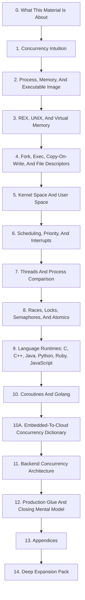

# Concurrency Deep Dive: Modular Reading Index

Use this page as the reading map. The sections are ordered so each layer gives vocabulary for the next one, but each file can still be opened directly when you want to revisit a topic.

## GitHub Self-Study Entry Points

- [README](README.md): repository landing page.
- [Self Study Guide](SELF_STUDY_GUIDE.md): paced learning plan.
- [Exercises And Checkpoints](EXERCISES_AND_CHECKPOINTS.md): checkpoint questions and practice prompts.
- [References](REFERENCES.md): source links for implementation-specific claims.

## Reading Path

0. [What This Material Is About](00-orientation.md)
   - Orientation
   - Explain why the material exists, what questions it answers, and what is intentionally out of scope.
1. [Concurrency Intuition](01-concurrency-intuition.md)
   - Slides 1-4
   - Build the vocabulary before introducing OS objects.
2. [Process, Memory, And Executable Image](02-process-memory-and-executable-image.md)
   - Slides 5-14
   - Explain process anatomy: PCB, stack, heap, executable bytes, ELF, and loading.
3. [REX, UNIX, And Virtual Memory](03-rex-unix-and-virtual-memory.md)
   - Slides 15-22
   - Use a simpler REX-style non-VM task model to understand why UNIX adds VM, process containers, and stronger resource management.
4. [Fork, Exec, Copy-On-Write, And File Descriptors](04-fork-exec-copy-on-write-and-fds.md)
   - Slides 23-34
   - Remove ambiguity around fork, exec, COW, page faults, context, and FD inheritance.
5. [Kernel Space And User Space](05-kernel-space-user-space.md)
   - Slides 35-40
   - Explain privilege, memory protection, system calls, and why UNIX needs a kernel boundary.
6. [Scheduling, Priority, And Interrupts](06-scheduling-priority-and-interrupts.md)
   - Slides 41-55
   - Cover scheduling policy, priority, system-call scheduling points, interrupts, and context switches.
7. [Threads And Process Comparison](07-threads-and-process-comparison.md)
   - Slides 56-65
   - Define threads, TCBs, process-vs-thread context, and why UNIX/RTOS models differ.
8. [Races, Locks, Semaphores, And Atomics](08-races-locks-semaphores-and-atomics.md)
   - Slides 66-75
   - Explain races, mutexes, semaphores, critical sections, interrupt locking, multicore requirements, and atomics.
9. [Language Runtimes: C, C++, Java, Python, Ruby, JavaScript](09-language-runtimes-c-cpp-java-python-ruby-js.md)
   - Slides 76-96
   - Compare runtime models, threading models, GC, GIL/GVL, and event-loop choices.
10. [Coroutines And Golang](10-coroutines-and-golang.md)
   - Slides 97-106
   - Explain coroutine context switches, coroutine tradeoffs, Go's goroutine model, and language summary.
10A. [Embedded-To-Cloud Concurrency Dictionary](10A-embedded-to-cloud-dictionary.md)
   - Bridge
   - Translate REX/RTOS concepts into backend/cloud concepts before architecture choices.
11. [Backend Concurrency Architecture](11-backend-concurrency-architecture.md)
   - Slides 107-114
   - Discuss when Node, Python, Java, and C++ fit backend systems based on concurrency model.
12. [Production Glue And Closing Mental Model](12-production-glue-and-closing.md)
   - Slides 115-122
   - Add memory model, false sharing, backpressure, structured concurrency, debugging, and final advice.
13. [Appendices](13-appendices.md)
   - Appendices
   - Keep optional snippets, decision tables, and delivery rhythm separate from the main flow.
14. [Deep Expansion Pack](14-deep-expansion-pack.md)
   - Extra modules
   - Fill in topics that were easy to skim: syscalls, page tables, futexes, condition variables, event loops, allocators, NUMA, watchdog/kickdog design, database races, distributed concurrency, and observability.

## Learning Flow

## How To Use This

- Use `index.md` as the table of contents.
- Each section has Previous/Index/Next navigation at top and bottom.
- Each section ends with `Lead Into Next Section`, written as a transition for both readers and teachers.
- Use the deep expansion pack selectively when readers or the team ask for more detail or when a topic feels too compressed.
- Keep Mermaid rendering enabled in VS Code/Cursor/GitHub to see diagrams.
